# 使用 Scrapy

将刮下的项目保存到 JSON 和 CSV 文件中

> 原文:[https://www . geesforgeks . org/saving-skied-items-to-JSON-and-CSV-file-use-scrapy/](https://www.geeksforgeeks.org/saving-scraped-items-to-json-and-csv-file-using-scrapy/)

在本文中，我们将看到如何使用 Scrapy 和将数据导出为 JSON 和 CSV 格式。我们将使用 Scrapy spider 从网页上抓取数据，并将其导出为两种不同的文件格式。

这里我们将从链接[中提取 http://quotes.toscrape.com/tag/friendship/](http://quotes.toscrape.com/tag/friendship/)。这个网站是由剪贴簿的制作者提供的，用于了解图书馆。让我们逐步了解上述方法:

**第一步:创建报废项目**

在终端执行以下命令，创建一个剪贴簿项目–

```
scrapy startproject gfg_friendshipquotes 
```

这将在您当前的目录中创建一个名为“gfg_friendshipquotes”的新目录。现在将目录更改为新创建的文件夹。

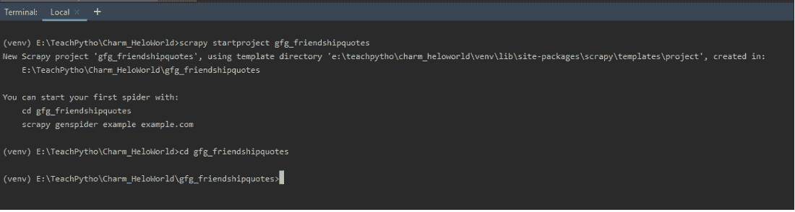

“gfg_friendshipquotes”的文件夹结构如下所示。保持当前配置文件的内容不变。

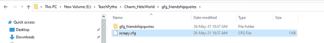 

**步骤 2:** 要创建蜘蛛文件，我们使用命令“genspider”。请注意，genspider 命令是在相同的目录级别执行的，其中存在 scrapy.cfg 文件。命令是–

> scrapy gens pider spider _ filename“URL _ of _ page _ to _ scratch”

**现在，在终端执行以下操作:**

> scrapy gens pider gfg _ friend quotes " quotes . toscrape . com/tag/friend/"

应该在 spider 文件夹中创建一个名为“gfg_friendquotes.py”的 spider Python 文件，如下所示:

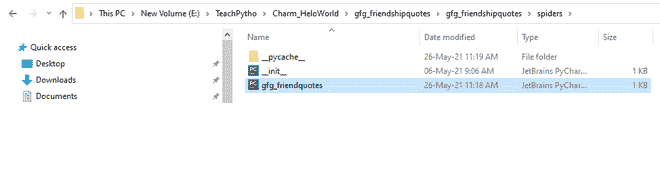

**gfg _ friendquotes . py 文件的默认代码如下:**

## 计算机编程语言

```
# Import the required library
import scrapy

# Spider class
class GfgFriendquotesSpider(scrapy.Spider):

   # The name of the spider
    name = 'gfg_friendquotes'

    # The domain, the spider will crawl
    allowed_domains = ['quotes.toscrape.com/tag/friendship/']

    # The URL of the webpage, data from which
    # will get scraped
    start_urls = ['http://quotes.toscrape.com/tag/friendship/']

    # default start function which will hold
    # the code for navigating and gathering
    # the data from tags
    def parse(self, response):
        pass
```

**步骤 3:** 现在，让我们分析所需元素的 XPath 表达式。如果你访问链接，[http://quotes.toscrape.com/tag/friendship/](http://quotes.toscrape.com/tag/friendship/)看起来如下:

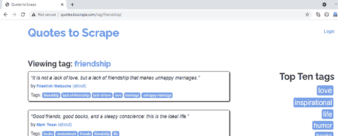

我们将抓取的页面的网址

我们将刮掉友谊引号标题、作者和标签。当您右键单击报价，阻止它，并选择检查选项时，您可以注意到它们属于“报价”类。当您将鼠标悬停在其余的报价块上时，可以注意到网页中的所有报价都将 CSS 类属性设为“报价”。

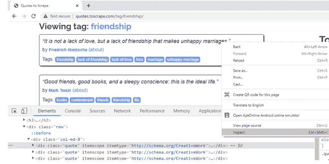

右键单击，检查，检查第一个报价块的 CSS 属性

要提取报价文本，右键单击第一个报价，然后说检查。引用的标题/文本，属于 CSS 类属性“文本”。

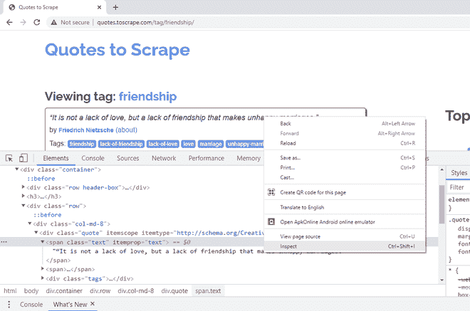

右键单击第一个标题，检查，检查 CSS 类属性

要提取引用的作者姓名，右键单击名字，然后说“检查”。它属于 CSS 类“作者”。这里有一个 itemprop CSS 属性，也是用相同的名称定义的。我们将在代码中使用这个属性。

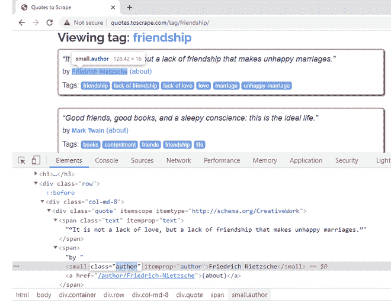

右键单击作者姓名以获取其 CSS 属性

**第 7 步:**要提取报价的标签，右键单击第一个标签，然后说检查。单个标签属于 CSS 类“标签”。它们一起定义了一个 itemprop CSS 属性“关键字”。它们还有一个“内容”CSS 属性，所有标签都在一行中。如果您观察，标签的实际文本存在于< a >超链接元素中。因此，从“内容”属性中提取会更容易。

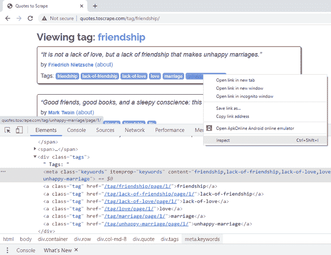

右键单击标签以获取其 CSS 属性

包含 XPath 表达式后，蜘蛛文件的最终代码如下

## 蟒蛇 3

```
# Import the required libraries
import scrapy

# Default class created when we run the "genspider" command

class GfgFriendquotesSpider(scrapy.Spider):
    # Name of the spider as mentioned in the "genspider" command
    name = 'gfg_friendquotes'
    # Domains allowed for scraping, as mentioned in the "genspider" command
    allowed_domains = ['quotes.toscrape.com/tag/friendship/']
    # URL(s) to scrape as mentioned in the "genspider" command
    # The scrapy spider, starts making  requests, to URLs mentioned here
    start_urls = ['http://quotes.toscrape.com/tag/friendship/']

    # Default callback method responsible for returning the scraped output and processing it.
    def parse(self, response):
       # XPath expression of all the Quote elements.
        # All quotes belong to CSS attribute class having value 'quote'
        quotes = response.xpath('//*[@class="quote"]')
        # Loop through the quotes object, to get required elements data.
        for quote in quotes:
            # XPath expression to fetch 'title' of the Quote
            # Title belong to CSS attribute class having value 'text'
            title = quote.xpath('.//*[@class="text"]/text()').extract_first()
            # XPath expression to fetch 'author name' of the Quote
            # Author name belong to CSS attribute itemprop having value 'author'
            author = quote.xpath(
                './/*[@itemprop="author"]/text()').extract_first()
            # XPath expression to fetch 'tags' of the Quote
            # Tags belong to CSS attribute itemprop having value 'keywords'
            tags = quote.xpath(
                './/*[@itemprop="keywords"]/@content').extract_first()
            # Return the output
            yield {'Text': title,
                   'Author': author,
                   'Tags': tags}
```

Scrapy 允许提取的数据以 JSON、CSV、XML 等格式存储。本教程展示了两种方法。您可以在终端上编写以下命令:

> 杂乱的爬行“蜘蛛名”-o store _ data _ extracted _ filename . file _ 扩展名

或者，通过在 settings.py 文件中提到 FEED_FORMAT 和 FEED_URI，可以将输出导出到一个文件中。

### **创建 JSON 文件**

为了将数据存储在 JSON 文件中，可以遵循下面提到的任何方法:

```
scrapy crawl gfg_friendquotes -o friendshipquotes.json
```

或者，我们可以在 settings.py 文件中提到 FEED_FORMAT 和 FEED_URI。settings.py 文件应该如下所示:

## 计算机编程语言

```
BOT_NAME = 'gfg_friendshipquotes'

SPIDER_MODULES = ['gfg_friendshipquotes.spiders']
NEWSPIDER_MODULE = 'gfg_friendshipquotes.spiders'

# Obey robots.txt rules
ROBOTSTXT_OBEY = True

# Desired file format
FEED_FORMAT = "json"

# Name of the file where
# data extracted is stored
FEED_URI = "friendshipfeed.json"
```

**输出:**

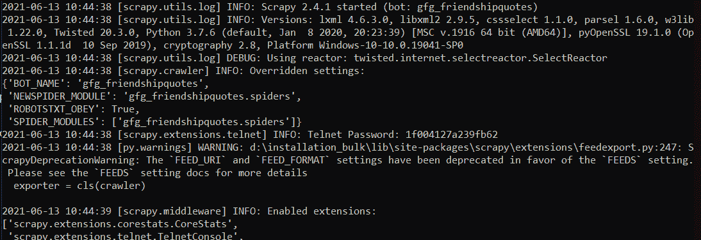

使用上述任何一种方法，JSON 文件在项目文件夹中生成如下:

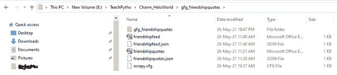

提取的数据，导出到 JSON 文件

预期的 JSON 文件如下所示:


导出的 JSON 数据，由蜘蛛代码抓取

### **创建 CSV 文件:**

要将数据存储在 CSV 文件中，可以遵循下面提到的任何方法。

**在** **终端写下以下命令:**

```
scrapy crawl gfg_friendquotes -o friendshipquotes.csv
```

或者，我们可以在 settings.py 文件中提到 FEED_FORMAT 和 FEED_URI。settings.py 文件应该如下所示:

## 计算机编程语言

```
BOT_NAME = 'gfg_friendshipquotes'

SPIDER_MODULES = ['gfg_friendshipquotes.spiders']
NEWSPIDER_MODULE = 'gfg_friendshipquotes.spiders'

# Obey robots.txt rules
ROBOTSTXT_OBEY = True

# Desired file format
FEED_FORMAT = "csv"

# Name of the file where data extracted is stored
FEED_URI = "friendshipfeed.csv"
```

**输出:**

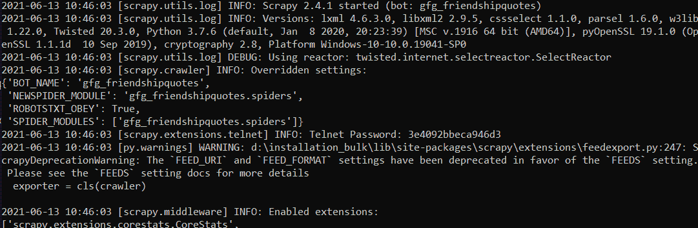

CSV 文件在项目文件夹中生成如下:


导出的文件是在您杂乱的项目结构中创建的

导出的 CSV 文件如下所示:

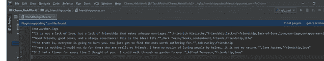

导出的 CSV 数据，由蜘蛛代码抓取