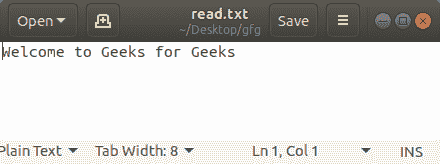
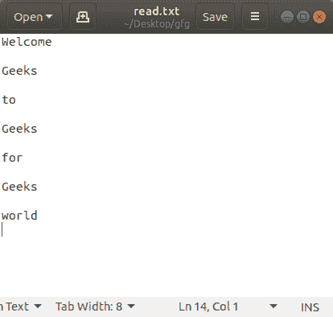
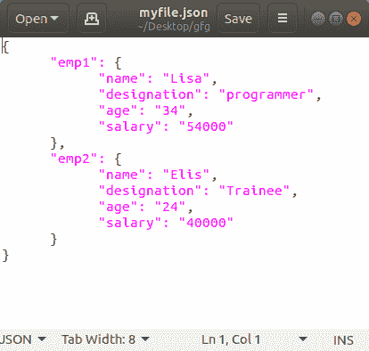

# 用 Python 将文本、JSON 和 CSV 保存到文件中

> 原文:[https://www . geesforgeks . org/saving-text-JSON-and-CSV-to-a-file-in-python/](https://www.geeksforgeeks.org/saving-text-json-and-csv-to-a-file-in-python/)

Python 允许用户处理文件(读取、写入、保存和删除文件等等)。因为 Python，我们可以非常容易地保存多种文件格式。Python 内置了保存多种文件格式的功能。

## 用 Python 打开文本文件

打开文件指的是准备好文件以供读取或写入。这可以使用`open()`功能来完成。

**语法:**

```
File_object = open("File_Name", "Access_Mode")

```

**参数:**

*   **File_Name:** 需要打开的文件的名称。
*   **访问模式:**访问模式控制打开文件中可能的操作类型。

**以下是最常用的访问模式:**

*   **只读(' r'):** 打开文本文件阅读。
*   **只写(' w'):** 打开文件写。
*   **仅追加(' a'):** 打开文件进行写入。正在写入的数据将被插入到现有数据的末尾。
*   **读写(' r+'):** 打开文件进行读写。

**注意:**默认情况下，Python 假定访问模式为 read(即“r”)

```
# Python program to demonstrate 
# opening a file 

# Open function to open the file "myfile.txt"   
# (same directory) in read mode and store 
# it's reference in the variable file1 

file1 = open("myfile.txt") 

# Reading from file 
print(file1.read()) 

file1.close() 
```

**注意:**更多信息请参考[用 Python 打开文件](https://www.geeksforgeeks.org/open-a-file-in-python/)。

#### 用 Python 保存文本文件

在了解了用 Python 打开文件后，让我们看看保存它的方法。以写模式打开一个新文件会创建一个文件，在关闭该文件后，文件会自动保存。但是，我们也可以向文件中写入一些文本。Python 为同一个提供了两种方法。

*   **write():** 将字符串 str1 插入文本文件中的一行。

    ```
    File_object.write(str1)
    ```

*   **writeline():**对于字符串元素的列表，每个字符串都被插入到文本文件中。用于一次插入多个字符串。

    ```
    File_object.writelines(L) for L = [str1, str2, str3] 
    ```

**示例:**

```
# Python program to demonstrate
# saving a text file

file = open('read.txt', 'w')
file.write('Welcome to Geeks for Geeks')
file.close()
```

**输出:**



#### 带语句

`with`Python 中的语句用于异常处理，使代码更加清晰，可读性更强。它简化了文件流等公共资源的管理。与上述实现不同，使用`with`语句时不需要调用`file.close()`。`with`声明本身确保了资源的正确获取和释放。

**语法:**

```
with open filename as file:
     statement(s)
```

**示例:**

```
# Python program to demonstrate
# saving a text file

with open('read.txt', 'w') as file:

    books = ['Welcome\n', 
             'Geeks\n', 
             'to\n', 
             'Geeks\n',
             'for\n', 
             'Geeks\n', 
             'world\n']

    file.writelines("% s\n" % data for data in books)
```

**输出:**



**注意:**更多信息，请参考[用 Python 写入文件](https://www.geeksforgeeks.org/writing-to-file-in-python/)。

## 用 Python 保存 CSV 文件

CSV 是逗号分隔值文件，最广泛用于放置表格数据。CSV 文件以纯文本形式存储表格数据(数字和文本)。文件的每一行都是数据记录。每条记录由一个或多个字段组成，用逗号分隔。Python 内置了一个名为`csv`的模块，用于编写和保存一个 CSV 文件。

**保存 CSV 文件:**

*   首先，我们需要导入 csv 库。
*   然后像我们通常做的那样打开文件，但是我们不是在 read_file 对象上写入内容，而是创建一个名为 read_writer 的新对象。
*   这个对象为我们提供了 **writelines()** 方法，它允许我们将所有行的数据放在一次输入中。

**示例:**

```
# Python program to demonstrate 
# writing to CSV 

import csv  

# field names  
fields = ['Name', 'Branch', 'Year', 'CGPA']  

# data rows of csv file  
rows = [ ['Nikhil', 'COE', '2', '9.0'],  
         ['Sanchit', 'COE', '2', '9.1'],  
         ['Aditya', 'IT', '2', '9.3'],  
         ['Sagar', 'SE', '1', '9.5'],  
         ['Prateek', 'MCE', '3', '7.8'],  
         ['Sahil', 'EP', '2', '9.1']]  

# name of csv file  
filename = "university_records.csv"

# writing to csv file  
with open(filename, 'w') as csvfile:  
    # creating a csv writer object  
    csvwriter = csv.writer(csvfile)  

    # writing the fields  
    csvwriter.writerow(fields)  

    # writing the data rows  
    csvwriter.writerows(rows)
```

**输出:**


**注意:**更多信息请参考[用 Python 写 CSV 文件](https://www.geeksforgeeks.org/writing-csv-files-in-python/)。

## 用 Python 保存一个 JSON 文件

JSON 的完整形式是 JavaScript 对象符号。这意味着由编程语言中的文本组成的脚本(可执行)文件用于存储和传输数据。Python 通过一个名为`json`的内置包支持 JSON。JSON 中的文本是通过引用字符串完成的，该字符串包含`{ }`内键值映射中的值。

这个模块提供了一个名为`[dump()](https://www.geeksforgeeks.org/json-dump-in-python/)`的方法，将 Python 对象转换成合适的 json 对象。

```
import json 

# python object(dictionary) to be dumped 
dict1 ={ 
    "emp1": { 
        "name": "Lisa", 
        "designation": "programmer", 
        "age": "34", 
        "salary": "54000"
    }, 
    "emp2": { 
        "name": "Elis", 
        "designation": "Trainee", 
        "age": "24", 
        "salary": "40000"
    }, 
} 

# the json file where the output must be stored 
out_file = open("myfile.json", "w") 

json.dump(dict1, out_file, indent = 6) 

out_file.close() 
```

**输出:**



**注:**更多信息请参考[使用 Python 中的 JSON 数据](https://www.geeksforgeeks.org/working-with-json-data-in-python/)。