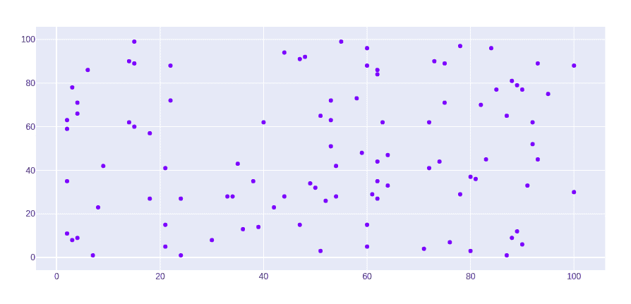
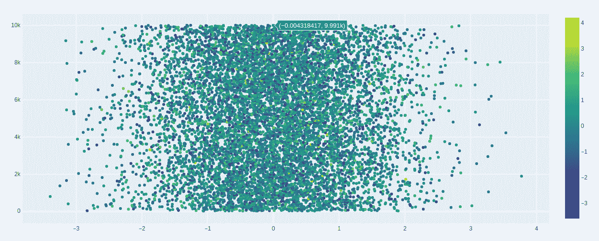
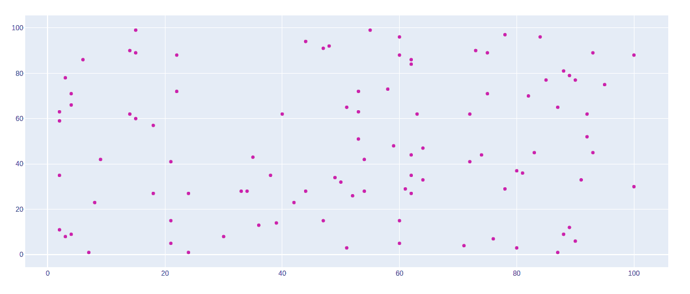
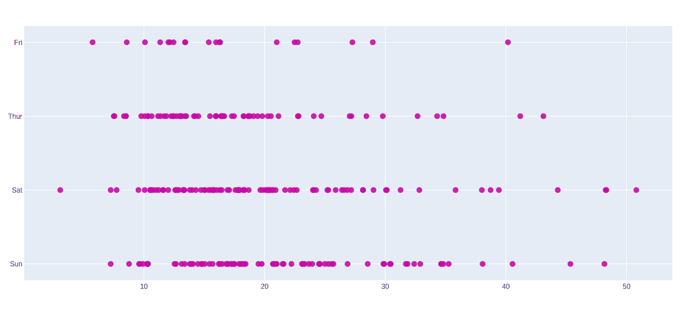

# 使用图形对象类

绘制散点图

> 原文:[https://www . geeksforgeeks . org/散点图使用图对象类/](https://www.geeksforgeeks.org/scatter-plot-in-plotly-using-graph_objects-class/)

**Plotly** 是一个 Python 库，用来设计图形，尤其是交互图形。它可以绘制各种图形和图表，如直方图、条形图、箱线图、展开图等。它主要用于数据分析以及财务分析。plotly 是一个交互式可视化库。

## 使用图形对象类的散点图

**散点图**是那些图表，其中数据点以水平和垂直轴表示，以显示一个变量如何影响另一个变量。graph_objects 类的散点()方法产生散点轨迹。属性的模式决定数据点的外观。

> **语法:** plotly.graph_objects。散点(arg =无，cliponaxis =无，connectgaps =无，customdata =无，customdatasrc =无，dx =无，dy =无，error _ x =无，error _ y =无，fill =无，fillcolor =无，groupnorm =无，气垫 info =无，气垫 infosrc =无，气垫 label =无，气垫 on =无，气垫 texttemplate =无，气垫 text =无，气垫 textsrc =无，ids =无，idssrc =无，legendgroup =无，无

**参数:**

<figure class="table">

| 名字 | 描述 |
| --- | --- |
| 高级的（deluxe 的简写） | 设置 x 坐标步长。 |
| 镝 | 设置 y 坐标步长。 |
| x | 设置 x 坐标。 |
| x0 | 生成一个 x 坐标的线性空间。与 dx 一起使用，其中 x0 是起始坐标，dx 是步长。 |
| y | 设置 y 坐标。 |
| y0 | 创建一个 y 坐标的线性空间。与 dy 一起使用，其中 y0 是起始坐标，dy 是步长。 |

</figure>

**示例:**

## 蟒蛇 3

```py
import plotly.graph_objects as px
import numpy as np

# creating random data through randomint
# function of numpy.random
np.random.seed(42)

random_x= np.random.randint(1,101,100)
random_y= np.random.randint(1,101,100)

plot = px.Figure(data=[px.Scatter(
    x = random_x,
    y = random_y,
    mode = 'markers',)
])

plot.show()
```

**输出:**



## 用颜色维度呈现分散

可以使用 showscale 参数显示色阶。此参数采用布尔值。如果该值为真，则显示刻度，否则不显示。

**示例:**

## 蟒蛇 3

```py
import plotly.graph_objects as go
import numpy as np

n = 10000
plot = go.Figure(data=[go.Scatter(
    x = np.random.randn(n),
    mode = 'markers',
    marker=dict(
        color=np.random.randn(n),
        colorscale='Viridis',
        showscale=True
    )
)
])

plot.show()
```

**输出:**



## 设置散点图的样式

在散点图中可以使用关键字参数进行样式化，让我们看看下面给出的例子:

**示例 1:** 更改图形的颜色

## 蟒蛇 3

```py
import plotly.graph_objects as px
import numpy as np

# creating random data through randomint
# function of numpy.random
np.random.seed(42)

random_x= np.random.randint(1,101,100)
random_y= np.random.randint(1,101,100)

plot = px.Figure(data=[px.Scatter(
    x = random_x,
    y = random_y,
    mode = 'markers',
    marker_color='rgba(199, 10, 165, .9)')
])

plot.show()
```

**输出:**



**示例 2:** 使用 tips 数据集

## 蟒蛇 3

```py
import plotly.graph_objects as px
import plotly.express as go
import numpy as np

df = go.data.tips()

x = df['total_bill']
y = df['day']

plot = px.Figure(data=[px.Scatter(
    x = x,
    y = y,
    mode = 'markers',
    marker_color='rgba(199, 10, 165, .9)')
])

plot.update_traces(mode='markers', marker_size=10)

plot.show()
```

**输出:**



## 气泡散点图

可以使用标记大小创建气泡散点图。标记大小和颜色用于控制标记的整体大小。标记大小有助于保持图形中气泡内部的颜色。

**示例:**

## 蟒蛇 3

```py
import plotly.graph_objects as px
import numpy as np

# creating random data through randomint
# function of numpy.random
np.random.seed(42)

random_x= np.random.randint(1,101,100)
random_y= np.random.randint(1,101,100)

plot = px.Figure(data=[px.Scatter(
    x = random_x,
    y = random_y,
    mode = 'markers',
    marker_size = [115, 20, 30])
])

plot.show()
```

**输出:**

