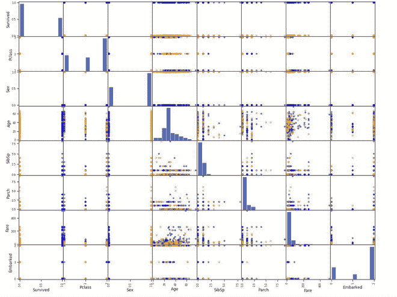
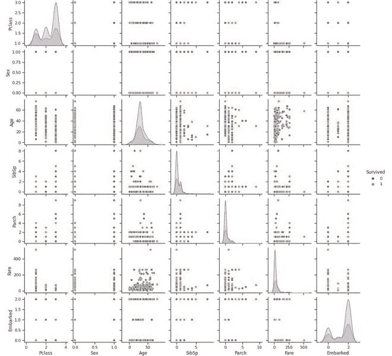

# 散点图矩阵

> 原文:[https://www.geeksforgeeks.org/scatter-plot-matrix/](https://www.geeksforgeeks.org/scatter-plot-matrix/)

在一个数据集中，对于 *k* 组变量/列(X <sub>1</sub> ，X <sub>2</sub> ，…。X <sub>k</sub> ，散点图矩阵以矩阵的形式绘制不同变量之间的所有成对散点图。

散点图矩阵回答以下问题:

*   不同变量之间是否存在任何成对关系？如果有关系，这些关系的本质是什么？
*   数据集中是否有异常值？
*   数据集中是否存在基于特定变量的分组聚类？

对于数据集中的***【k】***变量，散点图矩阵包含 k 行和 k 列。每行和每列代表一个散点图。每个单独的图(I，j)可以定义为:

*   纵轴:变量**X<sub>j</sub>T3】**
*   横轴:变量**X<sub>I</sub>T3】**

以下是绘制散点图矩阵时我们考虑的一些重要因素:

*   对角线上的图只是一条 45°的线，因为我们在这里绘制的是 X <sub>i</sub> vs X <sub>i.</sub> 但是，我们可以在对角线上绘制 X <sub>i</sub> 的直方图，或者将其留空。
*   由于 X <sub>i</sub> vs X <sub>j</sub> 相当于 X <sub>j</sub> vs X <sub>i</sub> 轴反转，我们也可以省略对角线以下的图。
*   如果我们在图中分散的点上叠加一些线图，可以更好地理解图。
*   成对图的思想也可以扩展到其他不同的图，如 qunatile-quantile 图或 bihistogram。

### 履行

*   对于这个实现，我们将使用泰坦尼克号数据集。该数据集可从 [Kaggle](https://www.kaggle.com/brendan45774/test-file) 下载。在绘制散射矩阵之前，我们将对数据帧执行一些预处理操作，以将其转换为所需的形式。

## 蟒蛇 3

```py
import pandas as pd
import numpy as np
import seaborn as sns
import matplotlib.pyplot as plt
% matplotlib inline

# load titanic dataset
titanic_dataset = pd.read_csv('tested.csv.xls')
titanic_dataset.head()
# Drop some unimportant columns in the dataset.
titanic_dataset.drop(['Name', 'Ticket','Cabin','PassengerId'],axis=1, inplace=True)

# check for different data types
titanic_dataset.dtypes

# print unique values of dataset
titanic_dataset['Embarked'].unique()
titanic_dataset['Sex'].unique()

# Replace NAs with mean
titanic_dataset.fillna(titanic_dataset.mean(), inplace=True)

# convert some column into integer for representation in
# scatter matrix
titanic_dataset["Sex"] = titanic_dataset["Sex"].cat.codes
titanic_dataset["Embarked"] = titanic_dataset["Embarked"].cat.codes

titanic_dataset.head()

# plot scatter matrix using pandas and matplotlib
survive_colors = {0:'orange', 1:'blue'}
pd.plotting.scatter_matrix(titanic_dataset,figsize=(20,20),grid=True,
                           marker='o', c= titanic_dataset['Survived'].map(colors))

# plot scatter matrix using seaborn
sns.set_theme(style="ticks")
sns.pairplot(titanic_dataset, hue='Survived')
```

```py
PassengerId    Survived    Pclass    Name    Sex    Age    SibSp    Parch    Ticket    Fare    Cabin    Embarked
0    892    0    3    Kelly, Mr. James    male    34.5    0    0    330911    7.8292    NaN    Q
1    893    1    3    Wilkes, Mrs. James (Ellen Needs)    female    47.0    1    0    363272    7.0000    NaN    S
2    894    0    2    Myles, Mr. Thomas Francis    male    62.0    0    0    240276    9.6875    NaN    Q
3    895    0    3    Wirz, Mr. Albert    male    27.0    0    0    315154    8.6625    NaN    S
4    896    1    3    Hirvonen, Mrs. Alexander (Helga E Lindqvist)    female    22.0    1    1    3101298    12.2875    NaN    S
```

```py
PassengerId      int64
Survived         int64
Pclass           int64
Sex             object
Age            float64
SibSp            int64
Parch            int64
Fare           float64
Embarked        object
dtype: object
```

```py
Survived    Pclass    Sex    Age    SibSp    Parch    Fare    Embarked
0    0    3    1    34.5    0    0    7.8292    1
1    1    3    0    47.0    1    0    7.0000    2
2    0    2    1    62.0    0    0    9.6875    1
3    0    3    1    27.0    0    0    8.6625    2
4    1    3    0    22.0    1    1    12.2875    2
```



Matplotlib 散射矩阵



海鸟散布矩阵

### 参考文献:

*   [NIST 手册](https://www.itl.nist.gov/div898/handbook/eda/section3/scatplma.htm)