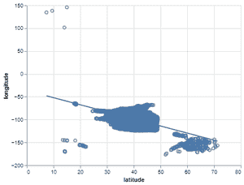
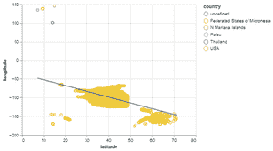
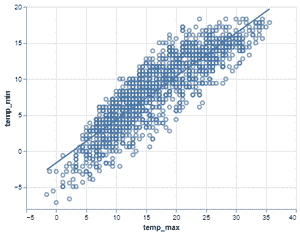
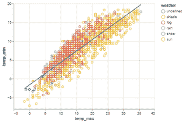

# Python 中使用牛郎星的回归线散点图

> 原文:[https://www . geesforgeks . org/散点图-带回归线-使用-python 中的牛郎星/](https://www.geeksforgeeks.org/scatter-plot-with-regression-line-using-altair-in-python/)

**先决条件:** [牛郎星](https://www.geeksforgeeks.org/introduction-to-altair-in-python/)

在本文中，我们将讨论如何使用牛郎星库绘制带有回归线的散点图。

**散点图和回归线**

*   在散点图中，两个不同数值变量的值用点或圆表示。散点图也称为散点图。水平轴和垂直轴上每个点的位置表示单个数据点的值。
*   散点图有利于观察变量之间的关系。
*   回归线是最适合数据的直线，因此从直线到图表上绘制的点的总距离最小。

**安装:**

要安装牛郎星库，请在命令提示符下编写以下命令。

```
pip install altair
```

在这篇关于数据集的文章中，我们使用 vega _ datasets 包，在命令提示符下安装 write 下面的命令。

```
pip install vega_datasets
```

**进场:**

*   导入必要的库。
*   从 vega_dataset 包创建或加载数据集。
*   要使用牛郎星库绘制散点图，我们必须给出三个重要的绘制元素，如下所示。
    *   在第一个元素牛郎星中。图表(数据集)将数据集作为参数传递。
    *   在第二个元素中用点(。)add mark_point()此元素指定我们正在绘制的图表类型。
    *   在第三个元素中用点(。)添加 encode()，在其中传递我们正在绘制散点图的列。
*   将此散点图存储在名为“fig”的变量中。
*   然后绘制回归线 transform _ revolution()函数，将列作为绘制回归线的参数传递，并将其添加到存储在“fig”变量中的散点图中。
*   将带有回归线的散点图存储在变量中，命名为“final_plot”。
*   如果用 python 文件编写程序代码，使用 save()函数保存绘图，您可以使用 CTRL+O 命令在 Chrome 浏览器上查看该绘图，然后打开保存的绘图进行可视化。
*   否则，如果写在 Jupyter 笔记本或笔记本环境中，请使用 show()来可视化情节。
*   要知道如何使用 Jupyter 笔记本:[开始使用 Jupyter 笔记本](https://www.geeksforgeeks.org/getting-started-with-jupyter-notebook-python/)。
*   为了更好地理解，让我们通过使用机场和 Vega 数据集包附带的 seattle_weather 数据集来做一些示例。

**示例 1:机场数据集上带有回归线的默认散点图。**

## 计算机编程语言

```
# importing libraries
import altair as alt
from vega_datasets import data

# importing airports dataset from 
# vega_datasets package
airport = data.airports()

# making the scatter plot on latitude and longitude
fig = alt.Chart(airport).mark_point().encode(x='latitude',y='longitude')

# making the regression line using transform_regression 
# function and add with the scatter plot
final_plot = fig + fig.transform_regression('latitude','longitude').mark_line()

# saving the scatter plot with regression line
final_plot.save('output1.html')
```

**输出:**



**示例 2:通过使用机场数据集设置颜色，使用回归线进行散点图。**

## 计算机编程语言

```
# importing libraries
import altair as alt
from vega_datasets import data

# importing airports dataset from vega_datasets package
airport = data.airports()

# making the scatter plot on latitude and longitude
# setting color on the basis of country
fig = alt.Chart(airport).mark_point().encode(
  x='latitude',y='longitude',color='country')

# making the regression line using transform_regression
# function and add with the scatter plot
final_plot = fig + fig.transform_regression('latitude','longitude').mark_line()

# saving the scatter plot with regression line
final_plot.save('output2.html')
```

**输出:**



**示例 3:使用 seattle_weather 数据集的带有回归线的默认散点图。**

## 计算机编程语言

```
# importing libraries
import altair as alt
from vega_datasets import data

# importing weather dataset from vega_datasets package
weather_data = data.seattle_weather()

# making the scatter plot on temp_max and temp_min
fig = alt.Chart(weather_data).mark_point().encode(x='temp_max',y='temp_min')

# making the regression line using transform_regression
# function and add with the scatter plot
final_plot = fig + fig.transform_regression('temp_max','temp_min').mark_line()

# saving the scatter plot with regression line
final_plot.save('output3.html')
```

**输出:**



**示例 4:通过使用 seattle_weather 数据集设置颜色，使用回归线绘制散点图。**

## 计算机编程语言

```
# importing libraries
import altair as alt
from vega_datasets import data

# importing weather dataset from vega_datasets package
weather_data = data.seattle_weather()

# making the scatter on temp_max and temp_min
fig = alt.Chart(weather_data).mark_point().encode(
  x='temp_max',y='temp_min',color='weather')

# making the regression line using transform_regression
# function and add with the scatter plot
final_plot = fig + fig.transform_regression('temp_max','temp_min').mark_line()

# saving the scatter plot with regression line
final_plot.save('output4.html')
```

**输出:**

