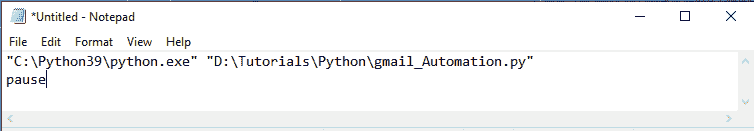
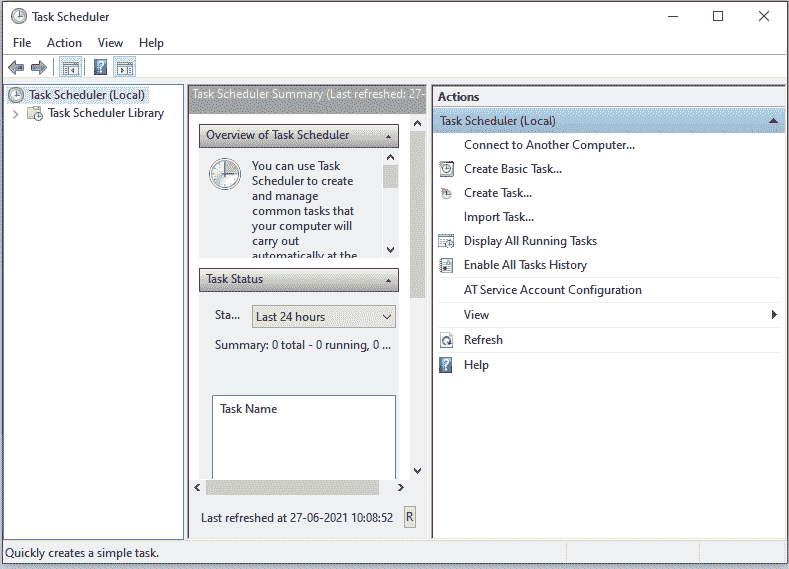
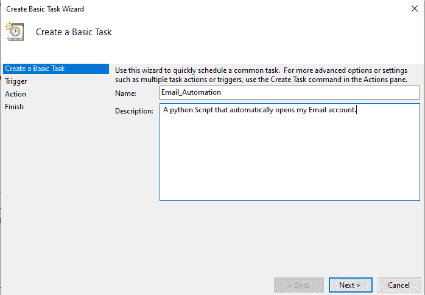
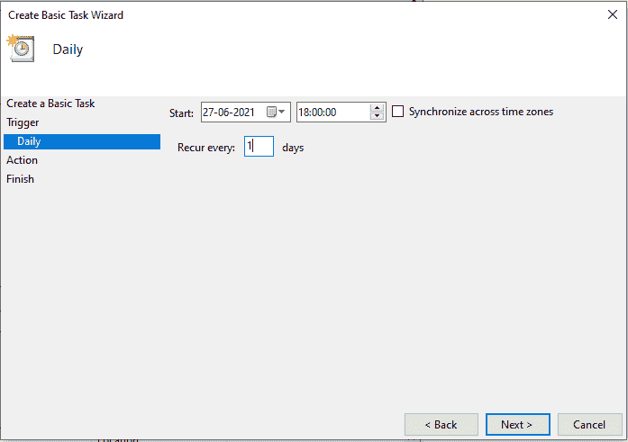
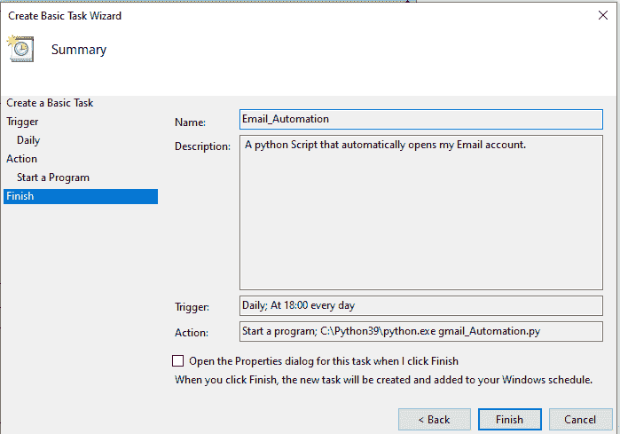
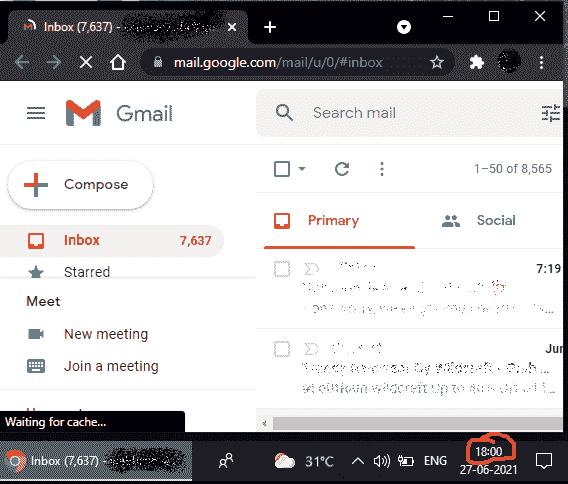

# 安排 Python 脚本每天运行

> 原文:[https://www . geesforgeks . org/schedule-a-python-script-to-run-daily/](https://www.geeksforgeeks.org/schedule-a-python-script-to-run-daily/)

在本文中，我们将看到如何安排 Python 脚本每天运行。安排 Python 脚本每天运行基本上意味着您的 Python 脚本应该每天在您指定的时间自动执行。

### 准备 Python 脚本。

创建您想要安排的 Python 脚本。在我们的例子中，我们制作了一个简单的 Python 脚本，它将打开我们的邮件帐户，每天检查我们的电子邮件。您需要导入“网络浏览器”模块。

或者，您可以使用任何想要安排的 Python 脚本。

## 蟒蛇 3

```py
# Modules which need to be imported
import webbrowser

# Site which you want to Open in your 
# Browser
url = "mail.google.com"

# Below code is used to specify
# location of webbrowser which you 
# want to use.
chrome_path = r'C: \Program Files(x86)\Google\/
Chrome\Application\chrome.exe'

# Below code will open your URL
webbrowser.register(
  'chrome', None, webbrowser.BackgroundBrowser(chrome_path))

webbrowser.get('chrome').open_new_tab(url)
```

**注意:**如果要使用上面的 Python 脚本，请根据系统上的位置更改 chrome_path。

**现在有两种方法可以安排脚本:**

*   使用批处理文件。
*   使用窗口任务计划程序。

### **方法一:使用批处理文件**

**步骤 1:** 创建批处理文件。

打开记事本并遵循以下通用结构:

> “存储 Python exe 的路径\python.exe”“存储 Python 脚本的路径\脚本名. py”
> 
> 中止

**批处理文件示例:**



最后，用您的文件名和“，”保存记事本。bat”扩展，如–“automation . bat”。

### 方法 2:使用 Windows 任务计划程序。

**步骤 1:** 在 Windows 机器上打开任务计划程序应用程序。

> **位置**->C:\程序数据\微软\ Windows \开始菜单\程序\管理工具\任务计划程序



**第二步:**点击“创建基本任务…”在操作选项卡中。并为您想要自动化的任务提供合适的名称和描述，然后单击“下一步”。



**步骤 3:** 在下一步中，您必须选择脚本应该以什么时间间隔执行。选择“每日”，然后单击下一步。现在，您需要指定您的 Python 脚本每天应该在什么时间执行，然后单击下一步。



**步骤 4:** 在下一步中，您需要从给定的选项中选择“启动程序”选项，然后单击“下一步”。在这里选择**(可选-对于创建批处理文件的用户)**现在，如果您遵循**“批处理文件步骤”**，您只需要在程序/脚本字段中输入您创建的批处理文件的文件位置，后跟“\yourbatchfilename.bat”，然后单击下一步并完成您的任务，您的 python 脚本现在将在您指定的时间每天运行。
在本节中，您将需要以下文件的文件位置:

*   **python.exe**–存放 python.exe 的路径(还需要在位置的末尾加上“\python.exe”。)
*   存储 python 脚本文件的路径。

> **在我们的情况下:**
> 
> python.exe 路径-C:\ python 39 \ python . exe
> 
> 我的 python 脚本路径–D:\教程\Python

**第五步:**如下图添加各自的文件位置和参数输入，指定你的 python 脚本名称。


**第 6 步:**在下一个选项卡中，您只需验证您的输入，然后单击“完成”。



就是这样，您的 Python 脚本现在是计划好的，将每天在您指定的时间执行。这是我们执行的 Python 脚本的截图。

