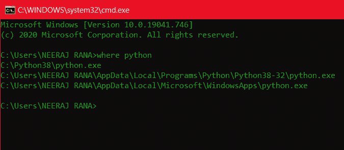
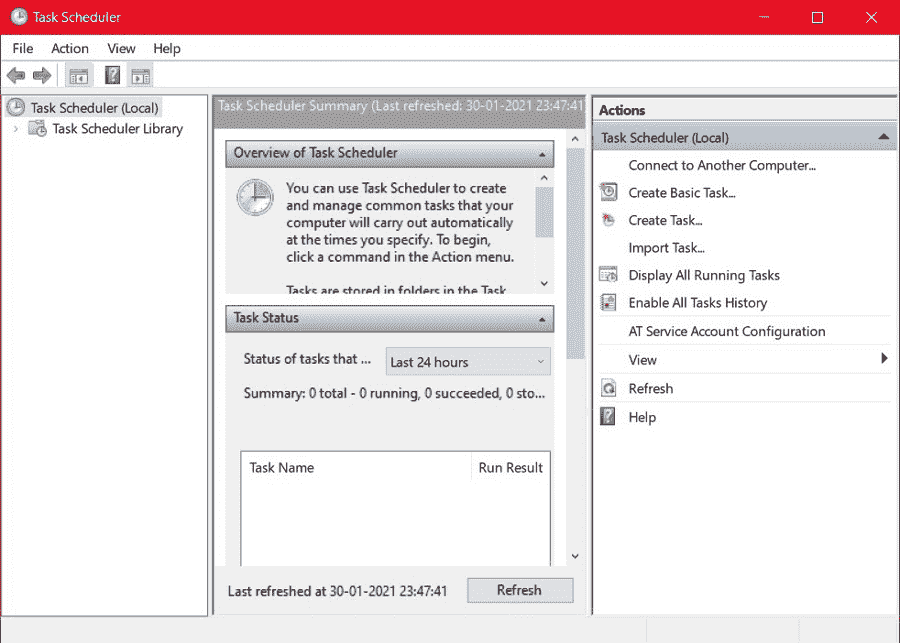
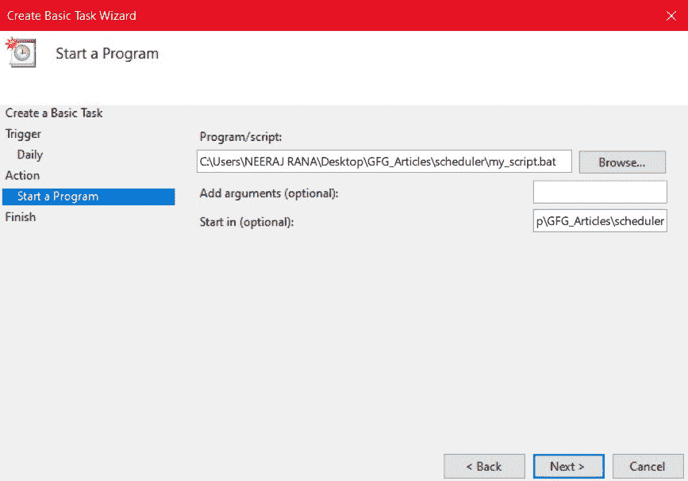
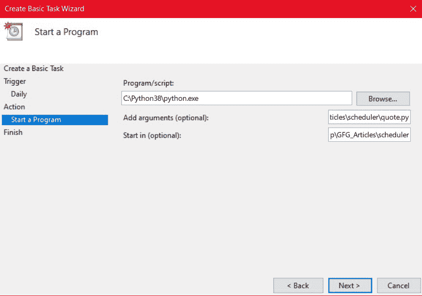
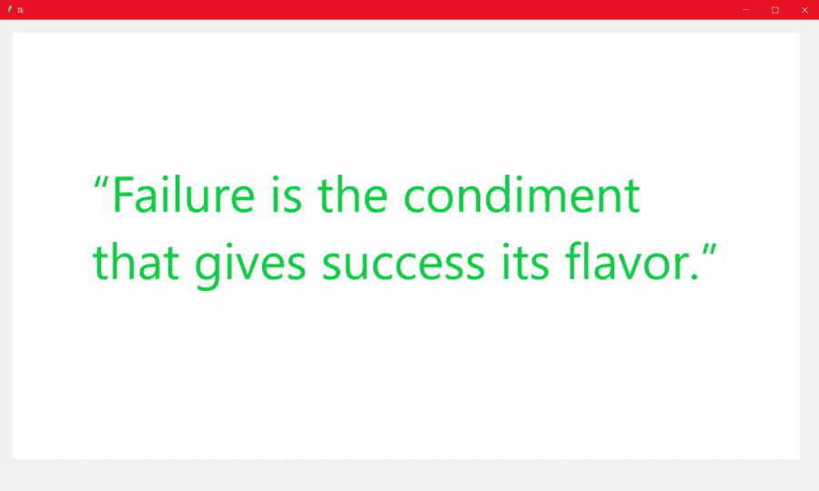

# 使用 Windows 调度程序调度 Python 脚本

> 原文:[https://www . geesforgeks . org/schedule-python-script-use-windows-scheduler/](https://www.geeksforgeeks.org/schedule-python-script-using-windows-scheduler/)

在本文中，我们将使用 windows 任务调度器来调度 python 脚本，即让它在某个时间或某个时间段后自动启动。

**出发前我们需要知道** **以下几点:**

*   **Python 脚本:**它是一堆 Python 代码，旨在由用户从命令行直接执行。其中大多数是自动化脚本，旨在自动化某些任务。这些通常包含几行代码。
*   **Windows 调度程序:** Windows 任务调度程序是一个 Microsoft Windows 组件或程序，它让用户能够调度某些脚本或程序，并在某个时间自动启动它们。它主要用于自动化某些任务，如每日计划、每月数据收集等。

### **让我们逐步实现:**

**第一步:制作 python 脚本**

首先，我们将制作我们想要安排的 python 脚本。如果您已经制作了脚本，请跳过这一部分。如果没有，你可以自己做 python 脚本，或者跟我学。

在这里，我们制作了一个 python 脚本，它从一个文件夹中获取一个随机的励志引用图像，我在这个文件夹中保存了其中的一些并显示出来。您将需要以下 python 包/模块: [tkinter](https://www.geeksforgeeks.org/python-gui-tkinter/) 、 [PIL](https://www.geeksforgeeks.org/python-pil-image-open-method/) 、 [os](https://www.geeksforgeeks.org/os-module-python-examples/) 、 [random](https://www.geeksforgeeks.org/random-numbers-in-python/) 。

## 蟒蛇 3

```py
# Python3 script to display
# random image quotes from a folder

# Importing modules
from tkinter import *
from PIL import ImageTk, Image
import os
import random

# Getting the file name of
# random selected image
name = random.choice(os.listdir(
    "C:\\Users\\NEERAJ RANA\\Desktop\\quotes_folder\\"))

# Appending the rest of the path
# to the filename
file = "C:\\Users\\NEERAJ RANA\\Desktop\\quotes_folder\\" + name

# Displaying the image
root = Tk()
canvas = Canvas(root, width=1300, height=750)
canvas.pack()
img = ImageTk.PhotoImage(Image.open(file))
canvas.create_image(20, 20, anchor=NW, image=img)
root.mainloop()
```

请记住根据系统上的文件夹位置更改文件夹路径。

**现在，有两种方式来安排脚本。第一种方法涉及制作批处理文件，而另一种方法不需要。如果不想制作批处理文件，可以跳过第 3 步。**

**第二步(可选):制作批处理文件**

批处理文件用于通过命令提示符执行命令。它包含一系列您通常在命令提示符下使用的纯文本命令，通常用于执行程序。

我们将制作一个批处理文件来运行我们的 python 脚本。

1.  首先，打开任何文本编辑器。
2.  接下来，在一个空文件中输入以下行:

```py
"C:\Python38\python.exe" "C:\Users\NEERAJ RANA\Desktop\GFG_Articles\scheduler\quote.py"
pause
```

第一个字符串是机器上 python 可执行文件的路径，第二个字符串是保存的 python 脚本的路径。如果不知道 python 可执行文件的路径，打开命令提示符，输入以下命令:**其中 python** 。



哪里命令

如果您看到多条路径，请使用其中任何一条。此外，根据您的系统更改保存的 python 脚本的路径。暂停命令用于暂停批处理程序的处理，并等待用户的输入。最后，用**保存这个文件。蝙蝠**延伸。

**第三步:调度脚本**

*   打开任务计划程序应用程序。应该是这样的:



*   单击右侧操作选项卡中的“创建基本任务...”。
*   在给定字段中输入任务的合适名称和描述，然后单击“下一步”。
*   选择您希望任务执行的频率。您可以选择每天、每周、每月等，然后单击下一步。
*   选择要触发任务的开始日期和时间。另外，选择您希望任务重复/重现的天数，然后单击“下一步”。
*   在“您想执行什么任务？”然后单击下一步。
*   如果您在步骤 2 中创建了批处理文件，只需在程序/脚本部分输入批处理文件的路径。如果跳过步骤 2，请在程序/脚本部分输入 python 可执行文件的路径，并在“添加参数(可选)”部分输入 python 脚本文件的路径。
*   如果您的脚本在某个文件夹中安装了某些依赖项，如浏览器可执行文件，您可以在“开始于(可选)”部分包含文件夹路径，然后单击“下一步”。



如果你制作了一个批处理文件



如果你没有制作批处理文件

*   8:最后，检查所有输入的值，然后单击完成。

现在，在您选择的时间，您的脚本将执行。

