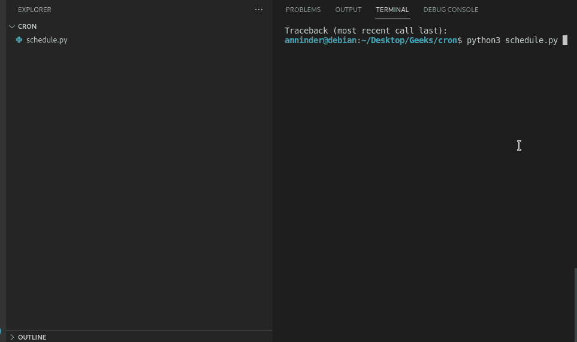
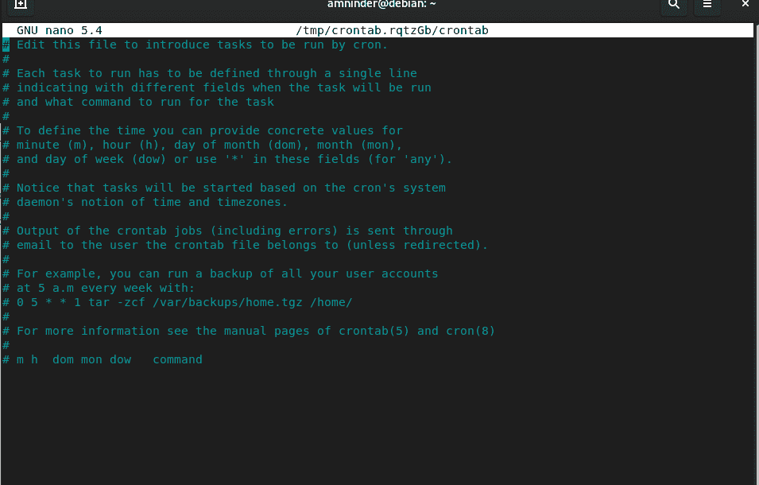
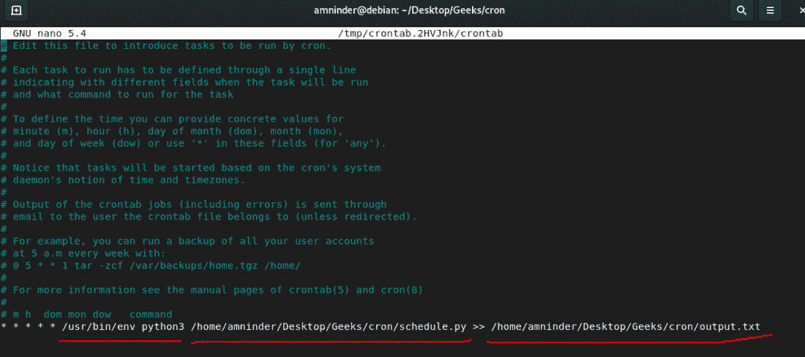
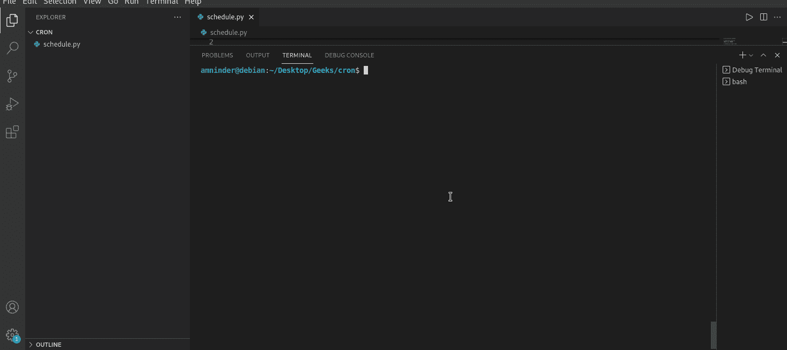

# 在 Linux 上调度 Python 脚本

> 原文:[https://www . geesforgeks . org/scheduling-python-scripts-on-Linux/](https://www.geeksforgeeks.org/scheduling-python-scripts-on-linux/)

有时候我们每天都需要做一个任务，我们可以每天自己做这些重复的任务，也可以利用编程的艺术，通过调度任务来自动化这些重复的任务。今天在这篇文章中，我们将学习如何在 Linux 上调度 python 脚本来完成重复的任务。

我们将使用一个名为 **cron** 的工具来调度 python 脚本。Cron 由 crontab 驱动，crontab 也被称为时间表，因为 cron 这个词来源于希腊语 **Chronos** ，意思是时间和时间表就是简单的表格。

> **语法:** * * * * *命令

在 Crontab 中有六个字段。前五个字段保留给计划执行的日期和时间，最后一个字段保留给要执行的命令。


#### 下面是我们将要安排的 python 脚本:

## 蟒蛇 3

```
#!/usr/bin/env python3

# importing libraries
import os
import random

# setting up folder name
folder_name = "geeksforgeeks"

# entering into the loop
# to create 2 folder every time this script runs
for i in range(2):

    # generating random number between 0 and 9
    number = int(random.randrange(0, 10))

    print("Creating folder {}".format(number))

    # creating directories
    os.mkdir(folder_name+" {}".format(number))
```

**输出:**



## 在 Linux 上调度 Python 脚本:

下面是在 Linux 中调度 python 脚本需要遵循的步骤:

**第一步:**首先，我们必须创建一个我们将要安排的 python 脚本。以上是我们将在本文中使用的 python 脚本。

**步骤 2:** 打开 crontab，创建一个配置文件，用于调度 python 脚本。

**第三步:**在终端运行以下命令，打开 crontab 配置文件。

```
crontab -e
```

这将打开一个编辑器来编辑配置文件，输出应该如下所示:



**第四步:**滚动到文件末尾，写下定时和要执行的命令。

> * * * */usr/bin/env pyt 3/home/amninder/Desktop/Geeks/cron/schedule . py > >/home/amninder/Desktop/Geeks/cron/output . txt

这里，“/usr/bin/env pyt 3/home/amninder/Desktop/Geeks/cron/schedule . py”是我们要计划的脚本的路径，“/home/amninder/Desktop/Geeks/cron/output . txt”是我们要保存输出的文件的路径。所有前 5 个字段上的星号(*)表示脚本将在每分钟、每小时后执行。



要检查日志以查看它是否工作，请运行以下命令:

```
sudo tail -f /var/log/syslog
```

**输出**:



要从 crontab 中删除作业，请运行以下命令。

> **crontab -r** :这将删除当前的 cron 作业。