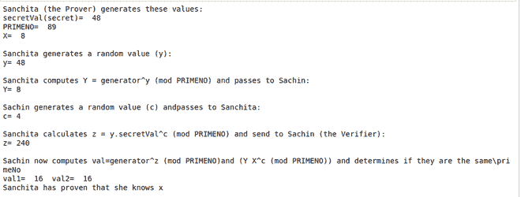

# 施诺尔识别方案

> 原文:[https://www . geesforgeks . org/schnorr-identificati on-scheme/](https://www.geeksforgeeks.org/schnorr-identification-scheme/)

Schnorr 签名以其简单性而闻名，并且是第一个基于某些离散对数问题的困难性的安全性的签名之一。 [Schnorr 数字签名方案](https://www.geeksforgeeks.org/schnorr-digital-signature/)不同于识别方案。私钥持有者使用一个识别方案向您证明他们持有私钥。此外，签名方案还证明，密钥持有者将他们的私钥与特定消息一起用作输入值，以便在该特定消息上生成可验证的数字签名。

## 用**离散对数**识别**方案**

**等价的含义“≦”**

整数模 36 的元素是 0，1，.。。, 34, 35.那么 41 就相当于 5 模 36，写成 41 ≡ 5 模 36，因为当 41 除以 36，余数是 5。

同样，我们也有 57 ≡ 5 mod 26。

**离散对数:**

离散对数是关于乘法循环群定义的对数。如果 G 是乘法循环群，G 是 G 的生成元，那么从循环群的定义中，我们知道 G 中的每一个元素 h 都可以写成 g <sup>x</sup> 对于某个 x，G 中 h 的以 G 为底的离散对数定义为 x。

如果群是 A，生成器是 2，那么 1 的离散对数是 4，因为 24 ≡ 1 mod 5。

对数对数对数 <sub>b</sub> (a)是数字 x，使得对于给定的数字 a 和 b，b <sup>x</sup> = a。类似地，在任何组 G 中，可以为所有整数 k 定义幂 b <sup>k</sup> ，离散对数对数对数 <sub>b</sub> (a)是整数 k，使得 b <sup>k</sup> = a。

**我们有以下 3 个参数:**

*   g 是发电机，
*   x 是秘密值
*   p 是质数。

**算法**

证明者桑奇塔有一个证明公钥(g，X)，其中 g 是一个生成器，X=gx(modN)。在桑奇塔生成她的公共证明密钥后，她将被沙欣挑战以产生正确的结果。离散对数是满足方程 ax≡b(modm)的整数 x，其中 a 和 m 是相对素数。

通过施诺尔识别，桑奇塔(证明者)具有(N，g，X)的证明公钥和(N，X)的证明密钥。n 是模运算的素数，x 是秘密，其中:

```py
X←gx(modN)

```

在登记秘密时，桑奇塔生成一个随机值(Y)，然后计算 Y:

```py
Y←gy(modN)

```

该值被发送给沙钦(他是验证者)。然后，萨钦生成一个随机值(c)，并将其发送给桑奇塔。这是桑奇塔产生正确结果的挑战。桑奇塔然后计算:

```py
z←(y+xc)(modN)

```

然后他把这个发给萨钦，以证明他知道 x。然后萨钦计算两个值:

```py
val1 = YXc(modN)
val2 = gz(modN)

```

如果值相同(val1≡val2)，桑奇塔已经证明她知道 x。

这是因为:

```py
YXc = gygxc = gy+cx
gz = gy+cx

```

## 蟒蛇 3

```py
import random
import sys

PRIMENO = 89
generator = 3

secretVal = random.randint(1, 97)

X = pow(generator, secretVal) % PRIMENO
y = random.randint(1, 97)
Y = pow(generator, y) % PRIMENO

print("Sanchita (the Prover) generates these values:")
print("secretVal(secret)= ", secretVal)
print("PRIMENO= ", PRIMENO)
print("X= ", X)

print("\nSanchita generates a random value (y):")
print("y=", y)

print("\nSanchita computes Y = generator^y \
(mod PRIMENO) and passes to Sachin:")

print("Y=", Y)

print("\nSachin generates a random value (c) and\
passes to Sanchita:")

c = random.randint(1, 97)
print("c=", c)
print("\nSanchita calculates z = y.secretVal^c \
(mod PRIMENO) and send to Sachin (the Verifier):")

z = (y + c * secretVal)

print("z=", z)

print("\nSachin now computes val=generator^z (mod PRIMENO)\
and (Y X^c (mod PRIMENO)) and determines if they are the same\primeNo")

val1 = pow(generator, z) % PRIMENO
val2 = (Y * (X**c)) % PRIMENO

print("val1= ", val1, end=' ')
print(" val2= ", val2)

if (val1 == val2):
    print("Sanchita has proven that she knows x")
else:
    print("Failure to prove")
```

**输出:**



**应用:**

*   它在密码研究中有它的使用案例
*   它用于零知识证明的实现。
*   它提供了一种更安全的身份验证方式，证明者无需透露其密钥。