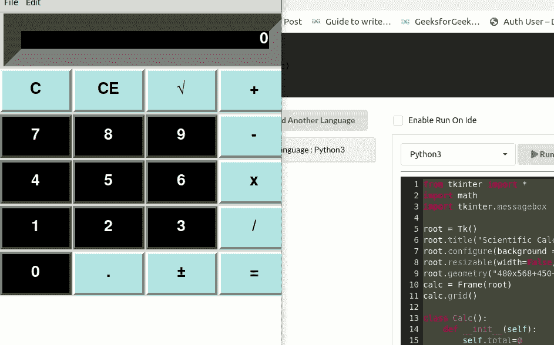

# Python 中使用 Tkinter 的科学 GUI 计算器

> 原文:[https://www . geesforgeks . org/scientific-GUI-calculator-using-tkinter-in-python/](https://www.geeksforgeeks.org/scientific-gui-calculator-using-tkinter-in-python/)

**先决条件:** [Python 图形用户界面–tkinter](https://www.geeksforgeeks.org/python-gui-tkinter/)

在本文中，我们将使用 Python 创建图形用户界面科学计算器。正如你所看到的，现在计算大量的数字是困难的或耗时的。我们使用 Python 创建了一个简单的科学计算器图形用户界面，允许您执行简单和复杂的计算。为了实现图形用户界面，我们将使用 Python 的 [Tkinter](https://www.geeksforgeeks.org/python-gui-tkinter/) 模块。

## 逐步实施

**步骤 1:** 导入模块

## 蟒蛇 3

```py
from tkinter import *
import math
import tkinter.messagebox
```

**步骤 2:** 这里我们将使用 Tkinter 为计算器的 GUI 创建几何图形或所谓的布局。

## 蟒蛇 3

```py
root = Tk()

# sets the name on the top of the gui
root.title("Scientific Calculator") 

# sets the background color of the calculator 
# as white
root.configure(background = 'white') 

# fixed the width and height of the gui,
# hence can't be expanded/stretched
root.resizable(width=False, height=False)

# sets the geometry
root.geometry("480x568+450+90") 

# holds the buttons in the calculator,
# act as a container for numbers and operators
calc = Frame(root)

# create a grid like pattern of the frame 
# i.e buttons
calc.grid()
```

**第三步:**现在我们将创建一个类，在这个类中，我们将创建科学计算器的所有功能，以便它们可以被调用并轻松执行。

## 蟒蛇 3

```py
class Calc():
    def __init__(self):
        self.total = 0
        self.current = ''
        self.input_value = True
        self.check_sum = False
        self.op = ''
        self.result = False

    def numberEnter(self, num):
        self.result = False
        firstnum = txtDisplay.get()
        secondnum = str(num)
        if self.input_value:
            self.current = secondnum
            self.input_value = False
        else:
            if secondnum == '.':
                if secondnum in firstnum:
                    return
            self.current = firstnum+secondnum
        self.display(self.current)

    def sum_of_total(self):
        self.result = True
        self.current = float(self.current)
        if self.check_sum == True:
            self.valid_function()
        else:
            self.total = float(txtDisplay.get())

    def display(self, value):
        txtDisplay.delete(0, END)
        txtDisplay.insert(0, value)

    def valid_function(self):
        if self.op == "add":
            self.total += self.current
        if self.op == "sub":
            self.total -= self.current
        if self.op == "multi":
            self.total *= self.current
        if self.op == "divide":
            self.total /= self.current
        if self.op == "mod":
            self.total %= self.current
        self.input_value = True
        self.check_sum = False
        self.display(self.total)

    def operation(self, op):
        self.current = float(self.current)
        if self.check_sum:
            self.valid_function()
        elif not self.result:
            self.total = self.current
            self.input_value = True
        self.check_sum = True
        self.op = op
        self.result = False

    def Clear_Entry(self):
        self.result = False
        self.current = "0"
        self.display(0)
        self.input_value = True

    def All_Clear_Entry(self):
        self.Clear_Entry()
        self.total = 0

    def pi(self):
        self.result = False
        self.current = math.pi
        self.display(self.current)

    def tau(self):
        self.result = False
        self.current = math.tau
        self.display(self.current)

    def e(self):
        self.result = False
        self.current = math.e
        self.display(self.current)

    def mathPM(self):
        self.result = False
        self.current = -(float(txtDisplay.get()))
        self.display(self.current)

    def squared(self):
        self.result = False
        self.current = math.sqrt(float(txtDisplay.get()))
        self.display(self.current)

    def cos(self):
        self.result = False
        self.current = math.cos(math.radians(float(txtDisplay.get())))
        self.display(self.current)

    def cosh(self):
        self.result = False
        self.current = math.cosh(math.radians(float(txtDisplay.get())))
        self.display(self.current)

    def tan(self):
        self.result = False
        self.current = math.tan(math.radians(float(txtDisplay.get())))
        self.display(self.current)

    def tanh(self):
        self.result = False
        self.current = math.tanh(math.radians(float(txtDisplay.get())))
        self.display(self.current)

    def sin(self):
        self.result = False
        self.current = math.sin(math.radians(float(txtDisplay.get())))
        self.display(self.current)

    def sinh(self):
        self.result = False
        self.current = math.sinh(math.radians(float(txtDisplay.get())))
        self.display(self.current)

    def log(self):
        self.result = False
        self.current = math.log(float(txtDisplay.get()))
        self.display(self.current)

    def exp(self):
        self.result = False
        self.current = math.exp(float(txtDisplay.get()))
        self.display(self.current)

    def acosh(self):
        self.result = False
        self.current = math.acosh(float(txtDisplay.get()))
        self.display(self.current)

    def asinh(self):
        self.result = False
        self.current = math.asinh(float(txtDisplay.get()))
        self.display(self.current)

    def expm1(self):
        self.result = False
        self.current = math.expm1(float(txtDisplay.get()))
        self.display(self.current)

    def lgamma(self):
        self.result = False
        self.current = math.lgamma(float(txtDisplay.get()))
        self.display(self.current)

    def degrees(self):
        self.result = False
        self.current = math.degrees(float(txtDisplay.get()))
        self.display(self.current)

    def log2(self):
        self.result = False
        self.current = math.log2(float(txtDisplay.get()))
        self.display(self.current)

    def log10(self):
        self.result = False
        self.current = math.log10(float(txtDisplay.get()))
        self.display(self.current)

    def log1p(self):
        self.result = False
        self.current = math.log1p(float(txtDisplay.get()))
        self.display(self.current)

added_value = Calc()
```

**第四步:**下面的代码将通过在入口函数内部传递字体样式、字体大小、背景颜色、前景色作为参数，在计算器的 GUI 中创建一个显示。

## 蟒蛇 3

```py
txtDisplay = Entry(calc,
                   font=('Helvetica', 20,
                         'bold'),
                   bg='black',
                   fg='white',
                   bd=30,
                   width=28,
                   justify=RIGHT)

txtDisplay.grid(row=0,
                column=0,
                columnspan=4,
                pady=1)

txtDisplay.insert(0, "0")
```

**第五步:**这里我们将为计算器创建一个数字键盘。

## 蟒蛇 3

```py
# store all the numbers in a variable
numberpad = "789456123"

# here i will count the rows for placing buttons
# in grid
i = 0

# create an empty list to store
# each button with its particular specifications
btn = []

# j is in that range to place
# the button in that particular row
for j in range(2, 5):

        # k is in this range to place the
    # button in that particular column
    for k in range(3):
        btn.append(Button(calc,
                          width=6,
                          height=2,
                          bg='black',
                          fg='white',
                          font=('Helvetica', 20, 'bold'),
                          bd=4, text=numberpad[i]))

        # set buttons in row & column and
        # separate them with a padding of 1 unit
        btn[i].grid(row=j, column=k, pady=1)

        # put that number as a symbol on that button
        btn[i]["command"] = lambda x=numberpad[i]: added_value.numberEnter(x)
        i += 1
```

**第六步:**现在我们将所有按钮/操作符放置在网格中各自的位置。这取决于您根据自己的选择通过更改它们的行和列值来设置它们。在这种情况下，每个按钮功能只是以操作符的名称、宽度、高度、背景、前景、字体和按钮的相应列&行位置作为参数。

## 蟒蛇 3

```py
btnClear = Button(calc, text=chr(67),
                  width=6, height=2,
                  bg='powder blue',
                  font=('Helvetica', 20, 'bold'),
                  bd=4,
                  command=added_value.Clear_Entry).grid(
    row=1, column=0, pady=1)

btnAllClear = Button(calc, text=chr(67)+chr(69),
                     width=6, height=2,
                     bg='powder blue',
                     font=('Helvetica',
                           20, 'bold'), bd=4,
                     command=added_value.All_Clear_Entry).grid(
    row=1, column=1, pady=1)

btnsq = Button(calc, text="\u221A", width=6,
               height=2, bg='powder blue',
               font=('Helvetica', 20, 'bold'),
               bd=4, command=added_value.squared).grid(
    row=1, column=2, pady=1)

btnAdd = Button(calc, text="+", width=6,
                height=2, bg='powder blue',
                font=('Helvetica', 20, 'bold'),
                bd=4, command=lambda: added_value.operation("add")
                ).grid(row=1, column=3, pady=1)

btnSub = Button(calc, text="-", width=6,
                height=2, bg='powder blue',
                font=('Helvetica', 20, 'bold'),
                bd=4,
                command=lambda: added_value.operation("sub")
                ).grid(row=2, column=3, pady=1)

btnMul = Button(calc, text="x", width=6, height=2,
                bg='powder blue',
                font=('Helvetica', 20, 'bold'),
                bd=4, command=lambda: added_value.operation("multi")
                ).grid(row=3, column=3, pady=1)

btnDiv = Button(calc, text="/", width=6,
                height=2, bg='powder blue',
                font=('Helvetica', 20, 'bold'),
                bd=4, command=lambda: added_value.operation("divide")
                ).grid(row=4, column=3, pady=1)

btnZero = Button(calc, text="0", width=6,
                 height=2, bg='black', fg='white',
                 font=('Helvetica', 20, 'bold'),
                 bd=4, command=lambda: added_value.numberEnter(0)
                 ).grid(row=5, column=0, pady=1)

btnDot = Button(calc, text=".", width=6,
                height=2, bg='powder blue',
                font=('Helvetica', 20, 'bold'),
                bd=4, command=lambda: added_value.numberEnter(".")
                ).grid(row=5, column=1, pady=1)
btnPM = Button(calc, text=chr(177), width=6,
               height=2, bg='powder blue',
               font=('Helvetica', 20, 'bold'),
               bd=4, command=added_value.mathPM
               ).grid(row=5, column=2, pady=1)

btnEquals = Button(calc, text="=", width=6,
                   height=2, bg='powder blue',
                   font=('Helvetica', 20, 'bold'),
                   bd=4, command=added_value.sum_of_total
                   ).grid(row=5, column=3, pady=1)
# ROW 1 :

btnPi = Button(calc, text="pi", width=6,
               height=2, bg='black', fg='white',
               font=('Helvetica', 20, 'bold'),
               bd=4, command=added_value.pi
               ).grid(row=1, column=4, pady=1)

btnCos = Button(calc, text="Cos", width=6,
                height=2, bg='black', fg='white',
                font=('Helvetica', 20, 'bold'),
                bd=4, command=added_value.cos
                ).grid(row=1, column=5, pady=1)

btntan = Button(calc, text="tan", width=6,
                height=2, bg='black', fg='white',
                font=('Helvetica', 20, 'bold'),
                bd=4, command=added_value.tan
                ).grid(row=1, column=6, pady=1)

btnsin = Button(calc, text="sin", width=6,
                height=2, bg='black', fg='white',
                font=('Helvetica', 20, 'bold'),
                bd=4, command=added_value.sin
                ).grid(row=1, column=7, pady=1)

# ROW 2 :

btn2Pi = Button(calc, text="2pi", width=6,
                height=2, bg='black', fg='white',
                font=('Helvetica', 20, 'bold'),
                bd=4, command=added_value.tau
                ).grid(row=2, column=4, pady=1)

btnCosh = Button(calc, text="Cosh", width=6,
                 height=2, bg='black', fg='white',
                 font=('Helvetica', 20, 'bold'),
                 bd=4, command=added_value.cosh
                 ).grid(row=2, column=5, pady=1)

btntanh = Button(calc, text="tanh", width=6,
                 height=2, bg='black', fg='white',
                 font=('Helvetica', 20, 'bold'),
                 bd=4, command=added_value.tanh
                 ).grid(row=2, column=6, pady=1)

btnsinh = Button(calc, text="sinh", width=6,
                 height=2, bg='black', fg='white',
                 font=('Helvetica', 20, 'bold'),
                 bd=4, command=added_value.sinh
                 ).grid(row=2, column=7, pady=1)

# ROW 3 :

btnlog = Button(calc, text="log", width=6,
                height=2, bg='black', fg='white',
                font=('Helvetica', 20, 'bold'),
                bd=4, command=added_value.log
                ).grid(row=3, column=4, pady=1)

btnExp = Button(calc, text="exp", width=6,
                height=2, bg='black', fg='white',
                font=('Helvetica', 20, 'bold'),
                bd=4, command=added_value.exp
                ).grid(row=3, column=5, pady=1)

btnMod = Button(calc, text="Mod", width=6,
                height=2, bg='black', fg='white',
                font=('Helvetica', 20, 'bold'),
                bd=4, command=lambda: added_value.operation("mod")
                ).grid(row=3, column=6, pady=1)

btnE = Button(calc, text="e", width=6,
              height=2, bg='black', fg='white',
              font=('Helvetica', 20, 'bold'),
              bd=4, command=added_value.e
              ).grid(row=3, column=7, pady=1)

# ROW 4 :

btnlog10 = Button(calc, text="log10", width=6,
                  height=2, bg='black', fg='white',
                  font=('Helvetica', 20, 'bold'),
                  bd=4, command=added_value.log10
                  ).grid(row=4, column=4, pady=1)

btncos = Button(calc, text="log1p", width=6,
                height=2, bg='black', fg='white',
                font=('Helvetica', 20, 'bold'),
                bd=4, command=added_value.log1p
                ).grid(row=4, column=5, pady=1)

btnexpm1 = Button(calc, text="expm1", width=6,
                  height=2, bg='black', fg='white',
                  font=('Helvetica', 20, 'bold'),
                  bd=4, command=added_value.expm1
                  ).grid(row=4, column=6, pady=1)

btngamma = Button(calc, text="gamma", width=6,
                  height=2, bg='black', fg='white',
                  font=('Helvetica', 20, 'bold'),
                  bd=4, command=added_value.lgamma
                  ).grid(row=4, column=7, pady=1)
# ROW 5 :

btnlog2 = Button(calc, text="log2", width=6,
                 height=2, bg='black', fg='white',
                 font=('Helvetica', 20, 'bold'),
                 bd=4, command=added_value.log2
                 ).grid(row=5, column=4, pady=1)

btndeg = Button(calc, text="deg", width=6,
                height=2, bg='black', fg='white',
                font=('Helvetica', 20, 'bold'),
                bd=4, command=added_value.degrees
                ).grid(row=5, column=5, pady=1)

btnacosh = Button(calc, text="acosh", width=6,
                  height=2, bg='black', fg='white',
                  font=('Helvetica', 20, 'bold'),
                  bd=4, command=added_value.acosh
                  ).grid(row=5, column=6, pady=1)

btnasinh = Button(calc, text="asinh", width=6,
                  height=2, bg='black', fg='white',
                  font=('Helvetica', 20, 'bold'),
                  bd=4, command=added_value.asinh
                  ).grid(row=5, column=7, pady=1)

lblDisplay = Label(calc, text="Scientific Calculator",
                   font=('Helvetica', 30, 'bold'),
                   bg='black', fg='white', justify=CENTER)
lblDisplay.grid(row=0, column=4, columnspan=4)
```

**第 7 步:**现在我们终于要创建计算器 GUI 的菜单栏了。

## 蟒蛇 3

```py
# use askyesno function to
# stop/continue the program exection 
def iExit(): 
    iExit = tkinter.messagebox.askyesno("Scientific Calculator",
                                        "Do you want to exit ?")
    if iExit>0:
        root.destroy()
        return

def Scientific():
    root.resizable(width=False, height=False)
    root.geometry("944x568+0+0")

def Standard():
    root.resizable(width=False, height=False)
    root.geometry("480x568+0+0")

menubar = Menu(calc)

# ManuBar 1 :

filemenu = Menu(menubar, tearoff = 0)
menubar.add_cascade(label = 'File', menu = filemenu)
filemenu.add_command(label = "Standard", command = Standard)
filemenu.add_command(label = "Scientific", command = Scientific)
filemenu.add_separator()
filemenu.add_command(label = "Exit", command = iExit)

# ManuBar 2 :

editmenu = Menu(menubar, tearoff = 0)
menubar.add_cascade(label = 'Edit', menu = editmenu)
editmenu.add_command(label = "Cut")
editmenu.add_command(label = "Copy")
editmenu.add_separator()
editmenu.add_command(label = "Paste")

root.config(menu=menubar)

root.mainloop()
```

**下面是完整的实现:**

## 蟒蛇 3

```py
from tkinter import *
import math
import tkinter.messagebox

root = Tk()
root.title("Scientific Calculator")
root.configure(background = 'white')
root.resizable(width=False, height=False)
root.geometry("480x568+450+90")
calc = Frame(root)
calc.grid()

class Calc():
    def __init__(self):
        self.total=0
        self.current=''
        self.input_value=True
        self.check_sum=False
        self.op=''
        self.result=False

    def numberEnter(self, num):
        self.result=False
        firstnum=txtDisplay.get()
        secondnum=str(num)
        if self.input_value:
            self.current = secondnum
            self.input_value=False
        else:
            if secondnum == '.':
                if secondnum in firstnum:
                    return
            self.current = firstnum+secondnum
        self.display(self.current)

    def sum_of_total(self):
        self.result=True
        self.current=float(self.current)
        if self.check_sum==True:
            self.valid_function()
        else:
            self.total=float(txtDisplay.get())

    def display(self, value):
        txtDisplay.delete(0, END)
        txtDisplay.insert(0, value)

    def valid_function(self):
        if self.op == "add":
            self.total += self.current
        if self.op == "sub":
            self.total -= self.current
        if self.op == "multi":
            self.total *= self.current
        if self.op == "divide":
            self.total /= self.current
        if self.op == "mod":
            self.total %= self.current
        self.input_value=True
        self.check_sum=False
        self.display(self.total)

    def operation(self, op):
        self.current = float(self.current)
        if self.check_sum:
            self.valid_function()
        elif not self.result:
            self.total=self.current
            self.input_value=True
        self.check_sum=True
        self.op=op
        self.result=False

    def Clear_Entry(self):
        self.result = False
        self.current = "0"
        self.display(0)
        self.input_value=True

    def All_Clear_Entry(self):
        self.Clear_Entry()
        self.total=0

    def pi(self):
        self.result =  False
        self.current = math.pi
        self.display(self.current)

    def tau(self):
        self.result =  False
        self.current = math.tau
        self.display(self.current)

    def e(self):
        self.result =  False
        self.current = math.e
        self.display(self.current)

    def mathPM(self):
        self.result = False
        self.current = -(float(txtDisplay.get()))
        self.display(self.current)

    def squared(self):
        self.result = False
        self.current = math.sqrt(float(txtDisplay.get()))
        self.display(self.current)

    def cos(self):
        self.result = False
        self.current = math.cos(math.radians(float(txtDisplay.get())))
        self.display(self.current)

    def cosh(self):
        self.result = False
        self.current = math.cosh(math.radians(float(txtDisplay.get())))
        self.display(self.current)

    def tan(self):
        self.result = False
        self.current = math.tan(math.radians(float(txtDisplay.get())))
        self.display(self.current)

    def tanh(self):
        self.result = False
        self.current = math.tanh(math.radians(float(txtDisplay.get())))
        self.display(self.current)

    def sin(self):
        self.result = False
        self.current = math.sin(math.radians(float(txtDisplay.get())))
        self.display(self.current)

    def sinh(self):
        self.result = False
        self.current = math.sinh(math.radians(float(txtDisplay.get())))
        self.display(self.current)

    def log(self):
        self.result = False
        self.current = math.log(float(txtDisplay.get()))
        self.display(self.current)

    def exp(self):
        self.result = False
        self.current = math.exp(float(txtDisplay.get()))
        self.display(self.current)

    def acosh(self):
        self.result = False
        self.current = math.acosh(float(txtDisplay.get()))
        self.display(self.current)

    def asinh(self):
        self.result = False
        self.current = math.asinh(float(txtDisplay.get()))
        self.display(self.current)

    def expm1(self):
        self.result = False
        self.current = math.expm1(float(txtDisplay.get()))
        self.display(self.current)

    def lgamma(self):
        self.result = False
        self.current = math.lgamma(float(txtDisplay.get()))
        self.display(self.current)

    def degrees(self):
        self.result = False
        self.current = math.degrees(float(txtDisplay.get()))
        self.display(self.current)

    def log2(self):
        self.result = False
        self.current = math.log2(float(txtDisplay.get()))
        self.display(self.current)

    def log10(self):
        self.result = False
        self.current = math.log10(float(txtDisplay.get()))
        self.display(self.current)

    def log1p(self):
        self.result = False
        self.current = math.log1p(float(txtDisplay.get()))
        self.display(self.current)

added_value = Calc()

txtDisplay = Entry(calc, font=('Helvetica',20,'bold'),
                   bg='black',fg='white',
                   bd=30,width=28,justify=RIGHT)
txtDisplay.grid(row=0,column=0, columnspan=4, pady=1)
txtDisplay.insert(0,"0")

numberpad = "789456123"
i=0
btn = []
for j in range(2,5):
    for k in range(3):
        btn.append(Button(calc, width=6, height=2,
                          bg='black',fg='white',
                          font=('Helvetica',20,'bold'),
                          bd=4,text=numberpad[i]))
        btn[i].grid(row=j, column= k, pady = 1)
        btn[i]["command"]=lambda x=numberpad[i]:added_value.numberEnter(x)
        i+=1

btnClear = Button(calc, text=chr(67),width=6,
                  height=2,bg='powder blue',
                  font=('Helvetica',20,'bold')
                  ,bd=4, command=added_value.Clear_Entry
                 ).grid(row=1, column= 0, pady = 1)

btnAllClear = Button(calc, text=chr(67)+chr(69),
                     width=6, height=2,
                     bg='powder blue', 
                     font=('Helvetica',20,'bold'),
                     bd=4,
                     command=added_value.All_Clear_Entry
                    ).grid(row=1, column= 1, pady = 1)

btnsq = Button(calc, text="\u221A",width=6, height=2,
               bg='powder blue', font=('Helvetica',
                                       20,'bold'),
               bd=4,command=added_value.squared
              ).grid(row=1, column= 2, pady = 1)

btnAdd = Button(calc, text="+",width=6, height=2,
                bg='powder blue',
                font=('Helvetica',20,'bold'),
                bd=4,command=lambda:added_value.operation("add")
                ).grid(row=1, column= 3, pady = 1)

btnSub = Button(calc, text="-",width=6,
                height=2,bg='powder blue',
                font=('Helvetica',20,'bold'),
                bd=4,command=lambda:added_value.operation("sub")
                ).grid(row=2, column= 3, pady = 1)

btnMul = Button(calc, text="x",width=6, 
                height=2,bg='powder blue', 
                font=('Helvetica',20,'bold'),
                bd=4,command=lambda:added_value.operation("multi")
                ).grid(row=3, column= 3, pady = 1)

btnDiv = Button(calc, text="/",width=6, 
                height=2,bg='powder blue',
                font=('Helvetica',20,'bold'),
                bd=4,command=lambda:added_value.operation("divide")
                ).grid(row=4, column= 3, pady = 1)

btnZero = Button(calc, text="0",width=6,
                 height=2,bg='black',fg='white',
                 font=('Helvetica',20,'bold'),
                 bd=4,command=lambda:added_value.numberEnter(0)
                 ).grid(row=5, column= 0, pady = 1)

btnDot = Button(calc, text=".",width=6,
                height=2,bg='powder blue', 
                font=('Helvetica',20,'bold'),
                bd=4,command=lambda:added_value.numberEnter(".")
                ).grid(row=5, column= 1, pady = 1)
btnPM = Button(calc, text=chr(177),width=6, 
               height=2,bg='powder blue', font=('Helvetica',20,'bold'),
               bd=4,command=added_value.mathPM
              ).grid(row=5, column= 2, pady = 1)

btnEquals = Button(calc, text="=",width=6,
                   height=2,bg='powder blue',
                   font=('Helvetica',20,'bold'),
                   bd=4,command=added_value.sum_of_total
                  ).grid(row=5, column= 3, pady = 1)
# ROW 1 :
btnPi = Button(calc, text="pi",width=6,
               height=2,bg='black',fg='white', 
               font=('Helvetica',20,'bold'),
               bd=4,command=added_value.pi
              ).grid(row=1, column= 4, pady = 1)

btnCos = Button(calc, text="Cos",width=6, 
                height=2,bg='black',fg='white',
                font=('Helvetica',20,'bold'),
                bd=4,command=added_value.cos
               ).grid(row=1, column= 5, pady = 1)

btntan = Button(calc, text="tan",width=6, 
                height=2,bg='black',fg='white',
                font=('Helvetica',20,'bold'),
                bd=4,command=added_value.tan
               ).grid(row=1, column= 6, pady = 1)

btnsin = Button(calc, text="sin",width=6,
                height=2,bg='black',fg='white',
                font=('Helvetica',20,'bold'),
                bd=4,command=added_value.sin
               ).grid(row=1, column= 7, pady = 1)

# ROW 2 :
btn2Pi = Button(calc, text="2pi",width=6, 
                height=2,bg='black',fg='white',
                font=('Helvetica',20,'bold'),
                bd=4,command=added_value.tau
               ).grid(row=2, column= 4, pady = 1)

btnCosh = Button(calc, text="Cosh",width=6,
                 height=2,bg='black',fg='white',
                 font=('Helvetica',20,'bold'),
                 bd=4,command=added_value.cosh
                ).grid(row=2, column= 5, pady = 1)

btntanh = Button(calc, text="tanh",width=6, 
                 height=2,bg='black',fg='white',
                 font=('Helvetica',20,'bold'),
                 bd=4,command=added_value.tanh
                ).grid(row=2, column= 6, pady = 1)

btnsinh = Button(calc, text="sinh",width=6, 
                 height=2,bg='black',fg='white',
                 font=('Helvetica',20,'bold'),
                 bd=4,command=added_value.sinh
                ).grid(row=2, column= 7, pady = 1)

# ROW 3 :
btnlog = Button(calc, text="log",width=6,
                height=2,bg='black',fg='white',
                font=('Helvetica',20,'bold'),
                bd=4,command=added_value.log
               ).grid(row=3, column= 4, pady = 1)

btnExp = Button(calc, text="exp",width=6, height=2,
                bg='black',fg='white',
                font=('Helvetica',20,'bold'),
                bd=4,command=added_value.exp
               ).grid(row=3, column= 5, pady = 1)

btnMod = Button(calc, text="Mod",width=6,
                height=2,bg='black',fg='white', 
                font=('Helvetica',20,'bold'),
                bd=4,command=lambda:added_value.operation("mod")
                ).grid(row=3, column= 6, pady = 1)

btnE   = Button(calc, text="e",width=6, 
                height=2,bg='black',fg='white',
                font=('Helvetica',20,'bold'),
                bd=4,command=added_value.e
               ).grid(row=3, column= 7, pady = 1)

# ROW 4 :
btnlog10 = Button(calc, text="log10",width=6, 
                  height=2,bg='black',fg='white', 
                  font=('Helvetica',20,'bold'),
                  bd=4,command=added_value.log10
                 ).grid(row=4, column= 4, pady = 1)

btncos   = Button(calc, text="log1p",width=6,
                  height=2,bg='black',fg='white',
                  font=('Helvetica',20,'bold'),
                  bd=4,command=added_value.log1p
                 ).grid(row=4, column= 5, pady = 1)

btnexpm1 = Button(calc, text="expm1",width=6,
                  height=2,bg='black',fg='white',
                  font=('Helvetica',20,'bold'),
                  bd = 4,command=added_value.expm1
                 ).grid(row=4, column= 6, pady = 1)

btngamma = Button(calc, text="gamma",width=6,
                  height=2,bg='black',fg='white',
                  font=('Helvetica',20,'bold'),
                  bd=4,command=added_value.lgamma
                 ).grid(row=4, column= 7, pady = 1)
# ROW 5 :
btnlog2 = Button(calc, text="log2",width=6, 
                 height=2,bg='black',fg='white',
                 font=('Helvetica',20,'bold'),
                 bd=4,command=added_value.log2
                ).grid(row=5, column= 4, pady = 1)

btndeg = Button(calc, text="deg",width=6, 
                height=2,bg='black',fg='white',
                font=('Helvetica',20,'bold'),
                bd=4,command=added_value.degrees
               ).grid(row=5, column= 5, pady = 1)

btnacosh = Button(calc, text="acosh",width=6,
                  height=2,bg='black',fg='white',
                  font=('Helvetica',20,'bold'),
                  bd=4,command=added_value.acosh
                 ).grid(row=5, column= 6, pady = 1)

btnasinh = Button(calc, text="asinh",width=6, 
                  height=2,bg='black',fg='white',
                  font=('Helvetica',20,'bold'),
                  bd=4,command=added_value.asinh
                 ).grid(row=5, column= 7, pady = 1)

lblDisplay = Label(calc, text = "Scientific Calculator",
                   font=('Helvetica',30,'bold'),
                   bg='black',fg='white',justify=CENTER)

lblDisplay.grid(row=0, column= 4,columnspan=4)

def iExit():
    iExit = tkinter.messagebox.askyesno("Scientific Calculator",
                                        "Do you want to exit ?")
    if iExit>0:
        root.destroy()
        return

def Scientific():
    root.resizable(width=False, height=False)
    root.geometry("944x568+0+0")

def Standard():
    root.resizable(width=False, height=False)
    root.geometry("480x568+0+0")

menubar = Menu(calc)

# ManuBar 1 :
filemenu = Menu(menubar, tearoff = 0)
menubar.add_cascade(label = 'File', menu = filemenu)
filemenu.add_command(label = "Standard", command = Standard)
filemenu.add_command(label = "Scientific", command = Scientific)
filemenu.add_separator()
filemenu.add_command(label = "Exit", command = iExit)

# ManuBar 2 :
editmenu = Menu(menubar, tearoff = 0)
menubar.add_cascade(label = 'Edit', menu = editmenu)
editmenu.add_command(label = "Cut")
editmenu.add_command(label = "Copy")
editmenu.add_separator()
editmenu.add_command(label = "Paste")

root.config(menu=menubar)

root.mainloop()
```

**输出:**

