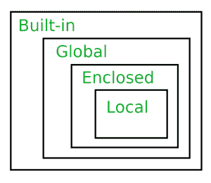

# Python 中的范围解析| LEGB 规则

> 原文:[https://www . geesforgeks . org/scope-resolution-in-python-legb-rule/](https://www.geeksforgeeks.org/scope-resolution-in-python-legb-rule/)

**名称空间:**名称空间是将名称映射到对象的容器，它们用于避免在不同名称空间中存在相同名称的情况下出现混淆。它们是由模块、函数、类等创建的。

**作用域:**作用域定义了为了获得*名称到对象*(变量)的映射而必须搜索名称空间的层次顺序。这是一个变量存在和被引用的环境。它定义了变量的可访问性和生存期。让我们举一个简单的例子，如下所示:

```
pi = 'outer pi variable'

def print_pi():
    pi = 'inner pi variable'
    print(pi)

print_pi()
print(pi)
```

**输出:**

```
inner pi variable
outer pi variable

```

上面的程序给出了不同的输出，因为相同的变量名 *pi* 驻留在不同的名称空间中，一个在函数 *print_pi* 中，另一个在上层。当执行 *print_pi()* 时，*内部 pi 变量*被打印为函数名称空间内的 *pi* 值。在外部命名空间中引用 *pi* 时，会打印值“*外部 pi 变量*”。从上面的例子中，我们可以猜测肯定有一个**规则**遵循，以便决定从哪个命名空间中选择一个变量。

**通过 LEGB 规则进行范围解析:**
在 Python 中， **LEGB 规则**用于决定搜索名称空间进行范围解析的顺序。
以下按照层级(最高到最低/最窄到最宽)列出了范围:

*   局部(L):在函数/类内部定义

*   封闭(E):在封闭函数中定义(嵌套函数概念)

*   全局(G):在最高层定义

*   内置(B):Python 内置模块中的保留名称


**局部范围:**
局部范围是指当前函数中定义的变量。函数总是首先在其局部范围内查找变量名。只有当它在那里找不到时，才会检查外部范围。

```
# Local Scope

pi = 'global pi variable'
def inner():
    pi = 'inner pi variable'
    print(pi)

inner()
```

**输出:**

```
inner pi variable

```

运行上述程序时，*内部*函数的执行会打印其本地(LEGB 规则中的最高优先级)变量 *pi* 的值，因为它是在本地范围内定义和可用的。

**局部和全局作用域:**
如果一个变量没有在局部作用域中定义，那么，它将在更高的作用域中被检查，在这种情况下，是在全局作用域中。

```
# Global Scope

pi = 'global pi variable'
def inner():
    pi = 'inner pi variable'
    print(pi)

inner()
print(pi)
```

**输出:**

```
inner pi variable
global pi variable

```

因此，如预期的那样，程序在执行 *inner()* 时打印出本地范围内的值。这是因为它是在函数内部定义的，这是查找变量的第一个地方。全球范围内的 *pi* 值打印在第 9 行*打印(pi)* 的执行上。

**局部、封闭和全局作用域:**
对于封闭的作用域，我们需要定义一个包围内部函数的外部函数，注释掉内部函数的局部 *pi* 变量，使用*非局部*关键字引用 *pi* 。

```
# Enclosed Scope

pi = 'global pi variable'

def outer():
    pi = 'outer pi variable'
    def inner():
        # pi = 'inner pi variable'
        nonlocal pi
        print(pi)
    inner()

outer()
print(pi)
```

**输出:**

```
outer pi variable
global pi variable

```

当执行 *outer()* 时， *inner()* 以及随后的 *print* 函数被执行，该函数打印包含的 *pi* 变量的值。第 10 行的语句在*内部*的局部范围内寻找变量，但在那里没有找到。由于 *pi* 是用*非本地*关键字引用的，这意味着 *pi* 需要从*外部*功能(即外部范围)访问。综上所述， *pi* 变量在局部范围内找不到，所以查找更高的范围。它存在于封闭和全局范围内。但是根据 LEGB 层次结构，即使我们在全局范围中定义了一个范围变量，也要考虑封闭的范围变量。

**局部、封闭、全局和内置范围:**
最终检查可以通过从*数学*模块导入 *pi* 并注释全局、封闭和局部 *pi* 变量来完成，如下所示:

```
# Built-in Scope
from math import pi

# pi = 'global pi variable'

def outer():
    # pi = 'outer pi variable'
    def inner():
        # pi = 'inner pi variable'
        print(pi)
    inner()

outer()
```

**输出:**

```
3.141592653589793

```

由于 *pi* 没有在局部、封闭或全局范围内定义，因此查找内置范围，即从*数学*模块导入的 *pi* 值。由于程序能够在最外面的范围内找到 *pi* 的值，因此获得以下输出: