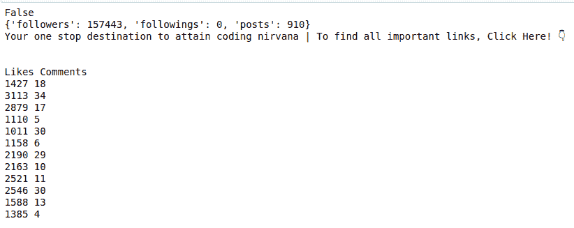
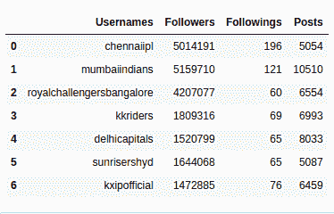

# 使用 Python 中的 Instagramy 刮取 insta gram

> 原文:[https://www . geeksforgeeks . org/scratch-insta gram-using-insta gramy-in-python/](https://www.geeksforgeeks.org/scrape-instagram-using-instagramy-in-python/)

在本文中，我们将学习如何使用网页抓取来获取 Instagram 配置文件的详细信息。Python 为网页抓取提供了强大的工具，这里我们将使用 [Instagramy](https://github.com/yogeshwaran01/instagramy) 。这个工具是专门为 Instagram 制作的，也可以使用 Pandas 分析数据。

### 装置

python 包 **Instagramy** 用于快速轻松的刮除 Instagram。通过运行以下命令来安装此包。基于网络连接，它会为您抓取数据。

```
pip install instagramy
```

**例 1:** 刮基本细节

## 蟒蛇 3

```
from instagramy import Instagram

# Connecting the profile
user = Instagram("geeks_for_geeks")

# printing the basic details like
# followers, following, bio
print(user.is_verified())
print(user.popularity())
print(user.get_biography())

# return list of dicts
posts = user.get_posts_details()

print('\n\nLikes', 'Comments')
for post in posts:
    likes = post["likes"]
    comments = post["comment"]
    print(likes,comments)
```

**输出:**



**示例 2:** 分析数据

## 蟒蛇 3

```
from instagramy import Instalysis

# Instagram user_id of ipl teams
teams = ["chennaiipl", "mumbaiindians",
         "royalchallengersbangalore", "kkriders",
         "delhicapitals", "sunrisershyd",
         "kxipofficial"]

data = Instalysis(teams)

# return the dataframe
data_frame = data.analysis()
data_frame
```

**输出:**

