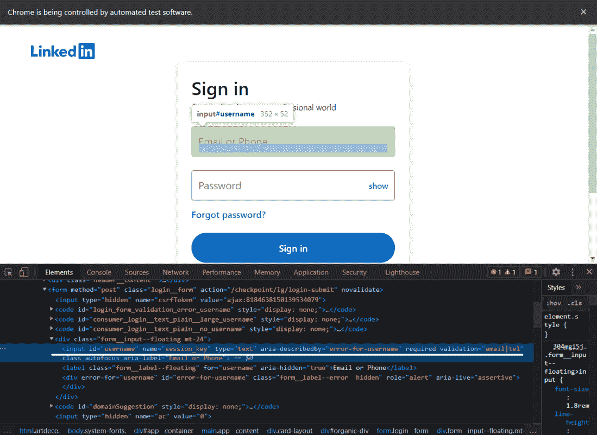
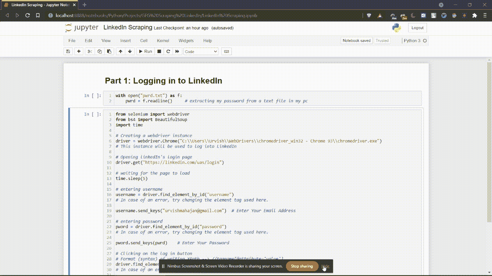
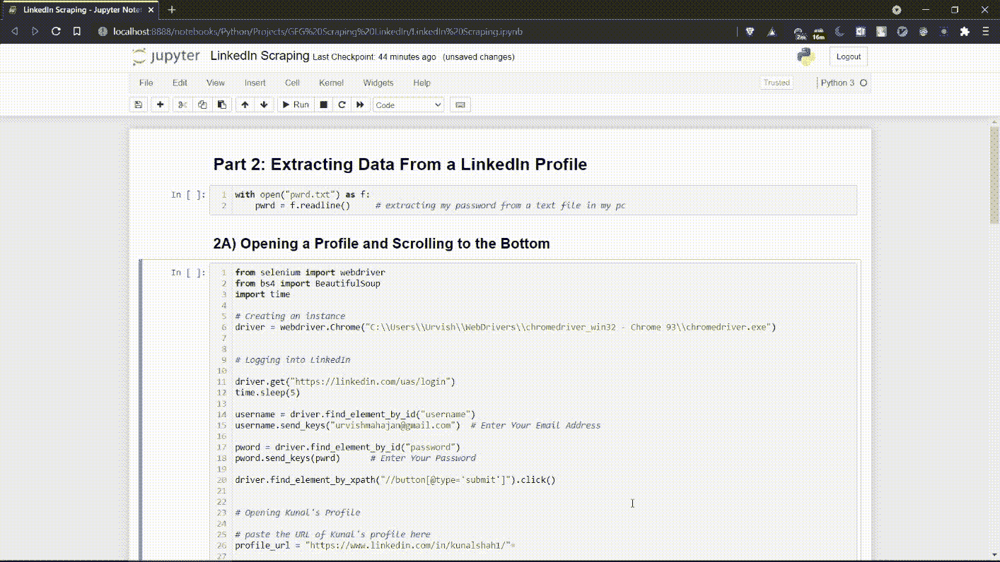

# 用 Python 中的硒和靓汤刮 LinkedIn】

> 原文:[https://www . geeksforgeeks . org/scrap-LinkedIn-use-selenium-and-beautiful-in-those-in-python/](https://www.geeksforgeeks.org/scrape-linkedin-using-selenium-and-beautiful-soup-in-python/)

在本文中，我们将使用 Python 中的 Selenium 和 Beautiful Soup 库来刮除 Linkedln。

首先，我们需要安装一些库。在终端中执行以下命令。

```py
pip install selenium 
pip install beautifulsoup4
```

为了使用硒，我们还需要一个网络驱动程序。你可以下载网络浏览器，火狐或者 Chrome 的驱动程序。在本文中，我们将使用 Chrome 网络驱动程序。

**注意:**在跟随这篇文章的同时，如果你得到一个**错误，**很可能有两个可能的原因。

1.  网页加载时间过长(可能是因为网络连接速度慢)。在这种情况下，使用 ***time.sleep()*** 功能为网页加载提供额外的时间。根据需要指定睡眠的秒数。
2.  网页的 HTML 与本文撰写时有所不同。如果是这样，您将不得不手动选择所需的网页元素，而不是复制下面写的元素名称。如何找到元素名称解释如下。另外，**不要从默认的高度和宽度减少窗口高度和宽度**。它还会改变网页的 HTML。

## 登录领英

在这里，我们将编写登录 Linkedin 的代码，首先，我们需要使用 selenium 启动网络驱动程序，并向网址发送 get 请求，识别 HTML 文档，并找到接受用户名/电子邮件、密码和登录按钮的输入标签和按钮标签。



领英登录页面

**代码:**

## 蟒蛇 3

```py
from selenium import webdriver
from bs4 import BeautifulSoup
import time

# Creating a webdriver instance
driver = webdriver.Chrome("Enter-Location-Of-Your-Web-Driver")
# This instance will be used to log into LinkedIn

# Opening linkedIn's login page
driver.get("https://linkedin.com/uas/login")

# waiting for the page to load
time.sleep(5)

# entering username
username = driver.find_element_by_id("username")

# In case of an error, try changing the element
# tag used here.

# Enter Your Email Address
username.send_keys("User_email")  

# entering password
pword = driver.find_element_by_id("password")
# In case of an error, try changing the element 
# tag used here.

# Enter Your Password
pword.send_keys("User_pass")        

# Clicking on the log in button
# Format (syntax) of writing XPath --> 
# //tagname[@attribute='value']
driver.find_element_by_xpath("//button[@type='submit']").click()
# In case of an error, try changing the
# XPath used here.
```

执行上述命令后，您将登录您的 LinkedIn 个人资料。这是它的样子。



第 1 部分代码执行

## 从领英档案中提取数据

这是完整代码执行的视频。



第 2 部分代码执行

### 2.a)打开配置文件并滚动到底部

假设您想从 Kunal Shah 的 LinkedIn 个人资料中提取数据。首先，我们需要使用他的个人资料的网址打开他的个人资料。然后，我们必须滚动到网页的底部，以便加载完整的数据。

## 蟒蛇 3

```py
from selenium import webdriver
from bs4 import BeautifulSoup
import time

# Creating an instance
driver = webdriver.Chrome("Enter-Location-Of-Your-Web-Driver")

# Logging into LinkedIn
driver.get("https://linkedin.com/uas/login")
time.sleep(5)

username = driver.find_element_by_id("username")
username.send_keys("")  # Enter Your Email Address

pword = driver.find_element_by_id("password")
pword.send_keys("")        # Enter Your Password

driver.find_element_by_xpath("//button[@type='submit']").click()

# Opening Kunal's Profile
# paste the URL of Kunal's profile here
profile_url = "https://www.linkedin.com/in/kunalshah1/"

driver.get(profile_url)        # this will open the link
```