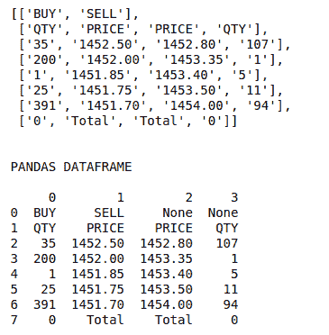

# 使用 Python 从任何网站上抓取表格

> 原文:[https://www . geesforgeks . org/scratch-tables-从任何网站-使用-python/](https://www.geeksforgeeks.org/scrape-tables-from-any-website-using-python/)

[刮痧](https://www.geeksforgeeks.org/introduction-to-web-scraping/)是每个人从任何网站获取数据都非常必不可少的技能。如果我们使用标准的[美汤](https://www.geeksforgeeks.org/implementing-web-scraping-python-beautiful-soup/)解析器来抓取和解析一个表，这可能是非常繁琐的工作。因此，在这里，我们将描述一个库，借助这个库，可以很容易地从任何网站上抓取任何表格。使用这种方法，你甚至不需要检查网站的元素，你只需要提供网站的网址。就这样，工作将在几秒钟内完成。

### 装置

您可以使用 pip 安装此库:

```
pip install html-table-parser-python3
```

### 入门指南

**步骤 1:** 导入任务所需的必要库

```
# Library for opening url and creating 
# requests
import urllib.request

# pretty-print python data structures
from pprint import pprint

# for parsing all the tables present 
# on the website
from html_table_parser.parser import HTMLTableParser

# for converting the parsed data in a
# pandas dataframe
import pandas as pd
```

**第二步:**定义一个获取网站内容的功能

```
# Opens a website and read its
# binary contents (HTTP Response Body)
def url_get_contents(url):

    # Opens a website and read its
    # binary contents (HTTP Response Body)

    #making request to the website
    req = urllib.request.Request(url=url)
    f = urllib.request.urlopen(req)

    #reading contents of the website
    return f.read()
```

现在，我们的函数已经准备好了，所以我们必须指定我们需要从中解析表格的网站的 url。

**注意:**这里我们将以 moneycontrol.com 网站为例，因为它有很多表格，会让你更好的理解。您可以在这里查看[网站。](https://www.moneycontrol.com/india/stockpricequote/refineries/relianceindustries/RI)

**步骤 3 :** 解析表格

```
# defining the html contents of a URL.
xhtml = url_get_contents('Link').decode('utf-8')

# Defining the HTMLTableParser object
p = HTMLTableParser()

# feeding the html contents in the
# HTMLTableParser object
p.feed(xhtml)

# Now finally obtaining the data of
# the table required
pprint(p.tables[1])
```

表的每一行都存储在一个数组中。这可以很容易地转换成熊猫的数据帧，并可以用来进行任何分析。

**完整代码:**

## 蟒蛇 3

```
# Library for opening url and creating
# requests
import urllib.request

# pretty-print python data structures
from pprint import pprint

# for parsing all the tables present
# on the website
from html_table_parser.parser import HTMLTableParser

# for converting the parsed data in a
# pandas dataframe
import pandas as pd

# Opens a website and read its
# binary contents (HTTP Response Body)
def url_get_contents(url):

    # Opens a website and read its
    # binary contents (HTTP Response Body)

    #making request to the website
    req = urllib.request.Request(url=url)
    f = urllib.request.urlopen(req)

    #reading contents of the website
    return f.read()

# defining the html contents of a URL.
xhtml = url_get_contents('https://www.moneycontrol.com/india\
/stockpricequote/refineries/relianceindustries/RI').decode('utf-8')

# Defining the HTMLTableParser object
p = HTMLTableParser()

# feeding the html contents in the
# HTMLTableParser object
p.feed(xhtml)

# Now finally obtaining the data of
# the table required
pprint(p.tables[1])

# converting the parsed data to
# dataframe
print("\n\nPANDAS DATAFRAME\n")
print(pd.DataFrame(p.tables[1]))
```

**输出:**

