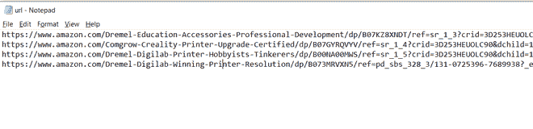
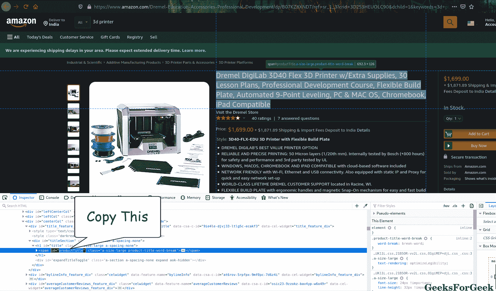
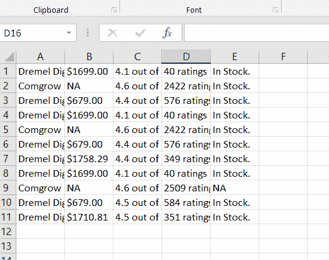

# 用靓汤刮亚马逊产品信息

> 原文:[https://www . geesforgeks . org/scratch-Amazon-product-information-use-beautiful-soup/](https://www.geeksforgeeks.org/scraping-amazon-product-information-using-beautiful-soup/)

**网页抓取**是一种专门从网站收集数据的数据提取方法。它被广泛用于数据挖掘或从大型网站收集有价值的见解。网页抓取对个人使用也很方便。Python 包含一个名为 [**的神奇库**](https://www.geeksforgeeks.org/implementing-web-scraping-python-beautiful-soup/) 允许网页抓取。我们将使用它来抓取产品信息，并将详细信息保存在 CSV 文件中。

在本文中，以下是必需的先决条件。

> url.txt:一个文本文件，很少有亚马逊产品页面的 url 需要抓取
> 
> 元素标识:我们需要我们想要抓取的对象的标识，将很快覆盖它…

在这里，我们的文本文件看起来像。



**所需模块及安装:**

我们的主要模块包含一个通过 HTTP 访问网页的方法。

```py
pip install bs4
```

[lxml](https://pypi.org/project/lxml/):python 语言处理网页的助手库。

```py
pip install lxml
```

[请求](https://pypi.org/project/requests/):使得发送 HTTP 请求的过程完美无缺，函数的输出

```py
pip install requests
```

**进场:**

*   首先，我们将导入所需的库。
*   然后我们将获取存储在文本文件中的网址。
*   我们将把网址输入到我们的汤对象中，然后汤对象将根据我们提供的元素 id 从给定的网址
    中提取相关信息，并将其保存到我们的 CSV 文件中。

**让我们看看代码，我们将看到在每个重要的步骤发生了什么。**

**第一步:**初始化我们的程序。

我们导入我们的漂亮的组和请求，创建/打开一个 CSV 文件来保存我们收集的数据。我们声明了 Header 并添加了一个用户代理。这确保了我们要进行网页抓取的目标网站不会将来自我们程序的流量视为垃圾邮件，并最终被它们阻止。这里有很多用户代理可用。

## 蟒蛇 3

```py
from bs4 import BeautifulSoup
import requests

File = open("out.csv", "a")

HEADERS = ({'User-Agent':
           'Mozilla/5.0 (X11; Linux x86_64)
                AppleWebKit/537.36 (KHTML, like Gecko)
                    Chrome/44.0.2403.157 Safari/537.36',
                           'Accept-Language': 'en-US, en;q=0.5'})

webpage = requests.get(URL, headers=HEADERS)
soup = BeautifulSoup(webpage.content, "lxml")
```

**步骤 2:** 检索元素标识。

我们通过查看呈现的网页来识别元素，但是我们的脚本不能这么说。为了精确定位我们的目标元素，我们将获取它的元素 id 并将其输入到脚本中。

获取元素的 id 非常简单。假设我需要产品名称的元素 id，我所要做的就是

1.  获取网址并检查文本
2.  在控制台中，我们获取 id=旁边的文本



复制元素 id

我们将它输入到 shoot . find 中，并将函数的输出转换成字符串。我们从字符串中删除逗号，这样它就不会干扰 CSV 尝试-除了编写格式。

## 蟒蛇 3

```py
try:
        title = soup.find("span",
                          attrs={"id": 'productTitle'})
       title_value = title.string

        title_string = title_value
                    .strip().replace(',', '')

except AttributeError:

        title_string = "NA"

        print("product Title = ", title_string)
```

**第三步:**将当前信息保存到文本文件中

我们使用我们的文件对象，并编写我们刚刚捕获的字符串，当以 CSV 格式解释字符串时，用逗号“，”结束字符串，以分隔它的列。

## 蟒蛇 3

```py
File.write(f"{title_string},")
```

**对我们希望从网络上获取的所有属性**
**执行上述 2 个步骤，如物品价格、可用性等。**

**第四步:**关闭文件。

## 蟒蛇 3

```py
File.write(f"{available},\n")

# closing the file
File.close()
```

在写最后一点信息时，请注意我们如何添加“\n”来更改行。不这样做将在一个很长的行中给我们所有需要的信息。我们使用 File.close()关闭文件。这是必要的，如果我们不这样做，我们可能会在下次打开文件时出错。

**第五步:**调用我们刚刚创建的函数。

## 蟒蛇 3

```py
if __name__ == '__main__':
  # opening our url file to access URLs
    file = open("url.txt", "r")

    # iterating over the urls
    for links in file.readlines():
        main(links)
```

我们在读取模式下打开 url.txt，并遍历它的每一行，直到到达最后一行。在每一行调用主函数。

**这就是我们整个代码的样子:**

## 计算机编程语言

```py
# importing libraries
from bs4 import BeautifulSoup
import requests

def main(URL):
    # opening our output file in append mode
    File = open("out.csv", "a")

    # specifying user agent, You can use other user agents
    # available on the internet
    HEADERS = ({'User-Agent':
                'Mozilla/5.0 (X11; Linux x86_64)
                    AppleWebKit/537.36 (KHTML, like Gecko)
                            Chrome/44.0.2403.157 Safari/537.36',
                                'Accept-Language': 'en-US, en;q=0.5'})

    # Making the HTTP Request
    webpage = requests.get(URL, headers=HEADERS)

    # Creating the Soup Object containing all data
    soup = BeautifulSoup(webpage.content, "lxml")

    # retrieving product title
    try:
        # Outer Tag Object
        title = soup.find("span",
                          attrs={"id": 'productTitle'})

        # Inner NavigableString Object
        title_value = title.string

        # Title as a string value
        title_string = title_value.strip().replace(',', '')

    except AttributeError:
        title_string = "NA"
    print("product Title = ", title_string)

    # saving the title in the file
    File.write(f"{title_string},")

    # retrieving price
    try:
        price = soup.find(
            "span", attrs={'id': 'priceblock_ourprice'})
                                .string.strip().replace(',', '')
        # we are omitting unnecessary spaces
        # and commas form our string
    except AttributeError:
        price = "NA"
    print("Products price = ", price)

    # saving
    File.write(f"{price},")

    # retrieving product rating
    try:
        rating = soup.find("i", attrs={
                           'class': 'a-icon a-icon-star a-star-4-5'})
                                    .string.strip().replace(',', '')

    except AttributeError:

        try:
            rating = soup.find(
                "span", attrs={'class': 'a-icon-alt'})
                                .string.strip().replace(',', '')
        except:
            rating = "NA"
    print("Overall rating = ", rating)

    File.write(f"{rating},")

    try:
        review_count = soup.find(
            "span", attrs={'id': 'acrCustomerReviewText'})
                                .string.strip().replace(',', '')

    except AttributeError:
        review_count = "NA"
    print("Total reviews = ", review_count)
    File.write(f"{review_count},")

    # print availablility status
    try:
        available = soup.find("div", attrs={'id': 'availability'})
        available = available.find("span")
                    .string.strip().replace(',', '')

    except AttributeError:
        available = "NA"
    print("Availability = ", available)

    # saving the availability and closing the line
    File.write(f"{available},\n")

    # closing the file
    File.close()

if __name__ == '__main__':
  # opening our url file to access URLs
    file = open("url.txt", "r")

    # iterating over the urls
    for links in file.readlines():
        main(links)
```

**输出:**

> 产品标题= Dremel DigiLab 3D40 Flex 3D 打印机 w/额外供应 30 个教案专业开发课程灵活构建板自动 9 点调平 PC & MAC OS Chromebook iPad 兼容
> 产品价格= $1699.00
> 整体评分= 5 颗星中的 4.1 颗
> 总评价= 40 个评分
> 供货情况=有货。
> 产品名称= Comgrow Creality Ender 3 Pro 3D 打印机，带可拆卸构建表面板和 UL 认证电源 220x220x250mm 毫米
> 产品价格= NA
> 整体评分= 4.6(共 5 颗星)
> 总评论数= 2509 评分
> 可用性= NA
> 产品名称= Dremel Digilab 3D20 3D 打印机创意构建器适用于全新爱好者和修补者
> 产品价格= 679.00 美元
> 整体评分= 4.5(共 4 颗星)
> 产品名称= Dremel DigiLab 3D45 获奖 3D 打印机 w/细丝 PC & MAC OS Chromebook iPad 兼容网络友好型内置高清摄像头加热内搭板尼龙 ECO ABS PETG PLA 打印能力
> 产品价格= 1710.81 美元
> 整体评分= 5 星中的 4.5 星
> 总评价= 351 评分
> 供货情况=有现货。

**我们的 out.csv 是这样的。**

