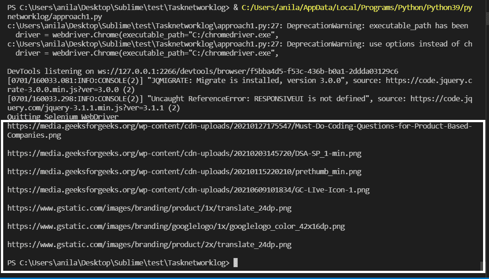
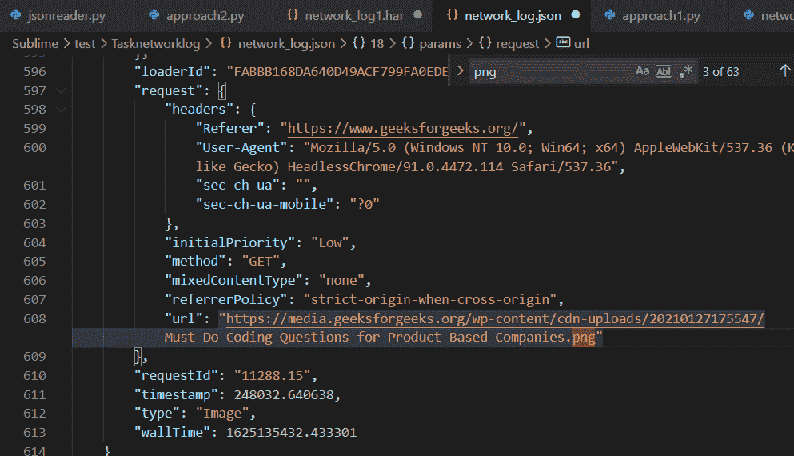
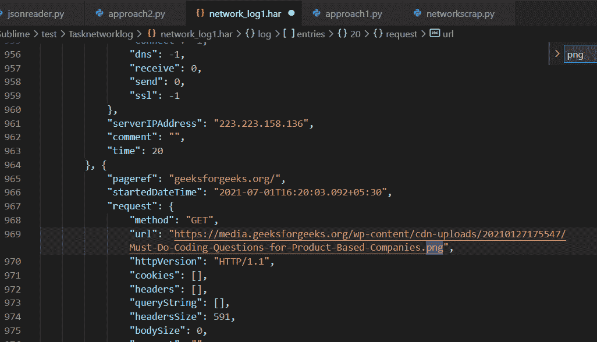

# 使用 Python 抓取网络流量中的数据

> 原文:[https://www . geeksforgeeks . org/scratch-data-in-network-traffic-use-python/](https://www.geeksforgeeks.org/scraping-data-in-network-traffic-using-python/)

在本文中，我们将学习如何使用 Python 在网络流量中丢弃数据。

### **所需模块**

*   [**Selenium**](https://www.geeksforgeeks.org/browser-automation-using-selenium/)**:**Selenium 是一个可移植的控制网页浏览器的框架。
*   **时间:**该模块提供各种与时间相关的功能。
*   [**【json】**](https://www.geeksforgeeks.org/python-json/)**:**该模块是处理 JSON 数据所必需的。
*   **browsermobproxy:** 这个模块帮助我们从网络流量中获取 HAR 文件。

有两种方法可以废弃网络流量数据。

### **方法 1:使用硒的 get_log()方法**

首先下载并根据你的 chrome 浏览器版本从[这里](https://chromedriver.chromium.org/downloads)提取 **chrome 网络驱动**并复制可执行路径。

**进场:**

*   从硒模块导入 ***设计功能*** 并启用性能记录。
*   用 ***启动 **chrome 网络驱动程序**可执行 _ 路径*** 并默认 ***chrome-options*** 或向其添加一些参数和修改后的 ***期望 _ 功能*** 。
*   使用 ***driver.get()*** 向网站发送 GET 请求，等待几秒钟加载页面。

**语法:**

> *driver.get(url)*

*   使用 ***driver.get_log()*** 获取性能日志，并将其存储在变量中。

**语法:**

> *driver.get_log(“性能”)*

*   迭代每个日志，并使用 ***json.loads()*** 解析日志，过滤所有与网络相关的日志。
*   通过使用 ***json.dumps()转换为 JSON 字符串，将过滤后的日志写入 JSON 文件。**T3】*

**示例:**

## 蟒蛇 3

```
# Import the required modules
from selenium import webdriver
from selenium.webdriver.common.desired_capabilities import DesiredCapabilities
import time
import json

# Main Function
if __name__ == "__main__":

    # Enable Performance Logging of Chrome.
    desired_capabilities = DesiredCapabilities.CHROME
    desired_capabilities["goog:loggingPrefs"] = {"performance": "ALL"}

    # Create the webdriver object and pass the arguments
    options = webdriver.ChromeOptions()

    # Chrome will start in Headless mode
    options.add_argument('headless')

    # Ignores any certificate errors if there is any
    options.add_argument("--ignore-certificate-errors")

    # Startup the chrome webdriver with executable path and
    # pass the chrome options and desired capabilities as
    # parameters.
    driver = webdriver.Chrome(executable_path="C:/chromedriver.exe",
                              chrome_options=options,
                              desired_capabilities=desired_capabilities)

    # Send a request to the website and let it load
    driver.get("https://www.geeksforgeeks.org/")

    # Sleeps for 10 seconds
    time.sleep(10)

    # Gets all the logs from performance in Chrome
    logs = driver.get_log("performance")

    # Opens a writable JSON file and writes the logs in it
    with open("network_log.json", "w", encoding="utf-8") as f:
        f.write("[")

        # Iterates every logs and parses it using JSON
        for log in logs:
            network_log = json.loads(log["message"])["message"]

            # Checks if the current 'method' key has any
            # Network related value.
            if("Network.response" in network_log["method"]
                    or "Network.request" in network_log["method"]
                    or "Network.webSocket" in network_log["method"]):

                # Writes the network log to a JSON file by
                # converting the dictionary to a JSON string
                # using json.dumps().
                f.write(json.dumps(network_log)+",")
        f.write("{}]")

    print("Quitting Selenium WebDriver")
    driver.quit()

    # Read the JSON File and parse it using
    # json.loads() to find the urls containing images.
    json_file_path = "network_log.json"
    with open(json_file_path, "r", encoding="utf-8") as f:
        logs = json.loads(f.read())

    # Iterate the logs
    for log in logs:

        # Except block will be accessed if any of the
        # following keys are missing.
        try:
            # URL is present inside the following keys
            url = log["params"]["request"]["url"]

            # Checks if the extension is .png or .jpg
            if url[len(url)-4:] == ".png" or url[len(url)-4:] == ".jpg":
                print(url, end='\n\n')
        except Exception as e:
            pass
```

**输出:**



**上面突出显示了图像网址。**



**包含图片网址的 network _ log . JSON**

### **方法二:使用 browsermobproxy 从**浏览器**的**的**网络标签中捕获 HAR 文件**

为此，需要满足以下要求。

*   从[这里](https://www.oracle.com/in/java/technologies/javase-jre8-downloads.html)下载安装 **Java** **v8**
*   从[这里](https://bmp.lightbody.net/)下载提取 **browsermobproxy** ，复制 bin 文件夹路径。
*   使用 pip 安装 **browsermob-proxy** 使用终端中的命令:

> *pip 安装 browser mob-代理*

*   根据你的 chrome 浏览器版本，从[这里](https://chromedriver.chromium.org/downloads)下载并解压 **chrome 网络驱动**，复制可执行路径。

**进场:**

*   从 **browsermobproxy** 导入服务器模块，用复制的 bin 文件夹路径启动服务器，并将端口设置为 ***8090*** 。
*   调用***create _ proxy*****方法从服务器创建代理对象，并将**【trustellservers】**参数设置为 ***true*** 。**
*   **用下面代码中讨论的 ***可执行文件 _ 路径*** 和 ***启动 **chrome 网络驱动程序**。*****
*   **现在，使用网站域的代理对象创建一个新的 HAR 文件。**
*   **使用 ***driver.get()*** 发送 GET 请求，等待几秒钟以正确加载。**

****语法:****

> ***driver.get(url)***

*   **使用 ***json.dumps()*** 将代理对象的网络流量的 HAR 文件转换为 JSON 字符串，将其写入 HAR 文件。**

****示例:****

## **蟒蛇 3**

```
# Import the required modules
from selenium import webdriver
from browsermobproxy import Server
import time
import json

# Main Function
if __name__ == "__main__":

    # Enter the path of bin folder by
    # extracting browsermob-proxy-2.1.4-bin
    path_to_browsermobproxy = "C:\\browsermob-proxy-2.1.4\\bin\\"

    # Start the server with the path and port 8090
    server = Server(path_to_browsermobproxy
                    + "browsermob-proxy", options={'port': 8090})
    server.start()

    # Create the proxy with following parameter as true
    proxy = server.create_proxy(params={"trustAllServers": "true"})

    # Create the webdriver object and pass the arguments
    options = webdriver.ChromeOptions()

    # Chrome will start in Headless mode
    options.add_argument('headless')

    # Ignores any certificate errors if there is any
    options.add_argument("--ignore-certificate-errors")

    # Setting up Proxy for chrome
    options.add_argument("--proxy-server={0}".format(proxy.proxy))

    # Startup the chrome webdriver with executable path and
    # the chrome options as parameters.
    driver = webdriver.Chrome(executable_path="C:/chromedriver.exe",
                              chrome_options=options)

    # Create a new HAR file of the following domain
    # using the proxy.
    proxy.new_har("geeksforgeeks.org/")

    # Send a request to the website and let it load
    driver.get("https://www.geeksforgeeks.org/")

    # Sleeps for 10 seconds
    time.sleep(10)

    # Write it to a HAR file.
    with open("network_log1.har", "w", encoding="utf-8") as f:
        f.write(json.dumps(proxy.har))

    print("Quitting Selenium WebDriver")
    driver.quit()

    # Read HAR File and parse it using JSON
    # to find the urls containing images.
    har_file_path = "network_log1.har"
    with open(har_file_path, "r", encoding="utf-8") as f:
        logs = json.loads(f.read())

    # Store the network logs from 'entries' key and
    # iterate them
    network_logs = logs['log']['entries']
    for log in network_logs:

        # Except block will be accessed if any of the
        # following keys are missing
        try:
            # URL is present inside the following keys
            url = log['request']['url']

            # Checks if the extension is .png or .jpg
            if url[len(url)-4:] == '.png' or url[len(url)-4:] == '.jpg':
                print(url, end="\n\n")
        except Exception as e:
            # print(e)
            pass
```

****输出:****

**

**上面突出显示了图像网址。**** **

**包含图像网址的网络 _ log1 . har****