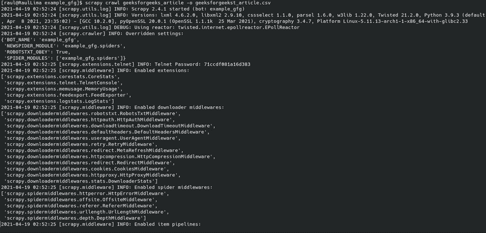
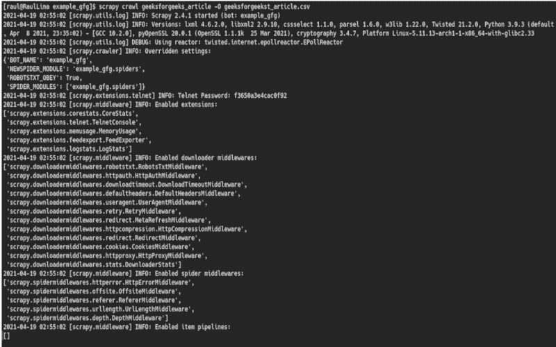

# 使用 Python-Scrapy 抓取动态内容

> 原文:[https://www . geeksforgeeks . org/scratch-dynamic-content-use-python-scratchy/](https://www.geeksforgeeks.org/scraping-dynamic-content-using-python-scrapy/)

假设我们正在从网站等来源读取一些内容，我们希望将这些数据保存在我们的设备上。我们可以将数据复制在笔记本或记事本上，以便在以后的工作中重复使用。通过这种方式，我们使用了刮擦(如果我们没有字体或数据库，表单暴力会移除文档、站点和代码中的数据)。

但是现在有很多工具可以刮一个网站。然而，这个例子是选择 **Scrapy** 来抓取 Python 站点。Scrapy 是一个从页面中提取数据结构或信息的框架。

## 装置

首先，我们必须检查 python、scrapy 和 vscode 或类似编辑器在我们计算机上的安装。之后，我们可以选择两种方式开始项目。首先是操作虚拟环境(在 python venv 或虚拟环境中是开发环境)，而在另一种方法中不使用虚拟环境。

**带 venv:** 在这种情况下，被用作进入 venv 模式的命令源，并在该模式下安装 scrapy。

> 安装 python 的命令–> sudo pacman-S python
> 
> 安装 vs-code–> sudo pacman-S 代码的命令
> 
> 在计算机中安装 scrapy 的命令–> sudo pacman-S scrapy
> 
> 创建开发环境的命令–> python 3.9-m venv venv
> 
> 执行或打开开发环境的命令–>源 venv/bin/activate
> 
> 在开发环境的 python 包中安装 scrapy 的命令–> pip 安装 scrapy

**没有 venv:** 为应用程序使用了命令 pip，pacman 来构建包。

> 安装 python 的命令–> sudo pacman-S python
> 
> 安装 vs-code–> sudo pacman-S 代码的命令
> 
> 在计算机中安装 scrapy 的命令–> sudo pacman-S scrapy
> 
> 在 python 包中安装 scrapy 的命令–> pip 安装 scrapy

## 入门指南

在这一部分中，安装完 scrapy 后，你有一个选择了一个本地在你的电脑中创建项目的 scrapy，并打开终端并写下命令 Scrapy start project[项目名称]，这创建项目的 Scrapy。

**带 venv 和不带 venv:**

> 在 scrapy–> scrapy start project 示例 _gfg 中命令哪个启动项目

创建项目的路径后，他们有必要输入它。

> 命令 cd 进入项目路径–> CD 示例 _gfg

项目中有一条叫蜘蛛的小路。根据文献记载，他们创造了蜘蛛来实现网站的抓取。

每个蜘蛛都有一个名字、start_url 和函数方法。

```py
cd example_gfg/example_gfg/spiders
```

## 蟒蛇 3

```py
import scrapy

class python_Spider(scrapy.Spider):
    name = ""
    start_urls = []
```

根据上面的代码，它在站点 Python 中提取:一年中的事件，蜘蛛名是 python_events 和 start URL(在蜘蛛名和 start URL 中，我们可以更改)。

## 蟒蛇 3

```py
import scrapy

class python_Spider(scrapy.Spider):
      name = "geeksforgeeks_article"

      start_urls = [
        'https://www.geeksforgeeks.org/data-structures/?ref=shm',
      ]

    def parse(self, response):
```

我们使用 parse 方法并调用这个函数，这个函数用于从站点中提取数据，然而，要刮擦站点就需要了解命令响应选择器 CSS 和 XPath。

*   **请求:**是实现对对象或数据的调用的请求。
*   **响应:**获得对请求的回答。
*   **选择器:**它代表一种方法，该方法由提取站点的 Html 中的选择部分或标签组成。
*   Scrapy 使用两种方法来选择:
    *   **XPath:** 它是一种在使用标签的文档中导航的搜索语言。
    *   **CSS:** 是层叠样式表，在 HTML 中搜索 id 或类中的标签。

在这个循环中，我们使用 yield(yield 是 Python 中的一个单词 reserve，类似于函数中的临时停止或冻结)来创建一个包含事件名称、日期和链接的字典。

## 蟒蛇 3

```py
import scrapy

class python_Spider(scrapy.Spider):
    name = "python_events"

    start_urls = [
        'https://www.python.org/blogs/',
    ]

    def parse(self, response):

        for item in response.css('ol'):

            yield {
                'title': item.css('a::text').get(),
                'link': item.css('a::attr(href)').get(),
            }
```

## 用报废外壳测试项目

Scrapy 有一个可以测试命令选择器 CSS 的外壳。

**不带 venv 和带 venv:**

```py
scrapy shell "https://www.geeksforgeeks.org/data-structures/?ref=shm"
response.css("a").get()
response.css("title").get()
response.css("title::text").get()
response.css("a::text").get() 
response.css("a::attr(href)").get()
```

<video class="wp-video-shortcode" id="video-585217-1" width="640" height="360" preload="metadata" controls=""><source type="video/mp4" src="https://media.geeksforgeeks.org/wp-content/uploads/20210419125723/0016.mp4?_=1">[https://media.geeksforgeeks.org/wp-content/uploads/20210419125723/0016.mp4](https://media.geeksforgeeks.org/wp-content/uploads/20210419125723/0016.mp4)</video>

## 示范

*   我们制作了代码并测试了一个报废的外壳。
*   我们运行代码或蜘蛛。
*   我们把它分成两种开发项目的形式，没有 venv 或者有 venv。

**没有 venv :** 我们应该输入执行命令的项目或蜘蛛的路径。

```py
scrapy crawl geeksforgeeks_article
```

<video class="wp-video-shortcode" id="video-585217-2" width="640" height="360" preload="metadata" controls=""><source type="video/mp4" src="https://media.geeksforgeeks.org/wp-content/uploads/20210417145502/0020.mp4?_=2">[https://media.geeksforgeeks.org/wp-content/uploads/20210417145502/0020.mp4](https://media.geeksforgeeks.org/wp-content/uploads/20210417145502/0020.mp4)</video>

**使用 venv** :如果我们处于 venv 模式，我们可以在任何路径上执行命令。

```py
scrapy crawl geeksforgeeks_article
```

<video class="wp-video-shortcode" id="video-585217-3" width="640" height="360" preload="metadata" controls=""><source type="video/mp4" src="https://media.geeksforgeeks.org/wp-content/uploads/20210419125745/0017.mp4?_=3">[https://media.geeksforgeeks.org/wp-content/uploads/20210419125745/0017.mp4](https://media.geeksforgeeks.org/wp-content/uploads/20210419125745/0017.mp4)</video>

我们可以用下面的命令将数据存储在一个文件中:

```py
scrapy crawl geeksforgeeks_article -O geeksforgeeks_article.csv 
```

或者

```py
scrapy crawl geeksforgeeks_article -o geeksforgeeks_article.csv
```

o(在新数据文件中创建和插入)和 o(在新数据文件中创建和追加)是创建新文件和插入的命令。

<video class="wp-video-shortcode" id="video-585217-4" width="640" height="360" preload="metadata" controls=""><source type="video/mp4" src="https://media.geeksforgeeks.org/wp-content/uploads/20210419132728/0021.mp4?_=4">[https://media.geeksforgeeks.org/wp-content/uploads/20210419132728/0021.mp4](https://media.geeksforgeeks.org/wp-content/uploads/20210419132728/0021.mp4)</video>

#### **输出:**



输出刮削 1



输出刮削 2