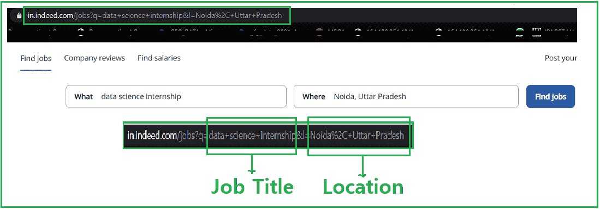
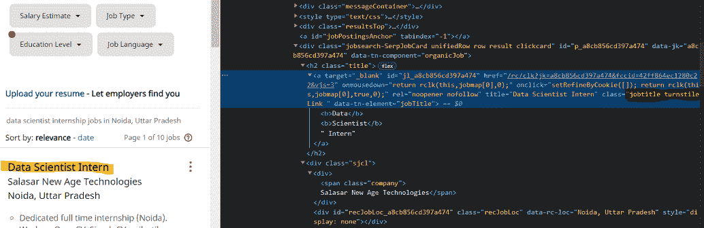
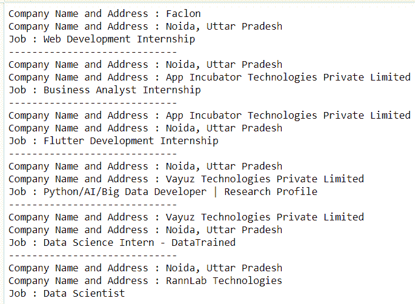

# 使用 Python 抓取实际作业数据

> 原文:[https://www . geeksforgeeks . org/scratch-确实-作业-数据-使用-python/](https://www.geeksforgeeks.org/scraping-indeed-job-data-using-python/)

在本文中，我们将看到如何使用 python 刮取实际工作数据。这里我们将使用美丽的汤和请求模块来刮数据。

### **需要的模块**

*   [**bs4**](https://www.geeksforgeeks.org/implementing-web-scraping-python-beautiful-soup/)【T4:美人汤(bs4)是一个从 HTML 和 XML 文件中拉出数据的 Python 库。这个模块没有内置 Python。要安装此软件，请在终端中键入以下命令。

> pip 安装 bs4

*   [**请求**](https://www.geeksforgeeks.org/python-requests-tutorial/) **:** 请求让你发送 HTTP/1.1 请求极其轻松。该模块也没有内置 Python。要安装此软件，请在终端中键入以下命令。

> pip 安装请求

### **进场:**

*   导入所有必需的模块。
*   将 getdata()函数(用户定义函数)中的 URL 传递给请求 URL 的函数，它会返回一个响应。我们使用 get 方法从给定的服务器中检索信息。

**语法:**

> requests.get(url，args)

*   将数据转换成 HTML 代码。

在给定的图像中，我们看到了链接，在那里我们搜索工作及其位置，然后网址变成类似这样的东西**https://in.indeed.com/jobs?q="+job+"&l =“+位置，**因此我们将把我们的字符串格式化为这种格式。



*   现在使用 bs4 解析 HTML 内容。

> **语法:**soup = beautulsoup(r . content，' html5lib ')
> 
> **参数:**
> 
> *   **r.content** :是原始的 HTML 内容。
> *   **html.parser** :指定我们想要使用的 html 解析器。

*   现在使用 soup 过滤所需的数据。查找所有函数。
    *   现在找到带有一个标签的列表，其中 class _ = jobtitle turnstileLink。您可以在浏览器中打开网页，并按下右键检查相关元素，如图所示。



*   用与上述相同的方法查找公司名称和地址。

### 使用的功能:

这个实现的代码被分成用户定义的函数，以增加代码的可读性和易用性。

*   **geturl():** 获取要从中抓取数据的 url
*   **html_code():** 获取所提供 URL 的 html 代码
*   **job_data():** 过滤掉作业数据
*   **公司 _ 数据():f** 过滤公司数据

**程序:**

## 蟒蛇 3

```py
# import module
import requests
from bs4 import BeautifulSoup

# user define function
# Scrape the data
# and get in string
def getdata(url):
    r = requests.get(url)
    return r.text

# Get Html code using parse
def html_code(url):

    # pass the url
    # into getdata function
    htmldata = getdata(url)
    soup = BeautifulSoup(htmldata, 'html.parser')

    # return html code
    return(soup)

# filter job data using
# find_all function
def job_data(soup):

    # find the Html tag
    # with find()
    # and convert into string
    data_str = ""
    for item in soup.find_all("a", class_="jobtitle turnstileLink"):
        data_str = data_str + item.get_text()
    result_1 = data_str.split("\n")
    return(result_1)

# filter company_data using
# find_all function

def company_data(soup):

    # find the Html tag
    # with find()
    # and convert into string
    data_str = ""
    result = ""
    for item in soup.find_all("div", class_="sjcl"):
        data_str = data_str + item.get_text()
    result_1 = data_str.split("\n")

    res = []
    for i in range(1, len(result_1)):
        if len(result_1[i]) > 1:
            res.append(result_1[i])
    return(res)

# driver nodes/main function
if __name__ == "__main__":

    # Data for URL
    job = "data+science+internship"
    Location = "Noida%2C+Uttar+Pradesh"
    url = "https://in.indeed.com/jobs?q="+job+"&l="+Location

    # Pass this URL into the soup
    # which will return
    # html string
    soup = html_code(url)

    # call job and company data
    # and store into it var
    job_res = job_data(soup)
    com_res = company_data(soup)

    # Traverse the both data
    temp = 0
    for i in range(1, len(job_res)):
        j = temp
        for j in range(temp, 2+temp):
            print("Company Name and Address : " + com_res[j])

        temp = j
        print("Job : " + job_res[i])
        print("-----------------------------")
```

**输出:**

