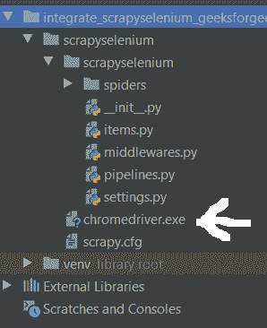
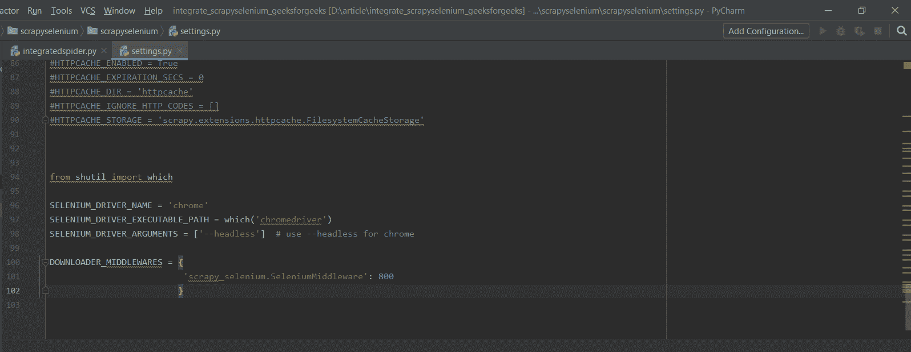
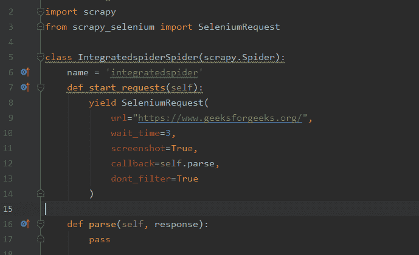
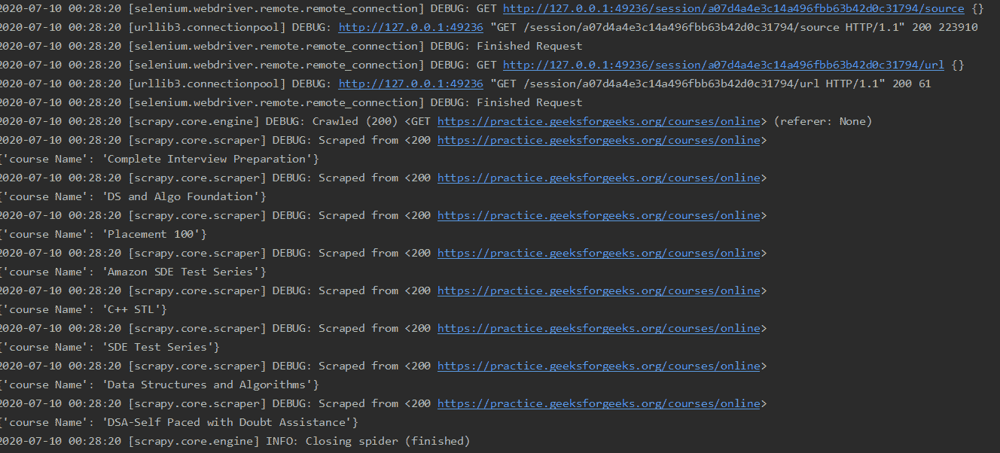
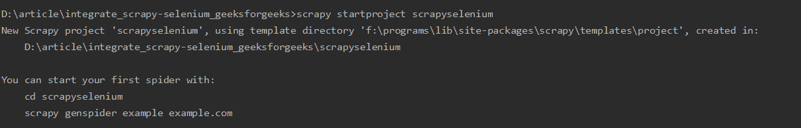
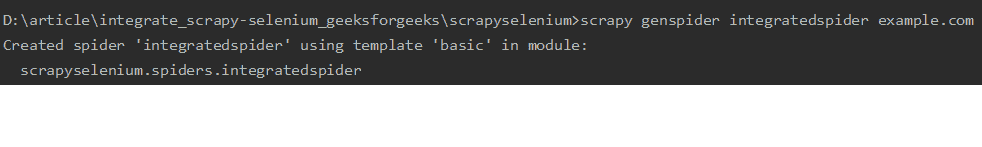
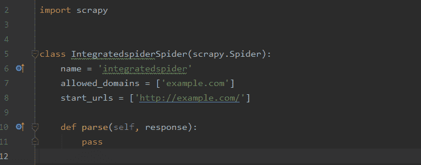

# 使用 Scrapy-Selenium 抓取支持 Javascript 的网站

> 原文:[https://www . geeksforgeeks . org/scratch-启用 JavaScript-网站-使用-scratchy-selenium/](https://www.geeksforgeeks.org/scraping-javascript-enabled-websites-using-scrapy-selenium/)

Scrapy-selenium 是一个用于网页抓取的中间件。scrapy 不支持抓取使用 javascript 框架的现代网站，这就是这个中间件与 scrapy 一起使用来抓取这些现代网站的原因。Scrapy-selenium 提供了 selenium 的功能，有助于使用 javascript 网站。这提供的其他优势是驱动力，通过它我们也可以看到幕后发生的事情。由于 selenium 是自动化工具，它还为我们提供了如何根据您在输入字段中传递的内容来处理输入标签和刮擦。通过使用硒，在输入字段传递输入变得更加容易。scrapy-selenium 于 2018 年首次推出，是一个开源软件。除此之外的另一种选择是刮花

*   **安装设置 Scrapy–**
*   **在 Scrapy 项目中集成 scrapy-selenium:**
    *   安装 Scrapy-selenium 并将其添加到您的设置中。Chrome 驱动将根据 chrome 浏览器的版本进行下载。转到你的 chrome 浏览器的帮助部分，然后点击关于谷歌 chrome 并检查你的版本。从这里提到的网站下载 chrome 驱动程序[要下载 chrome 驱动程序](https://chromedriver.chromium.org/downloads)
    *   **在哪里添加 chrome 驱动程序:**
        
    *   **在 settings.py 文件中添加:**
        
    *   **要在蜘蛛文件中进行的更改:**
        
    *   **要运行的项目:**

        ```py
        command- scrapy crawl spidername (scrapy crawl integratedspider in this project)

        ```

    *   **蜘蛛运行蜘蛛的命令是，杂乱爬行的蜘蛛名(这里的蜘蛛名是
        指的是蜘蛛中定义的那个名字)。**
    *   **函数 start_requests-** 首先要执行的请求是通过调用 start_requests()方法获得的，该方法为 yield SeleniumRequest 中 url 字段中指定的 url 生成 Request，并将解析方法作为 requests 的回调函数
    *   **url-** 这里提供了网站的 URL。
    *   **截图-** 你可以用 get _ scratch _ as _ file()方法截图一个网页，参数为文件名和截图将保存在项目中。
    *   **回调-** 将以该请求的响应作为其第一个参数调用的函数。
    *   **don _ filter-**表示调度程序不应过滤此请求。如果发送相同的 url 进行解析，它不会给出已经访问过的相同 url 的异常。这意味着同一 url 可以被多次访问，默认值为 false。
    *   **wait _ time-**Scrapy 不会在请求之间等待固定的时间。但是通过这个字段，我们可以在回调时分配它。
*   **刮痧硒蜘蛛的一般结构:**

    ```py
    import scrapy
    from scrapy_selenium import SeleniumRequest

    class IntegratedspiderSpider(scrapy.Spider):
        name = 'integratedspider'
        def start_requests(self):
            yield SeleniumRequest(
                url ="https://www.geeksforgeeks.org/",
                wait_time = 3,
                screenshot = True,
                callback = self.parse, 
                dont_filter = True    
            )

        def parse(self, response):
            pass
    ```

*   **刮痧硒项目:**
    使用刮痧硒从极客网站上刮取在线课程名称

    **获取我们需要报废的元素的 X 路径–**
    

    **从极客们中删除课程数据的代码–**

    ```py
    import scrapy
    from scrapy_selenium import SeleniumRequest

    class IntegratedspiderSpider(scrapy.Spider):
        name = 'integratedspider'
        def start_requests(self):
            yield SeleniumRequest(
                url = "https://practice.geeksforgeeks.org/courses/online",
                wait_time = 3,
                screenshot = True,
                callback = self.parse,
                dont_filter = True
            )

        def parse(self, response):
            # courses make list of all items that came in this xpath
            # this xpath is of cards containing courses details
            courses = response.xpath('//*[@id ="active-courses-content"]/div/div/div')

            # course is each course in the courses list
            for course in courses:
                # xpath of course name is added in the course path
                # text() will scrape text from h4 tag that contains course name
                course_name = course.xpath('.//a/div[2]/div/div[2]/h4/text()').get()

                # course_name is a string containing \n and extra spaces
                # these \n and extra spaces are removed

                course_name = course_name.split('\n')[1]
                course_name = course_name.strip()

                yield {
                    'course Name':course_name
                }
    ```

    **输出–**
    

*   报废安装
*   运行

    ```py
    scrapy startproject projectname  (projectname is name of project)
    ```

*   Now, let’s Run,

    ```py
    scrapy genspider spidername example.com
    ```

    (用你喜欢的蜘蛛名替换蜘蛛名，用你想刮的网站替换 example.com)。注意:以后也可以改变网址，在你的刺儿头蜘蛛里面。

    

    

    **刺痒蜘蛛:**
    

**官方链接**T2【github 回购