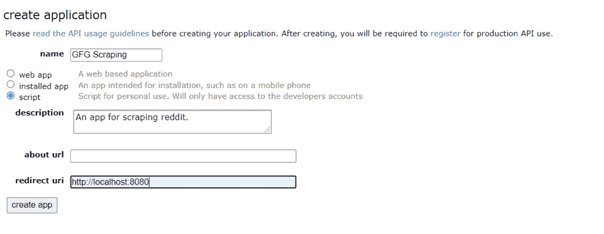
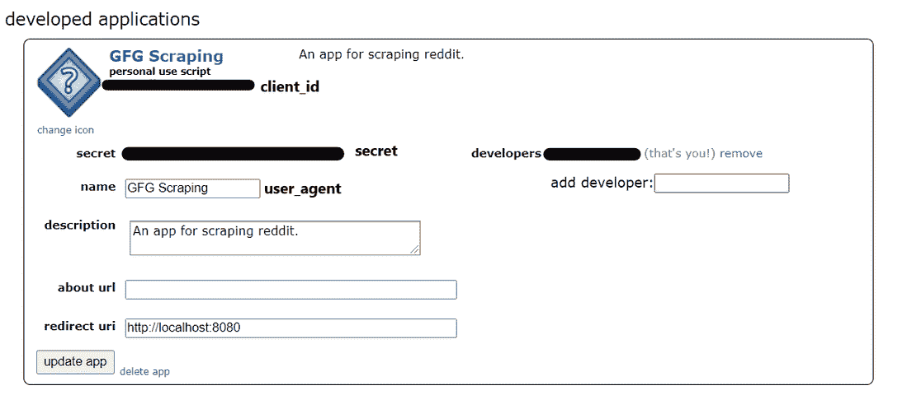
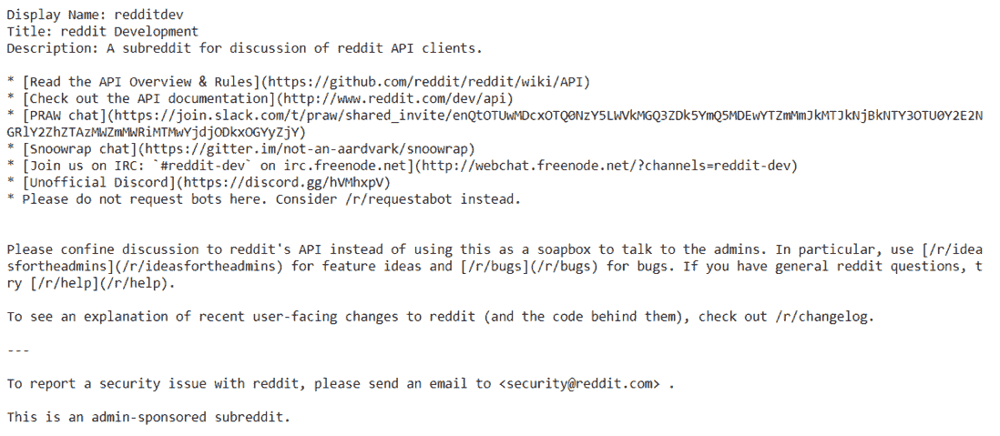
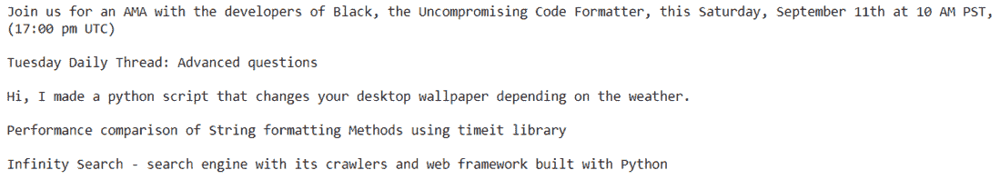
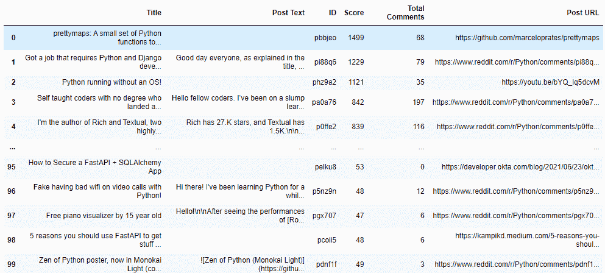
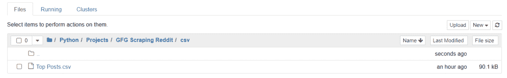
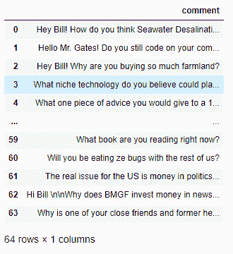

# 使用 Python 抓取 Reddit

> 原文:[https://www.geeksforgeeks.org/scraping-reddit-using-python/](https://www.geeksforgeeks.org/scraping-reddit-using-python/)

在本文中，我们将看到如何使用 python 来抓取 Reddit，这里我们将使用 Python 的 PRAW (Python Reddit API Wrapper)模块来抓取数据。Praw 是 Python Reddit API 包装器的缩写，它允许 Reddit API 通过 Python 脚本。

## 装置

要安装 PRAW，请在命令提示符下运行以下命令:

```py
pip install praw
```

## 创建 Reddit 应用程序

**第一步:**要从 Reddit 中提取数据，我们需要创建一个 Reddit 应用。您可以创建一个新的 Reddit 应用程序(https://www . Reddit . com/prefs/apps)。


Reddit–创建应用程序

**第二步:**点击“你是开发者吗？创建一个应用程序……”。

**第三步:**像这样的表单会出现在你的屏幕上。输入您选择的名称和描述。在**重定向 uri** 框中，输入 **http://localhost:8080**



应用程序表单

**第四步:**输入详细信息后，点击“创建 app”。



开发的应用程序

Reddit 应用程序已经创建。现在，我们可以使用 python 和 praw 从 Reddit 中抓取数据。记下 client_id、secret 和 user_agent 值。这些值将用于使用 python 连接到 Reddit。

## 创建 PRAW 实例

为了连接到 Reddit，我们需要创建一个 praw 实例。有两种类型的 praw 实例:

*   **只读实例**:使用只读实例，我们只能在 Reddit 上刮取公开可用的信息。例如，从特定子循环中检索前 5 篇文章。
*   **授权实例**:使用授权实例，你可以用你的 Reddit 账号做任何事情。像向上投票、发帖、评论等行为。，可以执行。

## 蟒蛇 3

```py
# Read-only instance
reddit_read_only = praw.Reddit(client_id="",         # your client id
                               client_secret="",      # your client secret
                               user_agent="")        # your user agent

# Authorized instance
reddit_authorized = praw.Reddit(client_id="",         # your client id
                                client_secret="",      # your client secret
                                user_agent="",        # your user agent
                                username="",        # your reddit username
                                password="")        # your reddit password
```

现在我们已经创建了一个实例，我们可以使用 Reddit 的 API 来提取数据。在本教程中，我们将只使用只读实例。

## 刮除红迪子漩涡

从子循环中提取数据有不同的方法。子列表中的帖子按热门、新、热门、有争议等分类。您可以使用自己选择的任何排序方法。

让我们从 redditdev 子版本中提取一些信息。

## 蟒蛇 3

```py
import praw
import pandas as pd

reddit_read_only = praw.Reddit(client_id="",         # your client id
                               client_secret="",      # your client secret
                               user_agent="")        # your user agent

subreddit = reddit_read_only.subreddit("redditdev")

# Display the name of the Subreddit
print("Display Name:", subreddit.display_name)

# Display the title of the Subreddit
print("Title:", subreddit.title)

# Display the description of the Subreddit
print("Description:", subreddit.description)
```

**输出:**



名称、标题和描述

**现在让我们从 Python 子循环中提取 5 个热门帖子:**

## 蟒蛇 3

```py
subreddit = reddit_read_only.subreddit("Python")

for post in subreddit.hot(limit=5):
    print(post.title)
    print()
```

**输出:**



前 5 大热门帖子

**我们现在将在熊猫数据框中保存 python 子循环的顶部帖子:**

## 蟒蛇 3

```py
posts = subreddit.top("month")
# Scraping the top posts of the current month

posts_dict = {"Title": [], "Post Text": [],
              "ID": [], "Score": [],
              "Total Comments": [], "Post URL": []
              }

for post in posts:
    # Title of each post
    posts_dict["Title"].append(post.title)

    # Text inside a post
    posts_dict["Post Text"].append(post.selftext)

    # Unique ID of each post
    posts_dict["ID"].append(post.id)

    # The score of a post
    posts_dict["Score"].append(post.score)

    # Total number of comments inside the post
    posts_dict["Total Comments"].append(post.num_comments)

    # URL of each post
    posts_dict["Post URL"].append(post.url)

# Saving the data in a pandas dataframe
top_posts = pd.DataFrame(posts_dict)
top_posts
```

**输出:**



python 子版本的顶部帖子

### 将数据导出到 CSV 文件:

## 蟒蛇 3

```py
import pandas as pd

top_posts.to_csv("Top Posts.csv", index=True)
```

**输出:**



热门帖子的 CSV 文件

## 抓取 Reddit 帖子:

要从 Reddit 帖子中提取数据，我们需要帖子的网址。一旦我们有了网址，我们需要创建一个提交对象。

## 蟒蛇 3

```py
import praw
import pandas as pd

reddit_read_only = praw.Reddit(client_id="",         # your client id
                               client_secret="",      # your client secret
                               user_agent="")        # your user agent

# URL of the post
url = "https://www.reddit.com/r/IAmA/comments/m8n4vt/\
im_bill_gates_cochair_of_the_bill_and_melinda/"

# Creating a submission object
submission = reddit_read_only.submission(url=url)
```

我们将从我们选择的帖子中提取最好的评论。我们需要 praw 模块中的 MoreComments 对象。为了提取注释，我们将在提交对象上使用 for 循环。所有评论都将被添加到 post_comments 列表中。我们还将在 for 循环中添加一个 if 语句，以检查任何注释是否具有更多注释的对象类型。如果是的话，这意味着我们的帖子有更多的评论。所以我们也将把这些评论添加到我们的列表中。最后，我们将把列表转换成熊猫数据框。

## 蟒蛇 3

```py
from praw.models import MoreComments

post_comments = []

for comment in submission.comments:
    if type(comment) == MoreComments:
        continue

    post_comments.append(comment.body)

# creating a dataframe
comments_df = pd.DataFrame(post_comments, columns=['comment'])
comments_df
```

**输出:**



列入熊猫数据框