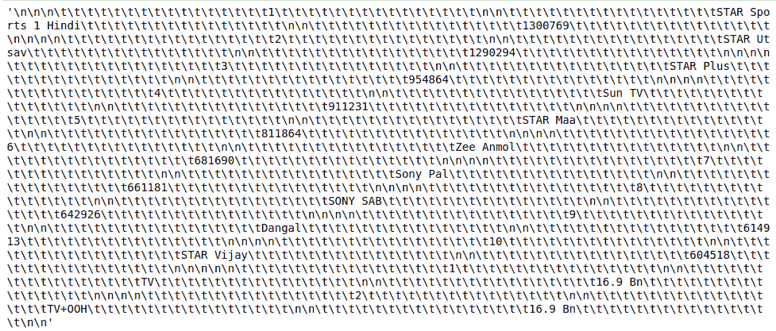

# 使用 Python 抓取电视评分点

> 原文:[https://www . geeksforgeeks . org/scratch-TV-rating-point-use-python/](https://www.geeksforgeeks.org/scraping-television-rating-point-using-python/)

在本文中，我们将编写 python 脚本来从 [BARC](https://barcindia.co.in/) 中抓取 TRP(电视收视率)。TRP 代表电视评分点，它代表在特定时期有多少人观看了哪些频道多少时间。它用来判断哪个电视节目看得最多。

### **所需模块:**

*   [**bs4**](https://www.geeksforgeeks.org/implementing-web-scraping-python-beautiful-soup/)【T4:美人汤(bs4)是一个从 HTML 和 XML 文件中拉出数据的 Python 库。这个模块没有内置 Python。要安装此软件，请在终端中键入以下命令。

```
pip install bs4

```

*   [**请求:**](https://www.geeksforgeeks.org/python-requests-tutorial/) 请求让你发送 HTTP/1.1 请求极其轻松。该模块也没有内置 Python。要安装此软件，请在终端中键入以下命令。

```
pip install requests

```

**我们来看看脚本的分步执行**

**第一步:**导入所有依赖

## 蟒蛇 3

```
# import module
import requests
from bs4 import BeautifulSoup
```

**步骤 2:** 创建一个 URL 获取函数

## 蟒蛇 3

```
# user define function 
# Scrape the data 
def getdata(url): 
    r = requests.get(url) 
    return r.text
```

**步骤 3:** 现在将 URL 传递给 getdata()函数，并将该数据转换为 HTML 代码

## 蟒蛇 3

```
htmldata = getdata("https://barcindia.co.in/data-insights")
soup = BeautifulSoup(htmldata, 'html.parser')
data = ''
for i in soup.find_all('tbody'):
    data = data + (i.get_text())

data
```

**输出:**



注意:这些脚本将只提供字符串格式的原始数据，您必须根据需要打印数据。

**步骤 4:** 现在遍历数据。

## 蟒蛇 3

```
data = ''.join((filter(lambda i: i not in ['\t'], data)))
print(data)
```

**输出:**

<video class="wp-video-shortcode" id="video-497534-1" width="665" height="374" preload="metadata" controls=""><source type="video/webm" src="https://media.geeksforgeeks.org/wp-content/cdn-uploads/20201012185022/scape-trp-python.webm?_=1">[https://media.geeksforgeeks.org/wp-content/cdn-uploads/20201012185022/scape-trp-python.webm](https://media.geeksforgeeks.org/wp-content/cdn-uploads/20201012185022/scape-trp-python.webm)</video>