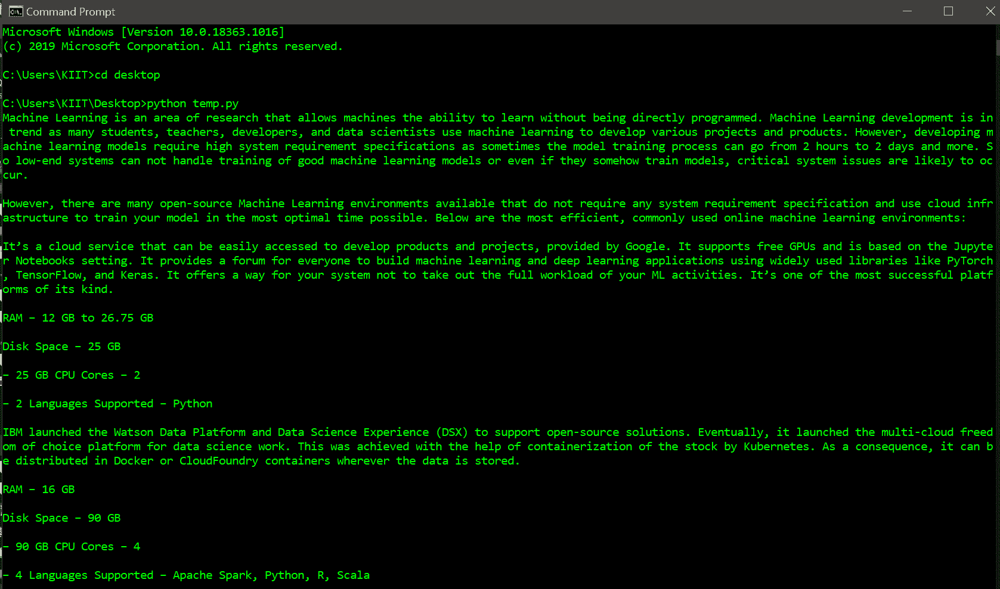
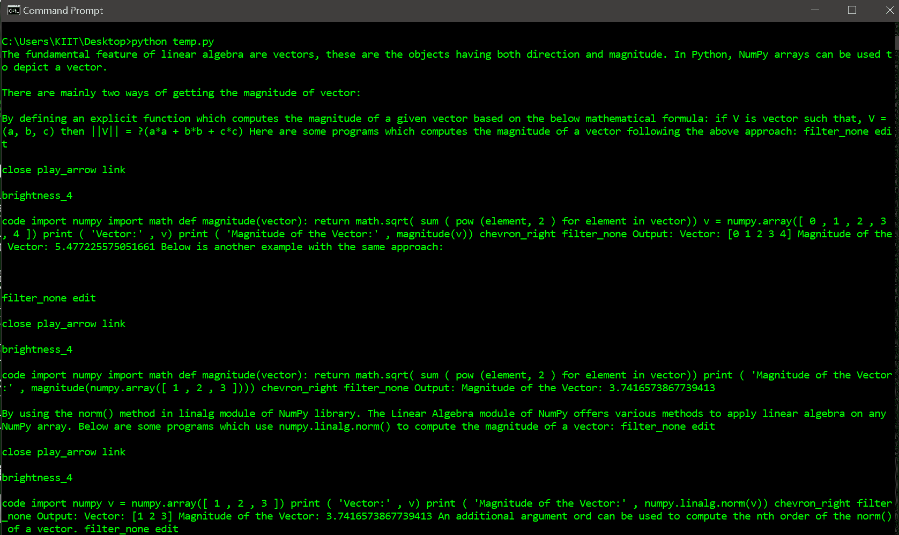

# 用 Python 中的 Newspaper3k 抓取网站

> 原文:[https://www . geeksforgeeks . org/scratch-网站-with-newspaper 3k-in-python/](https://www.geeksforgeeks.org/scraping-websites-with-newspaper3k-in-python/)

网页抓取是从网站收集信息的强大工具。要抓取多个网址，我们可以使用名为 *Newspaper3k* 的 Python 库。 *Newspaper3k* 包是一个用于网页抓取文章的 Python 库，它建立在请求之上，用于解析 *lxml* 。该模块是 [*报*](https://www.geeksforgeeks.org/newspaper-article-scraping-curation-python/) 模块的改进和更好的版本，也用于同样的目的。

### 安装:

要安装此模块，请在终端中键入以下命令。

```
pip install newspaper3k

```

### **分步方法:**

1.  首先，我们将定义一个包含网址的列表，或者分配一个单独的网址。
2.  我们将创建一个 *Article* 对象，传递参数，如 URL 的名称和可选参数，如语言='en '，用于英语
3.  然后，我们将下载并解析该文件。
4.  最后，显示提取的数据。

**以下是基于上述方法的一些示例:**

**例 1**

下面是一个从给定网址中删除数据的程序。

## 蟒蛇 3

```
# Import required module
import newspaper

# Assingn url
url = 'https://www.geeksforgeeks.org/top-5-open-source-online-machine-learning-environments/'

# Extract web data
url_i = newspaper.Article(url="%s" % (url), language='en')
url_i.download()
url_i.parse()

# Display scrapped data
print(url_i.text)
```

**输出:**



**例 2**

在这里，我们从多个网址中删除数据，然后显示出来。

## 蟒蛇 3

```
# Import required modules
import newspaper

# Define list of urls
list_of_urls = ['https://www.geeksforgeeks.org/how-to-get-the-magnitude-of-a-vector-in-numpy/',
                'https://www.geeksforgeeks.org/3d-wireframe-plotting-in-python-using-matplotlib/',
                'https://www.geeksforgeeks.org/difference-between-small-data-and-big-data/']

# Parse through each url and display its content
for url in list_of_urls:
    url_i = newspaper.Article(url="%s" % (url), language='en')
    url_i.download()
    url_i.parse()
    print(url_i.text)
```

**输出:**

