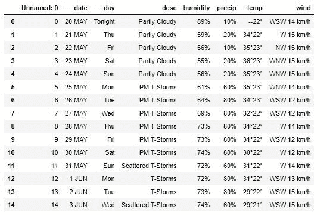

# 使用 Python 和 BS4 的报废天气预测数据

> 原文:[https://www . geeksforgeeks . org/skifing-weather-prediction-data-use-python-and-bs4/](https://www.geeksforgeeks.org/scrapping-weather-prediction-data-using-python-and-bs4/)

本文围绕使用 python 和 bs4 库废弃天气预测 d 数据展开。让我们检查脚本中使用的组件–

> **美化程序**–它是一个强大的 Python 库，用于从 HTML/XML 文件中拉出数据。它为已解析的页面创建一个解析树，可用于从 HTML/XML 文件中提取数据。
> **[请求](https://www.geeksforgeeks.org/python-requests-tutorial/)**–这是一个 Python HTTP 库。它使 HTTP 请求变得更简单。我们只需要添加 URL 作为参数，get()就可以从中获取所有信息。

We will be scrapping data from **https://weather.com/en-IN/weather/tenday/l/INKA0344:1:IN**.

**步骤 1–**运行以下命令，将存储的内容从 URL 获取到响应对象(文件)中:

```py
import requests
# to get data from website
file = requests.get("https://weather.com/en-IN/weather/tenday/l/INKA0344:1:IN")
```

**步骤 2–**解析 HTML 内容:

```py
# import Beautifulsoup for scraping the data 
from bs4 import BeautifulSoup
soup = BeautifulSoup(file.content, "html.parser")
```

**步骤 3–**从气象站点抓取数据运行以下代码:

```py
# create empty list
list =[]
all = soup.find("div", {"class":"locations-title ten-day-page-title"}).find("h1").text

# find all table with class-"twc-table"
content = soup.find_all("table", {"class":"twc-table"})
for items in content:
    for i in range(len(items.find_all("tr"))-1):
                # create empty dictionary
        dict = {}
        try:   
                        # assign value to given key 

            dict["day"]= items.find_all("span", {"class":"date-time"})[i].text
            dict["date"]= items.find_all("span", {"class":"day-detail"})[i].text            
            dict["desc"]= items.find_all("td", {"class":"description"})[i].text
            dict["temp"]= items.find_all("td", {"class":"temp"})[i].text
            dict["precip"]= items.find_all("td", {"class":"precip"})[i].text
            dict["wind"]= items.find_all("td", {"class":"wind"})[i].text
            dict["humidity"]= items.find_all("td", {"class":"humidity"})[i].text
        except:  
                     # assign None values if no items are there with specified class

            dict["day"]="None"
            dict["date"]="None"
            dict["desc"]="None"
            dict["temp"]="None"
            dict["precip"]="None"
            dict["wind"]="None"
            dict["humidity"]="None"

        # append dictionary values to the list
        list.append(dict)
```

> **find_all:** 用于拾取作为参数传入的 tag 及其后代的所有 HTML 元素。
> **find:** 它会搜索传递的元素标签。
> **list.append(dict):** 这会将所有数据追加到类型列表的列表中。

**步骤 4–**将列表文件转换为 CSV 文件，查看整理好的天气预报数据。

使用以下代码将列表转换为 CSV 文件并存储到`output.csv`文件中:

```py
import pandas as pd
convert = pd.DataFrame(list)
convert.to_csv("output.csv")
```

。

> **语法:**熊猫。DataFrame(数据=无，索引:可选[集合] =无，列:可选[集合] =无，数据类型:Union[str，numpy.dtype，ExtensionDtype，None] =无，副本:bool = False)
> 
> **参数:**
> 
> **数据:** Dict 可以包含 Series、arrays、常量或类似列表的对象。
> **索引:**用于结果帧。如果输入数据中没有索引信息部分并且没有提供索引，将默认为范围索引。
> **列:**用于结果帧的列标签。如果未提供列标签，将默认为 RangeIndex (0，1，2，…，n)。
> **数据类型:**用于设置默认值。
> **复制:**复制输入的数据。默认值为 false。

```py
# read csv file using pandas
a = pd.read_csv("output.csv")
print(a)
```

**输出:**

