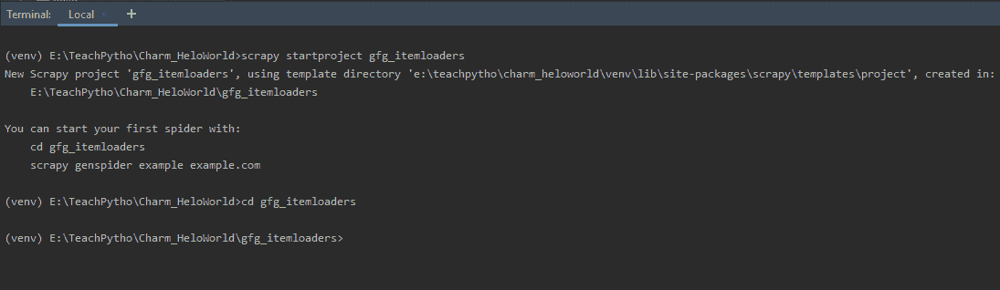
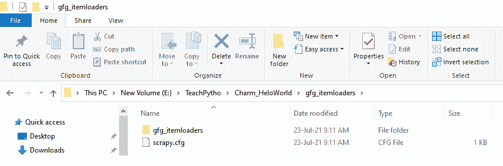
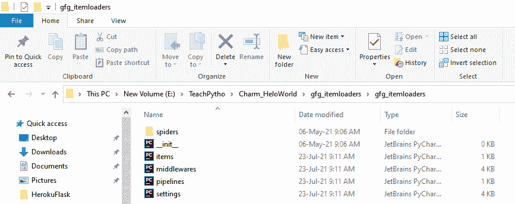
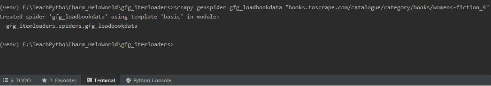
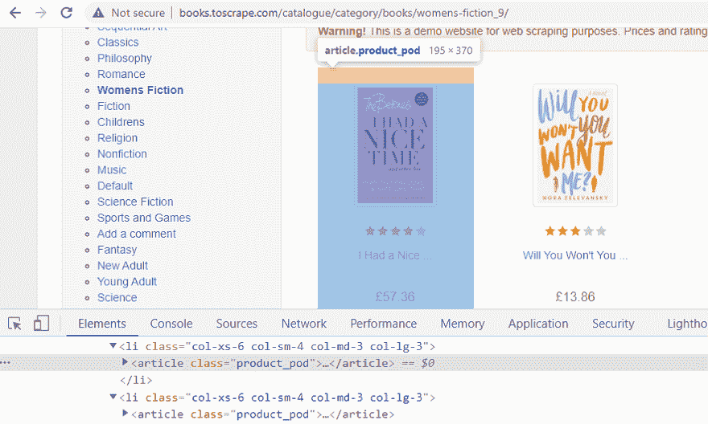
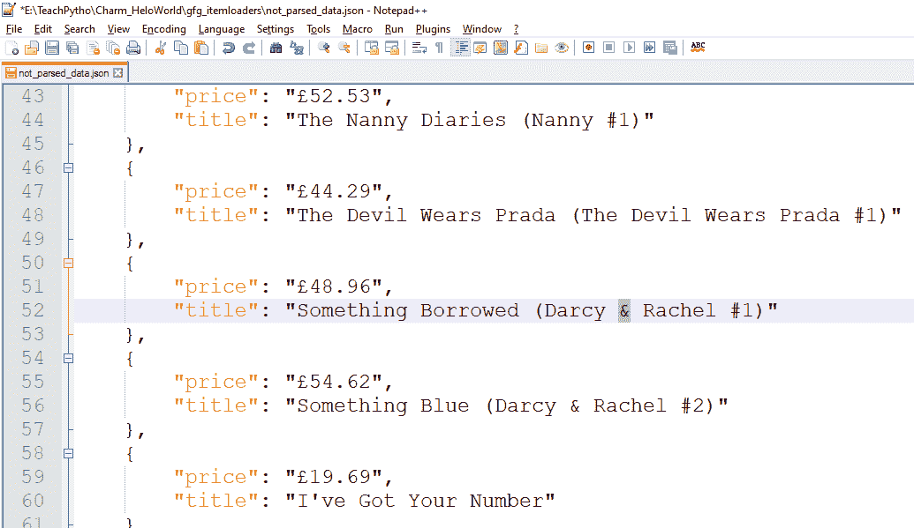

# 报废–物品装载器

> 原文:[https://www.geeksforgeeks.org/scrapy-item-loaders/](https://www.geeksforgeeks.org/scrapy-item-loaders/)

在本文中，我们将讨论 Scrapy 中的**项目加载器。**

Scrapy 是用来提取数据的，使用的是在网站上爬行的蜘蛛。获得的数据也可以以废品的形式进行处理。在填充项目字段之前，项目加载器在解析数据方面起着重要作用。在本文中，我们将了解项目加载器。

## **安装刮板:**

Scrapy，需要 Python 版本，3.6 及以上版本。使用 pip 命令将其安装在终端上，如下所示:

```py
pip install Scrapy  
```

该命令将在您的环境中安装剪贴簿库。现在，我们可以创建一个 Scrapy 项目，来编写 Python Spider 代码。

## **创建一个刺痒蜘蛛项目**

Scrapy 附带了一个高效的命令行工具，称为 Scrapy 工具。根据命令的用途，它们有一组不同的参数。为了编写 Spider 代码，我们从创建一个 Scrapy 项目开始。在终端使用以下“startproject”命令–

```py
scrapy startproject gfg_itemloaders
```

该命令将创建一个名为“gfg_itemloaders”的文件夹。现在，将目录更改为相同的文件夹，如下所示–



使用“开始项目”命令创建剪贴簿项目

**剪贴簿项目的文件夹结构如下所示:**



剪贴簿项目的文件夹结构

它有一个 scrapy.cfg 文件，也就是项目配置文件。包含此文件的文件夹称为根目录。该目录还包含 items.py、middleware.py 和其他设置文件，如下所示–



剪贴簿项目的文件夹结构

用于爬行的蜘蛛文件将在“蜘蛛”文件夹中创建。我们将在 items.py 文件中提到我们的 Scrapy 项和相关的加载器逻辑。暂时保留文件的内容。使用“genspider”命令，创建一个蜘蛛代码文件。

> scrapy gens pider gfg _ loadbookdata " books . toscrape . com/catalog/category/books/women-fiction _ 9 "

终端的命令如下所示



使用“genspider”命令创建蜘蛛文件

## 使用报废项目提取数据

**我们将从女性小说网页上抓取书名和书价。Scrapy，允许使用选择器，编写提取代码。它们可以使用 CSS 或 XPath 表达式来编写，遍历整个 HTML 页面，以获得我们想要的数据。抓取的主要目标是从非结构化的来源获取结构化数据。通常，Scrapy 蜘蛛会在 Python 字典对象中产生数据。这种方法是有益的，只需要少量的数据。但是，随着数据的增加，复杂性也会增加。此外，在我们存储内容之前，可能需要以任何文件格式处理数据。这就是“废品”派上用场的地方。它们允许使用项目加载器来处理数据。让我们为书名和价格写一个剪贴簿，并为同样的内容写一个 XPath 表达式。**

**items.py '文件，提到属性，我们需要刮擦。**

**我们定义如下:**

## **蟒蛇 3**

```py
# Define here the models for your scraped item
import scrapy

# Item class name for the book title and price
class GfgItemloadersItem(scrapy.Item):

    # Scrape Book price
    price = scrapy.Field()

    # Scrape Book Title
    title = scrapy.Field()
```

*   **请注意，字段()允许在一个位置定义所有字段元数据。它不提供任何额外的属性。**
*   **XPath 表达式，允许我们遍历网页，并提取数据。右键单击其中一本书，然后选择“检查”选项。这应该会在浏览器中显示它的 HTML 属性。网页上的所有书籍都包含在同一个

    <article>HTML 标签中，具有类属性，如“product_pod”。如下所示–</article>** 

**

所有图书都属于相同的“类”属性“product_pod”** 

*   **因此，我们可以迭代

    <article>标签类属性，以提取网页上的所有书籍标题和价格。同样，XPath 表达式将是 books = response . XPath('//*[@ class = " product _ pod "]')。这将返回属于类属性“product_pod”的所有书籍 HTML 标记。“*”运算符表示属于类“product_pod”的所有标记。因此，我们现在可以有一个循环，导航到页面上的每一本书。</article>** 
*   **在循环中，我们需要得到书名。因此，右键单击标题并选择“检查”。在**
*   **同样，要获得书的价格，右键单击并对其说检查，以获得其 HTML 属性。所有价格元素，都属于标签，类属性为“product_price”。实际价格在段落标记中提到，在元素中出现。因此，要获得 Price 的实际文本，XPath 表达式应该是 books.xpath('。//*[@ class = " product _ price "]/p/text()')。extract_first()。extract_first()方法返回第一个价格值。**

**我们将在蜘蛛中创建上面的一个对象，Item 类，并产生相同的。蜘蛛代码文件如下所示:**

## **蟒蛇 3**

```py
# Import Scrapy library
import scrapy

# Import Item class
from ..items import GfgItemloadersItem

# Spider class name
class GfgLoadbookdataSpider(scrapy.Spider):

    # Name of the spider
    name = 'gfg_loadbookdata'

    # The domain to be scraped
    allowed_domains = [
        'books.toscrape.com/catalogue/category/books/womens-fiction_9']

    # The URL to be scraped
    start_urls = [
        'http://books.toscrape.com/catalogue/category/books/womens-fiction_9/']

    # Default parse callback method
    def parse(self, response):

        # Create an object of Item class
        item = GfgItemloadersItem()

        # loop through all books
        for books in response.xpath('//*[@class="product_pod"]'):

            # XPath expression for the book price
            price = books.xpath(
                './/*[@class="product_price"]/p/text()').extract_first()

            # place price value in item key
            item['price'] = price

            # XPath expression for the book title
            title = books.xpath('.//h3/a/text()').extract()

            # place title value in item key
            item['title'] = title

            # yield the item
            yield item
```

*   **当我们执行上述代码时，使用 scrapy“crawl”命令，使用语法 as，scrapy crawl spider_name，在终端为–**

```py
scrapy crawl gfg_loadbookdata -o not_parsed_data.json
```

**数据被导出到“未解析数据. json”文件中，如下所示:**

**

未解析数据时产生的项** 

**现在，假设我们想要在以任何文件格式产生和存储这些数据之前，处理这些被抓取的数据，那么我们可以使用项目加载器。**

## ****项目加载器介绍****

**项目加载器允许以更流畅的方式来管理被抓取的数据。很多时候，我们可能需要处理我们收集的数据。该处理可以是:**

*   **精炼或编辑当前文本。**
*   **用其他字符替换现有的任何字符，或者用适当的字符替换丢失的数据。**
*   **删除不需要的字符。**
*   **清除空白字符。**

**在本文中，我们将进行以下处理–**

*   **从帐面价格中移除' '(英镑)货币。**
*   **将书名中出现的“&”符号替换为“与”。**

## ****项目加载器如何工作**？******

****到目前为止，我们知道项目加载器用于在填充项目字段之前解析数据。让我们了解项目加载器是如何工作的–****

*   ****项目加载器，帮助填充，刮擦的数据，到刮擦的项目。项目是在“项目.副本”文件中定义的字段。****
*   ****一个项目加载器将有一个输入处理器和一个输出处理器，为每个项目字段定义。****
*   ****我们知道，Scrapy 利用选择器(XPath 或 CSS 表达式)来导航到所需的 HTML 标签。****
*   ****项目加载器使用其 add_xpath()或 add_css()方法来获取所需的数据。****
*   ****然后，输入处理器对这些数据进行处理。我们可以提到，我们的自定义函数，作为参数，输入处理器，解析数据，我们想要的。****
*   ****输入处理器的结果存储在项目加载器中。****
*   ****一旦接收到所有数据，并根据 input_processor 进行解析，加载器将调用它的 load_item()方法来填充 item 对象。****
*   ****在这个过程中，输出处理器被调用，并作用于中间数据。****
*   ****输出处理器的结果被分配给项目对象。****
*   ****解析后的项目对象就是这样产生的。****

## ****内置处理器:****

****现在，让我们了解一下，在项目加载器实现中，我们将使用的内置处理器和方法。Scrapy 有六个内置处理器。让我们了解他们–****

******Identity():** 这是默认的，也是最简单的处理器。它从不改变任何价值。它既可以用作输入处理器，也可以用作输出处理器。这意味着，当没有提到其他处理器时，这将起作用，并返回不变的值。****

## ****蟒蛇 3****

```py
**# Import the processor
from itemloaders.processors import Identity

# Create object of Identity processor
proc = Identity()

# Assign values and print result
print(proc(['star','moon','galaxy']))**
```

******输出:******

```py
**['star','moon','galaxy']**
```

******TakeFirst():** 这将从接收到的数据中返回第一个非空值。它通常用作输出处理器。****

## ****蟒蛇 3****

```py
**# import the processor module
from itemloaders.processors import TakeFirst

# Create object of TakeFirst processor
proc = TakeFirst()

# assign values and print the result
print(proc(['', 'star','moon','galaxy']))**
```

******输出:******

```py
**'star'**
```

******Compose():** 这将获取数据，并将其传递给参数中的函数。如果参数中存在多个函数，则上一个函数的结果将传递给下一个函数。这种情况一直持续到最后一个函数被执行，并且输出被接收。****

## ****蟒蛇 3****

```py
**# Import the processor module
from itemloaders.processors import Compose

# Create an object of Compose processor and pass values
proc = Compose(lambda v: v[0], str.upper)

# Assign values and print result
print(proc(['hi', 'there']))**
```