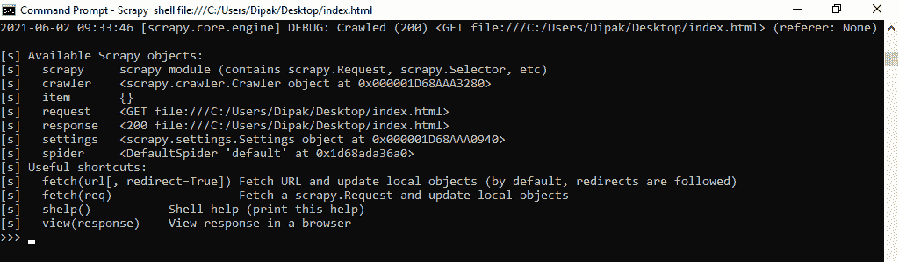
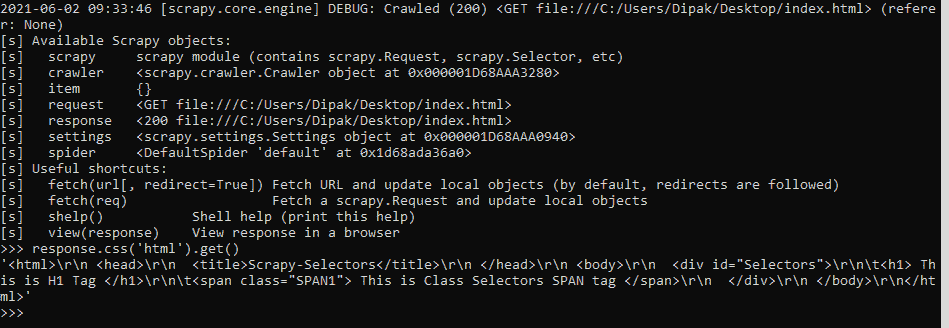
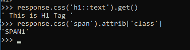
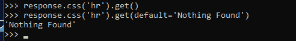
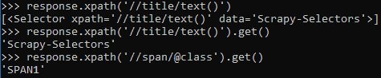
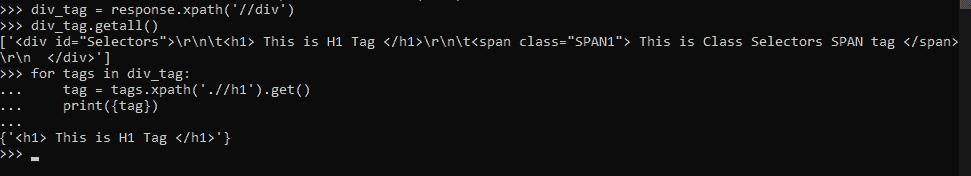
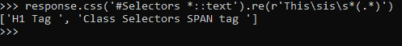
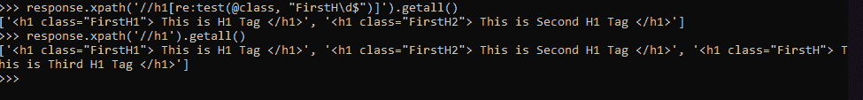
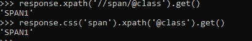
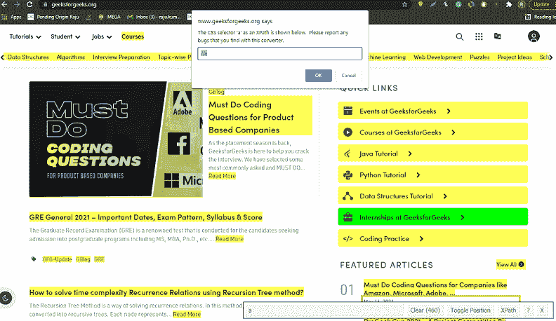

# 剪贴簿–选择器

> 原文:[https://www.geeksforgeeks.org/scrapy-selectors/](https://www.geeksforgeeks.org/scrapy-selectors/)

[Scrapy](https://www.geeksforgeeks.org/implementing-web-scraping-python-scrapy/) 选择器顾名思义就是用来选择一些东西的。如果我们谈论 CSS，那么也有选择器存在，用于选择和应用 CSS 效果到 HTML 标签和文本。

在 Scrapy 中，我们使用选择器来提及网站中被蜘蛛抓取的部分。因此，为了从网站上抓取正确的数据，我们应该选择正确表示数据的标签，这一点非常重要。有许多工具用于此。

### **选择器类型:**

在 Scrapy 中，主要有两种选择器，即 CSS 选择器和 XPath 选择器。它们都执行相同的功能，选择相同的文本或数据，但是传递参数的格式不同。

*   **CSS 选择器:**由于 CSS 语言是在任何 HTML 文件中定义的，所以我们可以使用它们的选择器作为在 Scrapy 中选择部分 HTML 文件的方式。
*   **XPath 选择器:**这是一种用于选择 XML 文档中节点的语言，因此它也可以用于 HTML 文件，因为 HTML 文件也可以表示为 XML 文档。

### 描述:

让我们有一个 HTML 文件(index.html)，如下所示，我们将使用我们的蜘蛛废弃它，看看选择器是如何工作的。我们将在 Scrapy Shell 上工作，给出选择数据的命令。

## 超文本标记语言

```
<html>
 <head>
  <title>Scrapy-Selectors</title>
 </head>
 <body>
  <div id='Selectors'>
    <h1> This is H1 Tag </h1>
    <span class="SPAN1"> This is Class Selectors SPAN tag </span>
  </div>
 </body>
</html>
```

以下是我们将使用的 Scrapy Shell 的视图:

**命令开壳:**

> Scrapy shell 文件:///C:/Users/Dipak/Desktop/index . html



剪贴簿外壳激活爬行蜘蛛在 Index.html 文件。

## 使用选择器:

现在我们将讨论如何在 Scrapy 中使用选择器。因为它主要有两种类型，如下所示:

### **CSS 选择器:**

在不同的情况下使用 CSS 选择器有多种格式。它们如下所示:

*   非常基本的开始从选择 HTML 文件中的基本标签开始，例如标签、、等。所以下面给出的是使用 Scrapy 在 HTML 文件中选择任何标签的基本格式。

```
Shell Command : response.css('html').get()

# Here response object calls CSS selector method to
# target HTML tag and get() method
# is used to select everything inside the HTML tag.
```



输出:选择 HTML 文件的全部内容。

*   因此，现在是时候修改我们的选择方式了，如果我们只想选择标签的内部文本，或者只想选择任何特定标签的属性，那么我们可以遵循下面给出的语法:

```
# To select the text inside the Tags 
# excluding tags we have to use (::text) 
# as our extension.
response.css('h1::text').get()

# To select the attributes details of
# any HTML tag  we have to use below 
# given syntax:
response.css('span').attrib['class']
```



以上命令的输出。

*   如果在 HTML 文件中有许多相同类型的标签，那么我们可以使用 ***。*** 改为*。get()* 选择所有标签。它返回所选标签及其数据的列表。
*   如果文件中没有提到我们必须选择的标签，那么 CSS 选择器不返回任何东西。我们还可以提供缺省数据，如果没有发现，就返回这些数据。



不选择任何内容。

### **XPath 选择器:**

这些选择器的工作方式类似于 CSS 选择器的工作方式，只是语法不同。

下面是可以用 XPATH 编写的附加税，用于选择，我们之前已经做过了。

```
# This is to select the text part of 
# title tag using XPATH
response.xpath('//title/text()')
response.xpath('//title/text()').get()

# This is how to select attributes
response.xpath('//span/@class').get()
```



XPATH 选择器。

**属性:**

1.我们可以将选择器嵌套在一起。因为如果我们的 HTML 文件可以包含 div 标签中的元素，那么我们可以嵌套选择器来选择其中的特定元素。为了实现这一点，我们首先必须选择 div 标签中的所有元素，然后我们可以从中选择任何特定的元素。

```
div_tag = response.xpath('//div')
div_tag.getall()

for tags in div_tag:
     tag = tags.xpath('.//h1').get()
     print({tag})
```



选择器中嵌套的使用

2.接下来，我们还可以在正则表达式中使用选择器。如果我们不知道属性或元素的名称，那么我们也可以使用正则表达式进行选择。为此，我们有一个名为()的方法。re())。

**。re()** 方法用于根据内容匹配选择标签。如果 HTML 标记中的内容与输入的正则表达式相匹配，则该方法返回该内容的列表。在上面的 HTML 文件中，我们在 DIV 标签中有两个名为 h1 和 span 的标签，这两个标签中的文本有相同的开始，即“这是”。因此，为了基于正则表达式选择它们，我们必须形成它们的正则表达式，如下所示:

> regexp = r'This\sis\s*。*)'，我们必须在。re()方法

所以我们的代码变成了

> response . CSS(' # Selectors *::text ')。关于(r'This\sis\s*。*)')



使用正则表达式选择文本

3.EXSLT 正则表达式也得到了刺痒蜘蛛的支持。我们可以使用它的方法基于一些新的正则表达式来选择项目。这个扩展提供了两种不同的名称空间用于 XPath

1.  **re:** 用于制作正则表达式。
2.  **设定:**用于设定操作

我们可以使用这些名称空间来修改我们的 Xpath 方法中指定的 select 语句。

下面是一个给定的例子:

假设我们在 HTML 文件中添加了两个 h1 标记并命名了它们的类，那么现在看起来如下:

## 超文本标记语言

```
<html>
 <head>
  <title>Scrapy-Selectors</title>
 </head>
 <body>
  <div id='Selectors'>
    <h1 class='FirstH1'> This is H1 Tag </h1>
    <h1 class='FirstH2'> This is Second H1 Tag </h1>
    <h1 class='FirstH'> This is Third H1 Tag </h1>
    <span class="SPAN1"> This is Class Selectors SPAN tag </span>
  </div>
 </body>
</html>
```

现在，如果我们想使用 regexp 选择两个 H1 标签，那么我们可以看到，我们必须选择在 id 部分首先有一个开始字符串的标签，结束整数并不重要。

所以这个的代码是:

> response . XPath('//h1[re:test(@ class，“first h \ d { content }”)x201；)]').getall()

这里我们使用 re:test 方法在 h1 标记的类属性上指定和测试我们的正则表达式，regexp 只选择那些类属性值以整数结尾的 h1 标记。



这是一个在 scrapy 的选择器中使用 EXSLT 的例子。

4.如果需要，我们可以使用合并在一起的两个选择器来增强选择的方式。

```
response.css('span').xpath('@class').get()
# CSS is used to select tag and XPATH is 
# used to select attribute
```



合并选择器。

**注:**

*   在 XPath 中，当我们使用选择器的嵌套属性时，我们应该注意一个关于相对 XPath 的事实。假设我们选择了一个 div 标签，如下所示:

> div_tag = response.xpath('//div ')

这将选择 div 标签和该标签内的所有元素。现在假设 div 标签包含一些

> 对于 in div _ tag.xpath('。//a’):

这是一个相对路径，告诉蜘蛛只从上面选择的 div 标签内的路径中选择标签元素。如果我们写–

> 对于 in div_tag('//a '):

它将选择 HTML 文档中的所有标签。所以要注意相对路径。

*   我们可以使用谷歌 Chrome Extension 命名为 ***SelectorGadget*** ，用来简化选择任务。因为今天所有的网站如果我们检查它们，都有非常长且难以理解和搜索的代码。因此，在它们之中，我们可以使用这个扩展，它只允许在前端选择标签。

