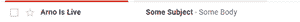

# 剪贴簿–发送电子邮件

> 原文:[https://www.geeksforgeeks.org/scrapy-sending-an-e-mail/](https://www.geeksforgeeks.org/scrapy-sending-an-e-mail/)

**先决条件:**T2【刺儿头】T3

**Scrapy** 提供了自己的发送电子邮件的工具，非常好用，而且是用 Twisted 非阻塞 IO 实现的，避免干扰爬虫的非阻塞 IO。本文讨论了如何使用 scrapy 发送邮件。

对于这个邮件发送器类，需要从 scrapy 导入，然后需要调用一个具有正确参数的专用函数来成功发送邮件。

### 使用的功能

*   MailSender()用于设置邮件程序。

> **语法:**
> 
> class scrapy . mail . mailstore(smtphost = none、mailfrom=None、smtpuser=None、smtppass=none、smtpport=None)
> 
> **参数**
> 
> *   smtphost(字符串或字节)–用于发送电子邮件的 SMTP 主机。
> *   邮件发件人(str)–用于发送电子邮件的地址(在发件人:标题中)。
> *   SMTP user–SMTP 用户。如果省略，将使用 MAIL_USER 设置。如果没有给出，将不会执行 SMTP 身份验证..
> *   smtppass(字符串或字节)–用于身份验证的 SMTP 通道。
> *   SMTP 端口(int)–要连接的 SMTP 端口
> *   SMTP TLS(bool)–使用 SMTP STARTTLS 强制实施
> *   smtpssl(bool)–强制使用安全的 ssl 连接

*   classmethodfrom_settings()实例化一个 Scrapy 设置对象，它可以尊重这些 Scrapy 设置。

> **语法:**
> 
> classmethodfrom_settings(设置)
> 
> **参数**
> 
> *   设置(剪贴簿.设置.设置对象)–电子邮件收件人

*   send()向给定的收件人发送电子邮件。

> **语法:**
> 
> 发送(收件人、主题、正文、抄送=无、附件=()、mimetype='text/plain '，字符集=无)
> 
> **参数**
> 
> *   收件人(字符串或列表)–作为字符串或字符串清单的电子邮件收件人
> *   主题(str)–电子邮件的主题
> *   抄送(字符串或列表)–以字符串或字符串清单形式发送给抄送的电子邮件
> *   正文(str)–电子邮件正文
> *   attachs(collections . ABC . Iterable)–元组(attach_name，mimetype，file_object)的可迭代列表，其中 attach_name 是具有将出现在电子邮件附件上的名称的字符串，mimetype 是附件的 mimetype，file_object 可以是具有附件内容的可读文件对象
> *   字符集(str)–用于电子邮件内容的字符编码

### 方法

*   导入模块
*   设置邮件程序
*   添加邮件的主题和正文
*   提供发件人和收件人电子邮件地址
*   发送邮件

**示例:**

## 蟒蛇 3

```py
# import module
from scrapy.mail import MailSender

# setup mailer
mailer = MailSender(mailfrom="Something@gmail.com",
                    smtphost="smtp.gmail.com", smtpport=465, smtppass="MySecretPassword")

# send mail
mailer.send(to=["abc@gmail.com"], subject="Scrapy Mail",
            body="Hi ! GeeksForGeeks", cc=["another@example.com"])
```

**输出:**

