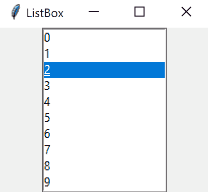
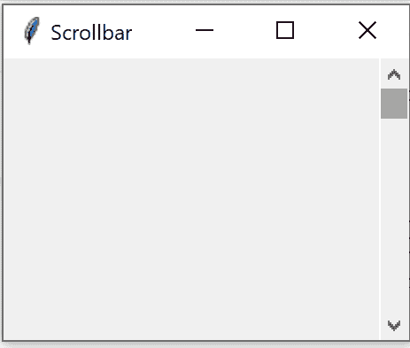
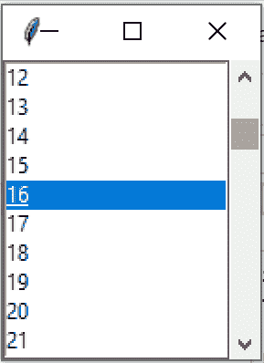

# Python-tkinter 中的可滚动列表框

> 原文:[https://www . geesforgeks . org/scroll-python 中的 listbox-tkinter/](https://www.geeksforgeeks.org/scrollable-listbox-in-python-tkinter/)

Tkinter 是 Python 的标准图形用户界面库。Python 中的 Tkinter 附带了很多好的小部件。小部件是标准的图形用户界面元素，列表框、滚动条也将在这个小部件下。

**注意:**更多信息请参考[Python GUI–tkinter](https://www.geeksforgeeks.org/python-gui-tkinter/)

#### 列表框

列表框小部件用于显示不同类型的项目。这些项目必须具有相同类型的字体和相同的字体颜色。项目也必须是文本类型。用户可以根据需要从给定列表中选择一个或多个项目。

**语法:**

```py
listbox = Listbox(root, bg, fg, bd, height, width, font, ..)
```



#### 卷动条

滚动条小部件用于向下滚动内容。我们还可以为入口小部件创建水平滚动条。

**语法:**
使用滚动条小部件的语法如下。

```py
w = Scrollbar(master, options) 
```

**参数:**

*   **主**:此参数用于表示父窗口。
*   **选项**:有很多可用的选项，可以作为键值对使用，用逗号分隔。



## 向列表框添加滚动条

为此，我们需要将滚动条附加到 Listbox 上，要附加，我们使用函数`listbox.config()`并将其命令参数设置为滚动条的 set 方法，然后将滚动条的命令参数设置为指向当滚动条位置改变时将被调用的方法

```py
from tkinter import *

# Creating the root window
root = Tk()

# Creating a Listbox and
# attaching it to root window
listbox = Listbox(root)

# Adding Listbox to the left
# side of root window
listbox.pack(side = LEFT, fill = BOTH)

# Creating a Scrollbar and 
# attaching it to root window
scrollbar = Scrollbar(root)

# Adding Scrollbar to the right
# side of root window
scrollbar.pack(side = RIGHT, fill = BOTH)

# Insert elements into the listbox
for values in range(100):
    listbox.insert(END, values)

# Attaching Listbox to Scrollbar
# Since we need to have a vertical 
# scroll we use yscrollcommand
listbox.config(yscrollcommand = scrollbar.set)

# setting scrollbar command parameter 
# to listbox.yview method its yview because
# we need to have a vertical view
scrollbar.config(command = listbox.yview)

root.mainloop()
```

**输出**
