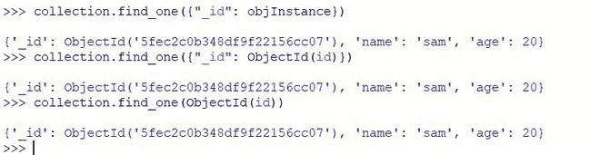

# 使用 PyMongo-Python 在 mongodb 中按 ObjectId 搜索

> 原文:[https://www . geesforgeks . org/search-by-objectid-in-MongoDB-with-pymongo-python/](https://www.geeksforgeeks.org/search-by-objectid-in-mongodb-with-pymongo-python/)

**MongoDB** 是 [NoSQL](https://www.geeksforgeeks.org/introduction-to-nosql/) 面向文档的数据库。在 MongoDB 中，数据存储在类似 JSON 的文档结构中，而不是以列和行的方式存储数据。MongoDB 在存储半结构化和非结构化数据方面非常灵活。MongoDB 用于大容量数据存储，可以水平扩展。

**ObjectId :** ObjectId 类是一个 12 字节的二进制 BSON 类型，其中 4 字节的创建时间戳，5 字节的随机值和 3 字节的递增计数器。ObjectId 是 MongoDB 文档的默认主键，通常在“_id”字段中找到。

```
eg : { "_id" : ObjectId("54759eb3c090d83494e2d804") }
```

**PyMongo :** PyMongo 是 MongoDB 的原生 Python 驱动。它允许通过 Python 与 MongoDB 数据库进行交互。

**步骤 1:** 确保在默认端口(27017)本地启动 MongoDB 数据库。连接到 MongoDB、访问数据库和收集对象。

## 蟒蛇 3

```
# importing MongoClient from pymongo
from pymongo import MongoClient

# importing ObjectId from bson library
from bson.objectid import ObjectId

# Establishing connection with
# mongodb on localhost
client = MongoClient('127.0.0.1', 27017)

# Access database object
db = client['database']

# Access collection object
collection = db['collection']
```

**第二步:**

使用 find_one()查询 MongoDB。该函数接受查询作为第一个参数，接受过滤器作为第二个参数。前两个方法是使用带有 ObjectId 的唯一查询实现的。最后一种方法是使用查询和过滤器实现的。

**示例 1:** 在本例中，我们已经存储了 ObjectId 对象实例，然后使用存储的对象实例搜索文档。

## 蟒蛇 3

```
# inserts data into collection and
# returns an object of type objectId
objInstance = collection.insert_one({"name": "sam", "age": 20}).inserted_id

# search MongoDB with
# an object of type objectId
collection.find_one(objInstance)
```

**输出:**


**示例 2:** 在本例中，我们使用的十六进制字符串不是 ObjectId 的对象。我们从 bson 库中导入 ObjectId 来搜索文档。

## 蟒蛇 3

```
# use the string object id
# and objectId object to
# create object of type ObjectId
id = "5fec2c0b348df9f22156cc07"
objInstance = ObjectId(id)

collection.find_one({"_id": objInstance})

# below line works same as the above
collection.find_one({"_id": ObjectId(id)})
collection.find_one(ObjectId(id))
```

**输出:**



**示例 3:** 在本例中，我们使用过滤器选项推进搜索。下面的过滤器将返回没有“_id”字段的整个文档。

## 蟒蛇 3

```
# search document with filter
# first parameter is search query
# second parameter is filter query
# you can as many fields you want
# you can specify either 1 or 0
# in filter fields
# if you specify 0 the field will
# be eleminated form the result
query = {"_id": ObjectId(id)}

filter = {"_id": 0}

collection.find_one(query, filter)
```

**输出:**

