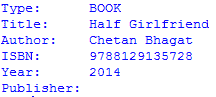
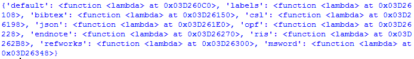

# 用 Python 搜书

> 原文:[https://www.geeksforgeeks.org/searching-books-with-python/](https://www.geeksforgeeks.org/searching-books-with-python/)

在本文中，我们将使用 **isbntools** 模块编写用于搜索书籍的 python 脚本。isbntools 模块能够通过图书名称或 ISBN( [国际标准书号](https://en.wikipedia.org/wiki/International_Standard_Book_Number))搜索图书，并返回图书的所有信息。

**安装:**运行以下 pip 命令:

```py
pip install isbntools
```

导入模块:

## 蟒蛇 3

```py
from isbntools.app import *
```

1.使用 **isbn_from_words()** 函数获取一本书的 isbn。

> **语法:** isbn_from_words(str)
> 
> **参数:**书名
> 
> **返回:**该书的 ISBN。

## 蟒蛇 3

```py
get_isbn = isbn_from_words("Half Girlfriend")
print(get_isbn)
```

**输出:**

```py
9788129135728
```

2.通过书号获取一本书的信息。

> **语法:**registry . bib formatters[标识符](meta(isbn))
> 
> **参数:**本书 ISB 号
> 
> **返回:**该书的元信息

注:标识符可用于打印不同类型的格式(bibtex、csl、opf、msword、endnote、refworks、json)。

## 蟒蛇 3

```py
print(registry.bibformatters['labels'](meta("9788129135728")))
```

**输出:**



3.如果您想打印没有标识符的对象，那么您将所有对象放在一个特定的位置。

## 蟒蛇 3

```py
print(registry.bibformatters)
```

**输出:**



4.获取 JSON 格式的信息:

## 蟒蛇 3

```py
print(registry.bibformatters['json'](meta("9788129135728")))
```