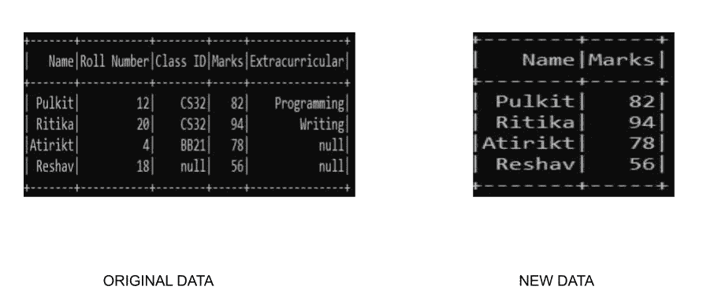

# 选择 PySpark 数据框中的列

> 原文:[https://www . geesforgeks . org/select-columns-in-pyspark-data frame/](https://www.geeksforgeeks.org/select-columns-in-pyspark-dataframe/)

在本文中，我们将学习如何在 PySpark dataframe 中选择列。

### **使用的功能:**

在 PySpark 中，我们可以使用**选择()**功能选择列。select()函数允许我们选择不同格式的单列或多列。

> **语法:**数据帧名称。选择(列名称)

**注意:**我们正在使用 **findspark.init()** 函数指定我们到 spark 目录的路径，以便使我们的程序能够在我们的本地机器中找到 apache spark 的位置。如果您正在云上运行程序，请忽略这一行。假设我们在 c drive 中有一个名为 spark 的 spark 文件夹，那么这个函数看起来像:**find spark . init(' c:/spark ')**。在本地运行程序时，不指定路径有时可能会导致**py4j . protocol . py4j 错误**错误。

**例 1:选择单列或多列**

通过指定特定的列名，我们可以使用 select()函数选择单个或多个列。在这里，我们使用自定义数据集，因此我们需要指定我们的模式以及它，以便创建数据集。

## 蟒蛇 3

```py
# select single and multiple columns
from pyspark.sql.types import StructType, StructField, StringType, IntegerType, FloatType
from pyspark.sql import SparkSession
import findspark

findspark.init('c:/spark')

# Initialize our data
data2 = [("Pulkit", 12, "CS32", 82, "Programming"),
         ("Ritika", 20, "CS32", 94, "Writing"),
         ("Atirikt", 4, "BB21", 78, None),
         ("Reshav", 18, None, 56, None)
         ]

# Start spark session
spark = SparkSession.builder.appName("Student_Info").getOrCreate()

# Define schema
schema = StructType([
    StructField("Name", StringType(), True),
    StructField("Roll Number", IntegerType(), True),
    StructField("Class ID", StringType(), True),
    StructField("Marks", IntegerType(), True),
    StructField("Extracurricular", StringType(), True)
])

# read the dataframe
df = spark.createDataFrame(data=data2, schema=schema)

# slelct columns
df.select("Name", "Marks").show()

# stop the session
spark.stop()
```

**输出:**



**注意:**有很多方法可以指定 select()函数的列名。这里我们用**“列名”**来指定列。其他方式包括(参考上述代码显示的所有示例):

*   df.select(df。名字，df。标记)
*   df.select(df["Name"]，df["Marks"])
*   我们可以使用 pyspark.sql.functions 模块中的 col()函数来指定特定的列

## 蟒蛇 3

```py
from pyspark.sql.functions import col

df.select(col("Name"),col("Marks")).show()
```