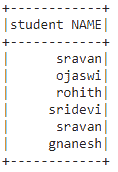
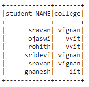

# 选择 PySpark 数据框的特定列及其位置

> 原文:[https://www . geesforgeks . org/select-specific-column-of-pyspark-data frame-with-position/](https://www.geeksforgeeks.org/select-specific-column-of-pyspark-dataframe-with-its-position/)

在本文中，我们将讨论如何从 Python 中的 pyspark 数据框中使用特定列的位置来选择它。为此，我们将在 dataframe.select()方法中使用 dataframe.columns()方法。

> **语法**:
> 
> data frame . select(data frame . columns[column _ number])。显示()
> 
> 哪里，
> 
> *   dataframe 是数据帧的名称
> *   dataframe.columns[]:是可以将列号作为输入并选择那些列的方法
> *   show()函数用于显示选定的列

让我们创建一个示例数据帧。

## 蟒蛇 3

```
# importing module
import pyspark

# importing sparksession from pyspark.sql module
from pyspark.sql import SparkSession

# creating sparksession and giving an app name
spark = SparkSession.builder.appName('sparkdf').getOrCreate()

# list  of students  data
data = [["1", "sravan", "vignan"], ["2", "ojaswi", "vvit"],
        ["3", "rohith", "vvit"], ["4", "sridevi", "vignan"],
        ["1", "sravan", "vignan"], ["5", "gnanesh", "iit"]]

# specify column names
columns = ['student ID', 'student NAME', 'college']

# creating a dataframe from the lists of data
dataframe = spark.createDataFrame(data, columns)

print("Actual data in dataframe")

# show dataframe
dataframe.show()
```

**输出:**


按列号选择列

## 蟒蛇 3

```
# select column with column number 1
dataframe.select(dataframe.columns[1]).show()
```

**输出:**



我们还可以使用 slice 运算符(:)选择多个具有相同函数的列。它最多可以访问 n 列。

> **语法**:data frame . select(data frame . columns[column _ start:column _ end])。显示()

## 蟒蛇 3

```
#select column with column number slice operator
dataframe.select(dataframe.columns[1:3]).show()
```

**输出:**

