# 选择性搜索目标检测| R-CNN

> 原文:[https://www . geesforgeks . org/selective-search-for-object-detection-r-CNN/](https://www.geeksforgeeks.org/selective-search-for-object-detection-r-cnn/)

目标定位问题是目标检测中最困难的部分。一种方法是我们使用不同大小的滑动窗口来定位图像中的对象。这种方法被称为穷举搜索。这种方法在计算上非常昂贵，因为我们需要在数千个窗口中搜索对象，即使是小图像尺寸。已经进行了一些优化，例如采用不同比例的窗口大小(而不是增加一些像素)。但是即使在此之后，由于窗口的数量，它也不是很有效。本文研究选择性搜索算法，该算法使用穷举搜索和分割(一种通过为图像中不同形状的对象分配不同颜色来分离它们的方法)。

**选择性搜索算法:**

1.  使用 Felzenszwalb 等人在其论文“基于图的高效图像分割”中描述的方法生成输入图像的初始子分割。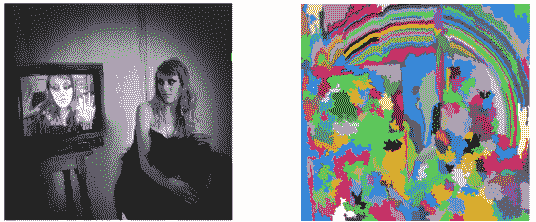
2.  递归地将较小的相似区域合并成较大的区域。我们使用贪婪算法来组合相似的区域，以形成更大的区域。算法写在下面。

```py
Greedy Algorithm : 

1\. From set of regions, choose two that are most similar.
2\. Combine them into a single, larger region.
3\. Repeat the above steps for multiple iterations.
```

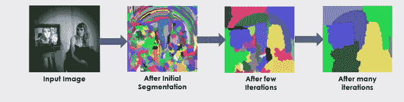*   Use the segmented region proposals to generate candidate object locations.

    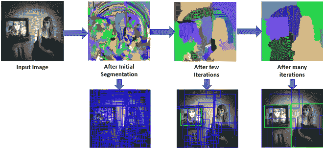

    ## 分割的相似性:

    选择性搜索论文在将最初的小分割合并成大分割时考虑了四种类型的相似性。这些相似之处是:

    *   **颜色相似度:**具体针对每个区域，我们生成图像中存在的每个颜色通道的直方图。本文在每个颜色通道的直方图中取 25 个面元。这为我们提供了 75 个面元(每个 R、G 和 B 对应 25 个面元)，并且每个区域的所有通道都被组合成一个向量(n = 75)。然后我们使用下面的等式找到相似性:
        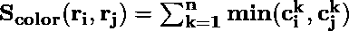
        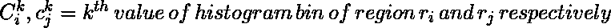
    *   **纹理相似度:**使用生成的图像的 8 个高斯导数计算纹理相似度，并为每个颜色通道提取具有 10 个面元的直方图。这给了我们每个区域 10×8×3 = 240 维向量。我们用这个方程导出相似性。
        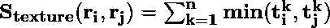
        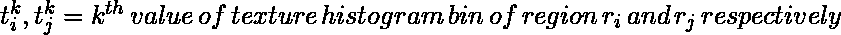
    *   **尺寸相似度:**尺寸相似度的基本思想是让较小的区域容易合并。如果不考虑这种相似性，那么较大的区域将继续与较大的区域合并，多个尺度的区域建议将仅在该位置生成。
        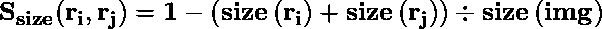
        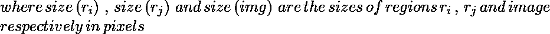*   **Fill Similarity :** Fill Similarity measures how well two regions fit with each other. If two region fit well into one another (For Example one region is present in another) then they should be merged, if two region does not even touch each other then they should not be merged.
    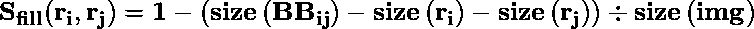
    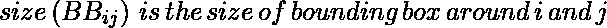
    Now, Above four similarities combined to form a final similarity.

    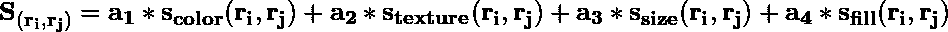
    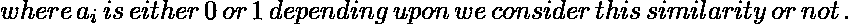

    ## 结果:

    来衡量这种方法的性能。本文描述了一个被称为 MABO(平均平均最佳重叠)的评价参数。
    有两个版本的选择性搜索来了**快速**和**品质**。它们之间的区别是，质量生成的边界框比快速生成的边界框多得多，因此需要更多的时间来计算，但具有更高的召回率和 ABO(平均最佳重叠)和 MABO(平均最佳重叠)。我们计算 ABO 如下。

    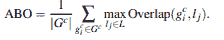

    正如我们可以观察到的，当所有的相似性被结合使用时，它给我们最好的 MABO。然而，也可以得出结论，RGB 不是在该方法中使用的最佳配色方案。HSV、Lab 和 rgI 的表现都比 RGB 好，这是因为这些对阴影和亮度变化不敏感。

    但是当我们多样化并结合这些不同的相似性、配色方案和阈值(k)时，

    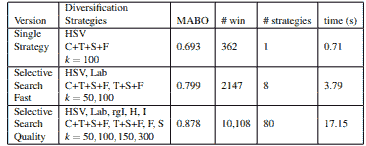

    在选择性搜索论文中，应用基于 MABO 的贪婪方法对不同策略进行搜索，得到以上结果。我们可以说，这种结合不同策略的方法虽然给出了更好的 MABO，但运行时间也大大增加。

    ## 对象识别中的选择性搜索:

    在选择性搜索论文中，作者将该算法用于目标检测，并通过给出地面真实实例和与地面真实重叠 20-50%的样本假设(作为否定实例)训练一个模型到 SVM 分类器中，并训练它来识别假阳性。下面给出了所用模型的体系结构。

    [](https://media.geeksforgeeks.org/wp-content/uploads/20200219164252/selasObjRec1.png)

    对象识别架构(来源:选择性搜索论文)

    VOC 2007 测试集生成的结果是，

    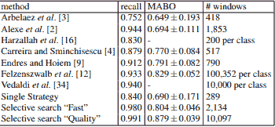

    正如我们所看到的，它在 VOC 2007 测试集上产生了非常高的召回率和最佳 MABO，并且与实现类似召回率和 MABO 的其他算法相比，它需要处理的窗口数量少得多。

    **应用:**

    选择性搜索广泛应用于早期最先进的架构，如 R-CNN、Fast R-CNN 等。然而，由于它处理的窗口数量，生成区域建议需要 1.8 到 3.7 秒(选择性快速搜索)，这对于实时对象检测系统来说是不够好的。

    **参考文献** **:**

    *   [Selective search paper (selective search object detection)](http://www.huppelen.nl/publications/selectiveSearchDraft.pdf)
    *   [Stanford Computer Vision Slide](http://vision.stanford.edu/teaching/cs231b_spring1415/slides/ssearch_schuyler.pdf)