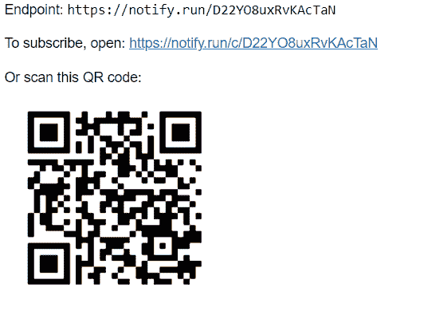
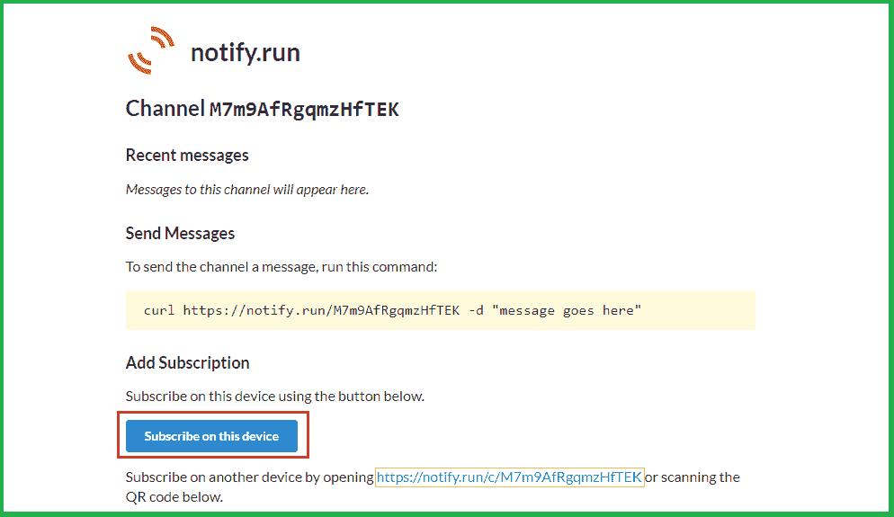
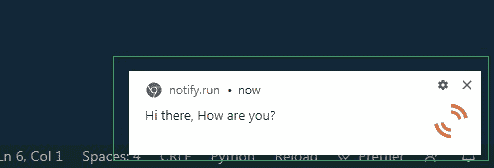
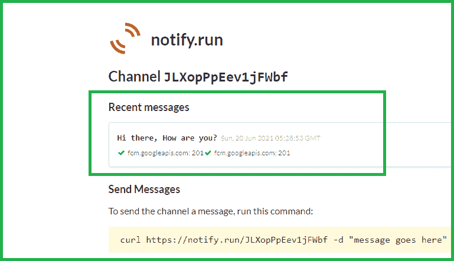
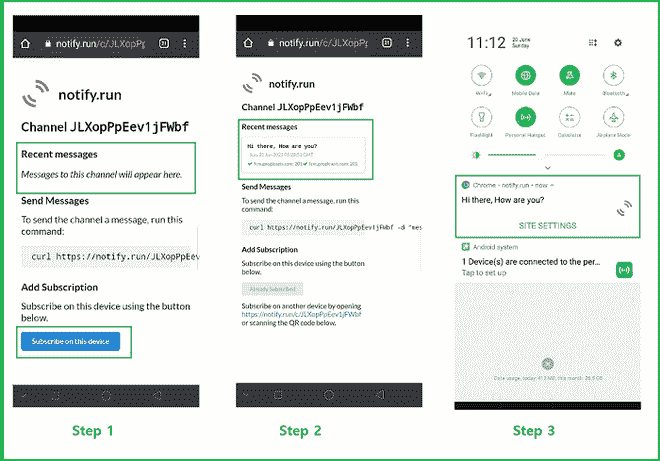

# 使用 Python 发送 Chrome 通知

> 原文:[https://www . geesforgeks . org/send-chrome-notification-use-python/](https://www.geeksforgeeks.org/send-chrome-notification-using-python/)

在本文中，我们将在本文中看到如何将 Chrome 通知从您的电脑发送到手机或几个设备。我们可能会发送消息、链接和其他内容。为此，我们将使用 Python 的 **notify2** 模块及其各种功能，这将有助于我们向许多设备传递消息。

**notify2** 是一个 Python 模块，用于传递通知，可以用于各种应用程序。例如，如果我们正在创建一个新闻通知程序，而您想在您的智能手机而不是本地工作站上查看更改，我们可以轻松使用此模块。

### **安装:**

```
pip install notify2
```

### **分步实施:**

**第一步:**创建一个程序，将你带到订阅网络应用程序。

## 蟒蛇 3

```
from notify_run import Notify

notify = Notify()
notify.register()
```

**输出:**



您将获得一个**链接**和一个**二维码**；点击链接或扫描二维码继续。

**第二步:**点击链接，会出现如下界面:



**第三步:**只需点击本设备上的**订阅按钮，如果想要其他设备上的提醒，底部提供链接；只需转到您设备的 chrome，复制此 URL，然后单击此设备上的订阅按钮。**

**第 4 步:**现在编写一个 Python 程序发送通知。

发送警报时，使用**发送**功能。只需在**发送**功能内写一条消息，执行脚本；Chrome 以及您订阅的任何设备都会提醒您。

## 蟒蛇 3

```
from notify_run import Notify

notify = Notify()
notify.send("Any Message you want to send")
```

**输出:**



运行脚本后，你会收到 Chrome 的通知

**运行脚本后，网页上也会显示消息:**



**其他设备，如手机:**

