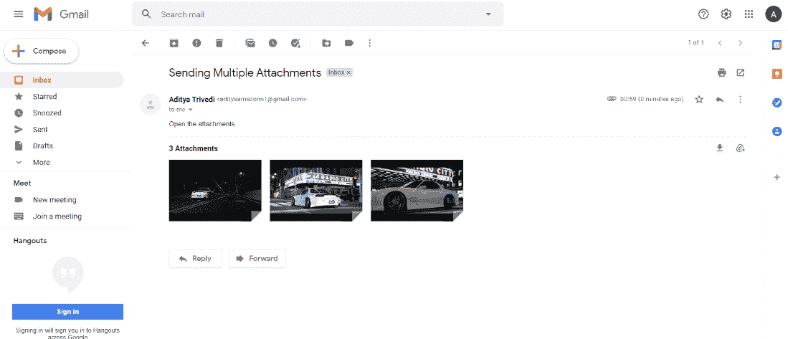
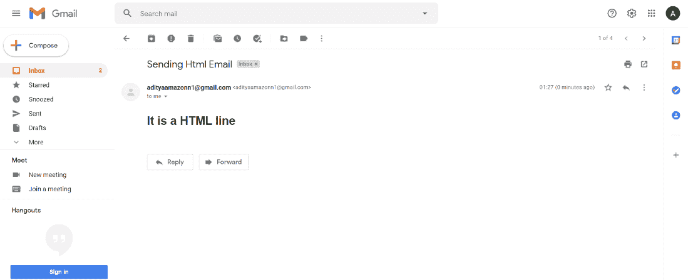

# 使用 Python 中的 yagmail 发送电子邮件

> 原文:[https://www . geesforgeks . org/send-email-use-YAG mail-in-python/](https://www.geeksforgeeks.org/send-email-using-yagmail-in-python/)

在本文中，我们将看到如何使用 **yagmail** 发送电子邮件。 **yagmail** (又一个 gmail)是 python 中的一个模块，用于使用 Python 发送电子邮件。这个模块什么都不是，只是一个 **Gmail/SMTP** (简单邮件传输协议)客户端，消除了通过 Python 发送电子邮件的问题。这有助于网络应用程序与 Gmail 交互，没有任何问题。

**注意:**这使得 Gmail 账户容易受到一些未经授权的访问，所以要对 Gmail 账户实施安全保护，使用 **OAuth2** 凭证获取访问权限。

#### 安装:

```
pip install yagmail
```

**注册用户邮箱 ID:**

通过注册，我们允许 **yagmail** 在同意发送电子邮件的情况下访问我们的 gmail 帐户。需要一个 **SMTP** 客户端为发送电子邮件的客户端提供身份验证。

> 注册(“发件人的 gmail 用户名”、“发件人的 Gmail 密码”)

**连接到 SMTP 服务器:**

要使用 SMTP 客户端启动与 SMTP 服务器的连接，请使用下面的命令。

> yag = yagmail。“发件人@gmail.com”

**添加内容并传送:**

*   在 send()函数的第一个参数中，传递接收者的电子邮件地址。
*   然后在第二封邮件中，传递发件人正在发送的邮件的主题。
*   现在在第三个，通过邮件的内容，即文本或媒体。

> yag.send("Receiver@gmail.com "、"邮件主题"、"内容(文本、媒体等)")

发送简单电子邮件:

## 蟒蛇 3

```
# importing yagmail and its packages
import yagmail

# initiating connection with SMTP server
yag = yagmail.SMTP("Sender's Email Address",
                   "Sender's Email Address Password")
# Adding Content and sending it
yag.send("Receiver's Email Address", 
         "Subject of Email to be send",
         "Content(Text,Media, etc. files) of Email to be send")
```

### **发送多附件邮件**

在这里，我们将发送一封带有多个附件的电子邮件。在附件中，属性通过必须发送给接收者的附件列表传递。

> **语法:**YAG . send(" Receiver @ Gmail . com "，"邮件主题"，"邮件内容"，附件= ['Attachment1.png '，' Attachment2.png '，' Attachment3.png'])

**代码:**

## 蟒蛇 3

```
# importing yagmail and its packages
import yagmail

# initiating connection with SMTP server
yag = yagmail.SMTP("Sender's Email Address", 
                   "Sender's Email Address Password")

# Adding multiple attachments and mailing them
yag.send("Receiver@gmail.com","Subject Of Mail","Content Of Mail",
         attachments=['Attachment1.png','Attachment2.png','Attachment3.png'])
```

**输出:**



### **向多个收件人发送电子邮件**

在 send()函数的“to”参数中，传递多个接收者电子邮件地址的列表。

> **语法:**YAG . send(to =[" recipient 1 @ Gmail . com "、" recipient2@gmail.com "、" recipient3@gmail.com"]、"邮件主题"、"邮件内容")

**代码:**

## 蟒蛇 3

```
# importing yagmail and its packages
import yagmail

# initiating connection with SMTP server
yag = yagmail.SMTP("Sender's Email Address", 
                   "Sender's Email Address Password")

# Adding multiple recipents name in "to" argument
yag.send(to=["recipient1@gmail.com","recipient2@gmail.com",
             "recipient3@gmail.com"],"Subject Of Mail","Content Of Mail")
```

**输出:**


### **发送带有抄送和密件抄送字段的电子邮件**

在抄送(副本)中传递收件人 2 的电子邮件地址，在第三个抄送(副本)中传递收件人 3 的电子邮件地址..

> **语法:**YAG . send(to =“receive R1 @ Gmail . com”，cc =“receive R2 @ Gmail . com”，bcc =“receive R1 @ Gmail . com”，“邮件主题”，“邮件内容”)

**代码:**

## 蟒蛇 3

```
# importing yagmail and its packages
import yagmail

# initiating connection with SMTP server
yag = yagmail.SMTP("Sender's Email Address", 
                   "Sender's Email Address Password")

# Passing other recipients name to cc and bcc arguments
yag.send(to = "Receiver1@gmail.com", cc = "Receiver2@gmail.com",
         bcc = "Receiver1@gmail.com","Subject Of Mail","Content Of Mail")
```

**输出:**


### **发送一封 HTML 邮件**

在 HTML 标签中传递邮件内容。因此，消息将按照您给出的 HTML 语法进行格式化。

> **语法:** yag.send(【收件人@gmail.com】、【邮件主题】、< h2 >邮件内容< /h2 >)

**代码:**

## 蟒蛇 3

```
# importing yagmail and its packages
import yagmail

# initiating connection with SMTP server
yag = yagmail.SMTP("Sender's Email Address",
                   "Sender's Email Address Password")

# Passing content inside HTML tags to content argument
yag.send("Receiver@gmail.com","Subject Of Mail",
         "<h2>Content Of Mail</h2>")
```

**输出:**

