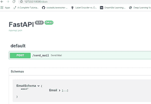
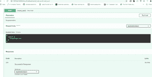
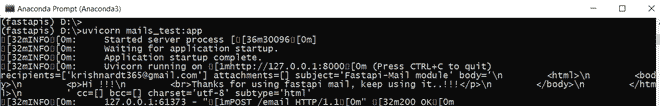

# 使用 Python 中的 FastAPI 框架发送电子邮件

> 原文:[https://www . geesforgeks . org/sensing-email-use-fastapi-framework-in-python/](https://www.geeksforgeeks.org/sending-email-using-fastapi-framework-in-python/)

在直接进入主题之前，让我们简单介绍一下我们将要使用的技术。顾名思义，我们将使用 FastAPI，一种 Python 语言框架。

### **FastAPI <u>：</u>**

FastAPI 是一个开发 REST Apis 的 python 框架。它非常容易构建，性能高，易于学习，并且可以随时部署代码。虽然我们正在使用 FastAPI，但解释它将超出本文的范围。有关 FastAPI 的更多详细信息，请参考下面的资源。

> #### 官方文件–[https://fastapi.tiangolo.com/](https://fastapi.tiangolo.com/)至
> 
> #### 巨蟒中使用快速应用编程接口的教程–[https://www。极客们。org/creating-first-rest-API-with-fastapi/](https://www.geeksforgeeks.org/creating-first-rest-api-with-fastapi/)

在本文中，我们将介绍如何使用 FastAPI 框架发送电子邮件。我们将使用快速 API 邮件库发送邮件。简单的轻量级邮件系统，发送电子邮件和附件。

### 装置

您可以使用安装库

```
pip install fastapi-mail
```

我们可以在有和没有登录验证的情况下使用下面的文章。我们不会使用任何注册/认证过程，因为它不在本文的范围内。

### 创建项目

导入发送电子邮件所需的库

```
from fastapi import FastAPI
from fastapi_mail import FastMail, MessageSchema,ConnectionConfig
from starlette.requests import Request
from starlette.responses import JSONResponse
from pydantic import EmailStr, BaseModel
from typing import List
app = FastAPI()
```

现在创建一个学究类来接受电子邮件作为输入。
迂腐是一个模块，帮助我们编写输入/请求的验证。

```
class EmailSchema(BaseModel):
   email: List[EmailStr]
```

使用 ConnectionConfig 设置发送电子邮件的配置

```
conf = ConnectionConfig(
   MAIL_USERNAME=from_,
   MAIL_PASSWORD="************",
   MAIL_PORT=587,
   MAIL_SERVER="smtp.gmail.com",
   MAIL_TLS=True,
   MAIL_SSL=False
)
```

对于 MAIL_SERVER 参数，

如果你想使用 Gmail，你可以输入“smtp.gmail.com”。

如果您想使用 outlook 作为发件人，您可以输入“smtp.office365.com”

让我们设置消息模式。

它包含诸如发送什么和发送谁之类的参数。

```
message = MessageSchema(
       subject="Fastapi-Mail module",
       recipients=email.dict().get("email"),  # List of recipients, as many as you can pass  
       body=template,
       subtype="html"
       )
```

定义配置和消息模式后，

我们可以发邮件。

```
fm = FastMail(conf)
await fm.send_message(message)
```

### 最终应用

整个代码是这样的，

## 蟒蛇 3

```
@app.post("/send_mail")
async def send_mail(email: EmailSchema):

    template = """
        <html>
        <body>

<p>Hi !!!
        <br>Thanks for using fastapi mail, keep using it..!!!</p>

        </body>
        </html>
        """

    message = MessageSchema(
        subject="Fastapi-Mail module",
        recipients=email.dict().get("email"),  # List of recipients, as many as you can pass
        body=template,
        subtype="html"
        )

    fm = FastMail(conf)
    await fm.send_message(message)
        print(message)

    return JSONResponse(status_code=200, content={"message": "email has been sent"})
```

最后，

使用启动应用程序

```
uvicorn main:app --reload
```

成功启动服务器后，使用以下链接查看 API 列表。在我们的例子中，当您可以直接从文档页面本身给出输入时，我们将只有一个发送邮件 API(一个 POST 请求)。

```
http://127.0.0.1:8000/docs
```

### 输出–



成功启动服务器后的文档页面

现在通过点击试用并输入如下所示的所需电子邮件来执行该应用编程接口。



一旦 API 执行，它将返回 API 的返回语句中提到的成功输出。

```
"message": "email has been sent"
```

最后，终端的输出，

如果邮件发送成功，返回状态代码(200)。



它显示的输出是我们通过电子邮件发送的模板。

你甚至可以发送带有附件等的邮件。，相同的结账文件–[https://pypi.org/project/fastapi-mail/](https://pypi.org/project/fastapi-mail/)