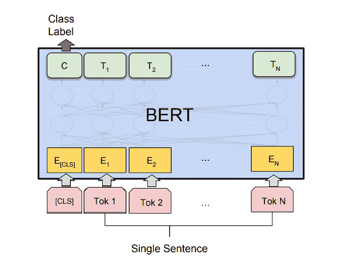

# 使用 BERT 的情感分类

> 原文:[https://www . geesforgeks . org/情操-分类-使用-bert/](https://www.geeksforgeeks.org/sentiment-classification-using-bert/)

BERT 代表变形金刚的双向表示，是由谷歌 AI 语言的研究人员在 2018 年提出的。尽管其主要目的是提高对与谷歌搜索相关的查询含义的理解，但 BERT 成为各种自然语言任务的最重要的和完整架构之一，在句子对分类任务、问答任务、任务、和等方面产生了最先进的结果。关于架构的更多详细信息，请查看本文[](https://www.geeksforgeeks.org/understanding-bert-nlp/)

**建筑:**

BERT 最重要的特点之一是其  对的适应性以最先进的精度执行不同的 NLP 任务(类似于我们在 Computer vision 中使用的迁移学习)。对于的说法，论文也提出了不同任务的架构。在这篇文章、中，我们将使用 BERT 架构进行单句分类任务特别是用于 CoLA(语言可接受性语料库)二元分类任务的架构。在前一篇关于 BERT 、的帖子中，我们详细讨论了 BERT 架构，但让我们回顾一下它的一些重要细节:

[](https://media.geeksforgeeks.org/wp-content/uploads/20200422012400/Single-Sentence-Classification-Task.png)

BERT 单句分类任务

伯特在两个版本中提出:

*   BERT (BASE): 12 层编码器堆栈，带有 12 个双向自关注头和 768 个隐藏单元。
*   BERT (LARGE): 24 层编码器堆栈，有 24 个双向自关注头和 1024 个隐藏单元。

对于 TensorFlow 的实现，谷歌提供了两个版本的 BERT BASE 和 BERT LARGE: Uncased 和 cased。在未大写的版本中，字母在单词标记化之前小写。

**实施:**

*   首先，我们需要将 GitHub repo 克隆到 BERT，以简化设置。

**代码:**

## 蟒蛇 3

```py
! git clone https://github.com / google-research / bert.git
```

```py
Cloning into 'bert'...
remote: Enumerating objects: 340, done.
remote: Total 340 (delta 0), reused 0 (delta 0), pack-reused 340
Receiving objects: 100% (340/340), 317.20 KiB | 584.00 KiB/s, done.
Resolving deltas: 100% (185/185), done.
```

*   现在，我们需要使用以下链接下载 BERT <sub>BASE</sub> 模型，并将其解压缩到工作目录(或所需位置)。

**代码:**

## 蟒蛇 3

```py
# Download BERT BASE model from tF hub ! wget https://storage.googleapis.com / bert_models / 2018_10_18 / uncased_L-12_H-768_A-12.zip ! unzip uncased_L-12_H-768_A-12.zip
```

```py
Archive:  uncased_L-12_H-768_A-12.zip
   creating: uncased_L-12_H-768_A-12/
  inflating: uncased_L-12_H-768_A-12/bert_model.ckpt.meta  
  inflating: uncased_L-12_H-768_A-12/bert_model.ckpt.data-00000-of-00001  
  inflating: uncased_L-12_H-768_A-12/vocab.txt  
  inflating: uncased_L-12_H-768_A-12/bert_model.ckpt.index  
  inflating: uncased_L-12_H-768_A-12/bert_config.json  
```

*   我们将使用 TensorFlow 1x 版本。在 Google colab 中有一个神奇的函数叫做 tensorflow_version，可以切换不同的版本。

**代码:**

## 蟒蛇 3

```py
% tensorflow_version 1.x
```

```py
TensorFlow 1.x selected.
```

*   现在，我们将导入运行该项目所需的模块，我们将使用来自 TensorFlow 内置模块的 NumPy、scikit-learn 和 Keras。这些已经预装在 colab 中，请确保在您的环境中安装这些。

**代码:**

## 蟒蛇 3

```py
import os
import re
import numpy as np
import pandas as pd
from sklearn.preprocessing import LabelEncoder
from sklearn.model_selection import train_test_split
import tensorflow as tf
from tensorflow import keras
import csv
from sklearn import metrics
```

*   现在我们将加载 IMDB 情感数据集，并在训练前进行一些预处理。为了从 TensorFlow Hub 加载 IMDB 数据集，我们将遵循本[教程。](https://www.tensorflow.org/hub/tutorials/tf2_text_classification)

**代码:**

## 蟒蛇 3

```py
# load data from positive and negative directories and a columns that takes there\
# positive and negative label
def load_directory_data(directory):
  data = {}
  data["sentence"] = []
  data["sentiment"] = []
  for file_path in os.listdir(directory):
    with tf.gfile.GFile(os.path.join(directory, file_path), "r") as f:
      data["sentence"].append(f.read())
      data["sentiment"].append(re.match("\d+_(\d+)\.txt", file_path).group(1))
  return pd.DataFrame.from_dict(data)

# Merge positive and negative examples, add a polarity column and shuffle.
def load_dataset(directory):
  pos_df = load_directory_data(os.path.join(directory, "pos"))
  neg_df = load_directory_data(os.path.join(directory, "neg"))
  pos_df["polarity"] = 1
  neg_df["polarity"] = 0
  return pd.concat([pos_df, neg_df]).sample(frac = 1).reset_index(drop = True)

# Download and process the dataset files.
def download_and_load_datasets(force_download = False):
  dataset = tf.keras.utils.get_file(
      fname ="aclImdb.tar.gz",
      origin ="http://ai.stanford.edu/~amaas / data / sentiment / aclImdb_v1.tar.gz",
      extract = True)

  train_df = load_dataset(os.path.join(os.path.dirname(dataset),
                                       "aclImdb", "train"))
  test_df = load_dataset(os.path.join(os.path.dirname(dataset),
                                      "aclImdb", "test"))

  return train_df, test_df
train, test = download_and_load_datasets()
train.shape, test.shape
```

```py
Downloading data from http://ai.stanford.edu/~amaas/data/sentiment/aclImdb_v1.tar.gz
84131840/84125825 [==============================] - 8s 0us/step
((25000, 3), (25000, 3))
```

*   该数据集包含每次培训和测试的 50k 评论 25k，我们将从每次测试和培训中抽取 5k 评论。此外，测试和训练数据集都包含 3 列，其列表如下

**代码:**

## 蟒蛇 3

```py
# sample 5k datapoints for both train and test
train = train.sample(5000)
test = test.sample(5000)
# List columns of train and test data
train.columns, test.columns
```

```py
(Index(['sentence', 'sentiment', 'polarity'], dtype='object'),
 Index(['sentence', 'sentiment', 'polarity'], dtype='object'))
```

*   现在，我们需要转换 BERT 模型训练和预测所需的特定格式，为此我们将使用 pandas dataframe。以下是 BERT 培训和测试格式中所需的栏目:
    *   **GUID:** 该行的 ID。训练和测试数据都需要
    *   **类标签**。:0 或 1 的值，取决于积极情绪和消极情绪。
    *   **alpha:** 这是一个用于文本分类的虚拟列，但在训练过程中被 BERT 预期。
    *   **文本:**需要分类的数据点的审核文本。显然是训练和测试都需要的

**代码:**

## 蟒蛇 3

```py
# code
# Convert training data into BERT format
train_bert = pd.DataFrame({
  'guid': range(len(train)),
 'label':train['polarity'],
 'alpha': ['a']*train.shape[0],
 'text': train['sentence'].replace(r'\n', '', regex = True)
})

train_bert.head()
print("-----")
# convert test data into bert format
bert_test = pd.DataFrame({
 'id':range(len(test)),
 'text': test['sentence'].replace(r'\n', ' ', regex = True)
})
bert_test.head()
```

```py
guid    label    alpha    text
14930    0    1    a    William Hurt may not be an American matinee id...
1445    1    1    a    Rock solid giallo from a master filmmaker of t...
16943    2    1    a    This movie surprised me. Some things were "cli...
6391    3    1    a    This film may seem dated today, but remember t...
4526    4    0    a    The Twilight Zone has achieved a certain mytho...
-----
guid    text
20010    0    One of Alfred Hitchcock's three greatest films...
16132    1    Hitchcock once gave an interview where he said...
24947    2    I had nothing to do before going out one night...
5471    3    tell you what that was excellent. Dylan Moran ...
21075    4    I watched this show until my puberty but still...
```

*   现在，我们将数据分成三个部分:训练、开发和测试，并将其保存到 tsv 文件中，将其保存到一个文件夹中(这里是“IMDB 数据集”)。这是因为运行分类器文件需要 tsv 格式的数据集。

**代码:**

## 蟒蛇 3

```py
# split  data into  train and validation set
bert_train, bert_val = train_test_split(train_bert, test_size = 0.1)
# save train, validation and testfile to afolder
bert_train.to_csv('bert / IMDB_dataset / train.tsv', sep ='\t', index = False, header = False)
bert_val.to_csv('bert / IMDB_dataset / dev.tsv', sep ='\t', index = False, header = False)
bert_test.to_csv('bert / IMDB_dataset / test.tsv', sep ='\t', index = False, header = True)
```

*   在这一步中，我们使用以下命令训练模型，为了在 colab 上执行 bash 命令，我们使用！在命令前面签名。run_classifier 文件在给定命令的帮助下训练模型。由于时间和资源的限制，我们将只在 3 个时代运行它。

**代码:**

## 蟒蛇 3

```py
# Most of the arguments  hereare self-explanatory but some  arguments needs  to be explained:
# task name:We have discussed this above .Here we need toperform binary  classification that why we use cola
# vocab file :  A vocab file (vocab.txt) to map WordPiece to word id.
# init checkpoint:  A tensorflow checkpoint required. Here we used downloaded bert.
# max_seq_length :caps the maximunumber of words  to each reviews
# bert_config_file: file contains hyperparameter settings ! python bert / run_classifier.py
--task_name = cola --do_train = true --do_eval = true
--data_dir =/content / bert / IMDB_dataset
--vocab_file =/content / uncased_L-12_H-768_A-12 / vocab.txt
--bert_config_file =/content / uncased_L-12_H-768_A-12 / bert_config.json
--init_checkpoint =/content / uncased_L-12_H-768_A-12 / bert_model.ckpt
--max_seq_length = 64
--train_batch_size = 8 --learning_rate = 2e-5
--num_train_epochs = 3.0
--output_dir =/content / bert_output/
--do_lower_case = True
--save_checkpoints_steps 10000
```

```py
# Last few lines
INFO:tensorflow:***** Eval results *****
I0713 06:06:28.966619 139722620139392 run_classifier.py:923] ***** Eval results *****
INFO:tensorflow:  eval_accuracy = 0.796
I0713 06:06:28.966814 139722620139392 run_classifier.py:925]   eval_accuracy = 0.796
INFO:tensorflow:  eval_loss = 0.95403963
I0713 06:06:28.967138 139722620139392 run_classifier.py:925]   eval_loss = 0.95403963
INFO:tensorflow:  global_step = 1687
I0713 06:06:28.967317 139722620139392 run_classifier.py:925]   global_step = 1687
INFO:tensorflow:  loss = 0.95741796
I0713 06:06:28.967507 139722620139392 run_classifier.py:925]   loss = 0.95741796
```

*   现在，我们将使用测试数据用下面的 bash 脚本来评估我们的模型。该脚本将预测保存到 tsv 文件中。

**代码:**

## 蟒蛇 3

```py
# code to predict bert on test.tsv
# here we use  saved training checkpoint as  initial model ! python bert / run_classifier.py
--task_name = cola
--do_predict = true
--data_dir =/content / bert / IMDB_dataset
--vocab_file =/content / uncased_L-12_H-768_A-12 / vocab.txt
--bert_config_file =/content / uncased_L-12_H-768_A-12 / bert_config.json
--init_checkpoint =/content / bert_output / model.ckpt-0
--max_seq_length = 128
--output_dir =/content / bert_output/
```

```py
INFO:tensorflow:Restoring parameters from /content/bert_output/model.ckpt-1687
I0713 06:08:22.372014 140390020667264 saver.py:1284] Restoring parameters from /content/bert_output/model.ckpt-1687
INFO:tensorflow:Running local_init_op.
I0713 06:08:23.801442 140390020667264 session_manager.py:500] Running local_init_op.
INFO:tensorflow:Done running local_init_op.
I0713 06:08:23.859703 140390020667264 session_manager.py:502] Done running local_init_op.
2020-07-13 06:08:24.453814: I tensorflow/stream_executor/platform/default/dso_loader.cc:44] Successfully opened dynamic library libcublas.so.10
INFO:tensorflow:prediction_loop marked as finished
I0713 06:10:02.280455 140390020667264 error_handling.py:101] prediction_loop marked as finished
INFO:tensorflow:prediction_loop marked as finished
I0713 06:10:02.280870 140390020667264 error_handling.py:101] prediction_loop marked as finished
```

*   下面的代码对每一行测试数据进行最大预测，并将其存储到一个列表中。

**代码:**

## 蟒蛇 3

```py
# code
import  csv
label_results =[]
with open('/content / bert_output / test_results.tsv') as file:
    rows = csv.reader(file, delimiter ="\t")
    for row in rows:
      data_1 =[float(i) for i in row]
      label_results.append(data_1.index(max(data_1)))
```

*   下面的代码计算准确度和 F1 分数。

**代码:**

## 蟒蛇 3

```py
print("Accuracy", metrics.accuracy_score(test['polarity'], label_results))
print("F1-Score", metrics.f1_score(test['polarity'], label_results))
```

```py
Accuracy 0.8548
F1-Score 0.8496894409937888
```

*   我们在 IMDB 评论数据集上获得了 85%的准确率和 F1 分数，同时仅针对 3 个时期训练 BERT (BASE)，这是一个相当好的结果。更多时代的训练肯定会提高准确率。

**参考文献:**

*   [BERT 纸](https://arxiv.org/abs/1810.04805)
*   [Google BERT repo](https://github.com/google-research/bert)
*   [MC.ai BERT 文本分类](https://mc.ai/a-guide-to-simple-text-classification-with-bert/)