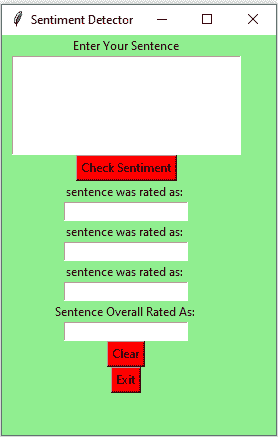

# 使用 Tkinter–Python 的情感检测器 GUI

> 原文:[https://www . geesforgeks . org/情绪-检测器-gui-using-tkinter-python/](https://www.geeksforgeeks.org/sentiment-detector-gui-using-tkinter-python/)

**先决条件:**[tkinter 简介](https://www.geeksforgeeks.org/python-gui-tkinter/) | [使用维德进行情感分析](https://www.geeksforgeeks.org/python-sentiment-analysis-using-vader/)

Python 为开发图形用户界面提供了多种选择。在所有的 GUI 方法中，Tkinter 是最常用的方法。Python 搭配 Tkinter 输出了创建 GUI 应用程序最快最简单的方法。在本文中，我们将学习如何使用 Tkinter 创建一个情绪检测器 GUI 应用程序，并提供一步一步的指导。

要创建 tkinter:

*   导入模块–tkinter
*   创建主窗口(容器)
*   向主窗口添加任意数量的小部件。
*   在小部件上应用事件触发器。

图形用户界面如下所示:



让我们创建一个基于图形用户界面的情绪检测器应用程序，它可以显示关于用户给出的给定句子的情绪。

**下面是实现:**

## 蟒蛇 3

```py
# import SentimentIntensityAnalyzer class
# from vaderSentiment.vaderSentiment module.
from vaderSentiment.vaderSentiment import SentimentIntensityAnalyzer

# import all methods and classes from the tkinter
from tkinter import *

# Function for clearing the  
# contents of all entry boxes
# And text area.
def clearAll() :

    # deleting the content from the entry box
    negativeField.delete(0, END)
    neutralField.delete(0, END)
    positiveField.delete(0, END)
    overallField.delete(0, END)

    # whole content of text area  is deleted
    textArea.delete(1.0, END)

# function to print sentiments
# of the sentence.
def detect_sentiment():

    # get a whole input content from text box
    sentence = textArea.get("1.0", "end")

    # Create a SentimentIntensityAnalyzer object.
    sid_obj = SentimentIntensityAnalyzer()

    # polarity_scores method of SentimentIntensityAnalyzer
    # object gives a sentiment dictionary.
    # which contains pos, neg, neu, and compound scores.
    sentiment_dict = sid_obj.polarity_scores(sentence)

    string = str(sentiment_dict['neg']*100) + "% Negative"
    negativeField.insert(10, string)

    string = str(sentiment_dict['neu']*100) + "% Neutral"
    neutralField.insert(10, string)

    string = str(sentiment_dict['pos']*100) +"% Positive"
    positiveField.insert(10, string)

    # decide sentiment as positive, negative and neutral
    if sentiment_dict['compound'] >= 0.05 :
        string = "Positive"

    elif sentiment_dict['compound'] <= - 0.05 :
        string = "Negative"

    else :
        string = "Neutral"

    overallField.insert(10, string)

# Driver Code
if __name__ == "__main__" :

    # Create a GUI window
    gui = Tk()

    # Set the background colour of GUI window
    gui.config(background =  "light green")

    # set the name of tkinter GUI window
    gui.title("Sentiment Detector")

    # Set the configuration of GUI window
    gui.geometry("250x400")

    # create a label : Enter Your Task
    enterText = Label(gui, text = "Enter Your Sentence",
                                     bg = "light green")

    # create a text area for the root
    # with lunida 13 font
    # text area is for writing the content
    textArea = Text(gui, height = 5, width = 25, font = "lucida 13")

    # create a Submit Button and place into the root window
    # when user press the button, the command or 
    # function affiliated to that button is executed 
    check = Button(gui, text = "Check Sentiment", fg = "Black",
                         bg = "Red", command = detect_sentiment)

    # Create a negative : label
    negative = Label(gui, text = "sentence was rated as: ",
                                        bg = "light green")

    # Create a neutral : label
    neutral = Label(gui, text = "sentence was rated as: ",
                                       bg = "light green")

    # Create a positive : label
    positive = Label(gui, text = "sentence was rated as: ",
                                        bg = "light green")

    # Create a overall : label
    overall = Label(gui, text = "Sentence Overall Rated As: ",
                                           bg = "light green")

    # create a text entry box 
    negativeField = Entry(gui)

    # create a text entry box 
    neutralField = Entry(gui)

    # create a text entry box 
    positiveField = Entry(gui)

    # create a text entry box 
    overallField = Entry(gui)

    # create a Clear Button and place into the root window
    # when user press the button, the command or 
    # function affiliated to that button is executed .
    clear = Button(gui, text = "Clear", fg = "Black",
                      bg = "Red", command = clearAll)

    # create a Exit Button and place into the root window
    # when user press the button, the command or 
    # function affiliated to that button is executed .
    Exit = Button(gui, text = "Exit", fg = "Black",
                        bg = "Red", command = exit)

    # grid method is used for placing 
    # the widgets at respective positions 
    # in table like structure.
    enterText.grid(row = 0, column = 2)

    textArea.grid(row = 1, column = 2, padx = 10, sticky = W)

    check.grid(row = 2, column = 2)

    negative.grid(row = 3, column = 2)

    neutral.grid(row = 5, column = 2)

    positive.grid(row = 7, column = 2)

    overall.grid(row = 9, column = 2)

    negativeField.grid(row = 4, column = 2)

    neutralField.grid(row = 6, column = 2)

    positiveField.grid(row = 8, column = 2)

    overallField.grid(row = 10, column = 2)

    clear.grid(row = 11, column = 2)

    Exit.grid(row = 12, column = 2)

    # start the GUI
    gui.mainloop()

```

**输出:**

<video class="wp-video-shortcode" id="video-413845-1" width="640" height="360" preload="metadata" controls=""><source type="video/mp4" src="https://media.geeksforgeeks.org/wp-content/uploads/20210116120203/FreeOnlineScreenRecorderProject5.mp4?_=1">[https://media.geeksforgeeks.org/wp-content/uploads/20210116120203/FreeOnlineScreenRecorderProject5.mp4](https://media.geeksforgeeks.org/wp-content/uploads/20210116120203/FreeOnlineScreenRecorderProject5.mp4)</video>