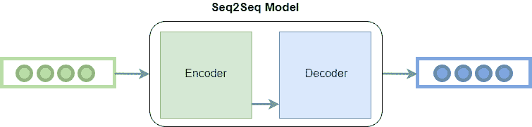

# 机器学习中的 seq2seq 模型

> 原文:[https://www . geesforgeks . org/seq2seq-机器学习模型/](https://www.geeksforgeeks.org/seq2seq-model-in-machine-learning/)

**Seq2seq** 最早是由谷歌引入机器翻译的。在此之前，翻译的方式非常幼稚。你曾经键入的每个单词都被转换成了它的目标语言，没有考虑它的语法和句子结构。Seq2seq 利用深度学习彻底改变了翻译过程。它不仅在翻译时考虑当前单词/输入，而且还考虑其邻域。

如今，它被用于各种不同的应用，如图像字幕、会话模型、文本摘要等。

**Seq2seq Working:**
顾名思义，Seq2seq 将一个单词序列(句子或句子)作为输入，生成一个单词输出序列。它通过使用递归神经网络(RNN)做到这一点。虽然很少使用 RNN 的普通版本，但使用了更高级的版本，即 LSTM 或 GRU。这是因为 RNN 存在渐变消失的问题。谷歌提议的版本中使用了 LSTM。它通过在每个时间点进行两次输入来发展单词的上下文。一个来自用户，另一个来自其先前的输出，因此命名为 recurrent(输出作为输入)。

它主要有两个组成部分，即*编码器*和*解码器*，因此有时被称为**编解码网络**。

**编码器:**它利用深度神经网络层，将输入的单词转换成对应的隐藏向量。每个向量代表当前单词和单词的上下文。

**解码器:**类似于编码器。它将编码器生成的隐藏向量、自身的隐藏状态和当前单词作为输入，产生下一个隐藏向量，最终预测下一个单词。

除了这两个之外，许多优化还会导致 seq2seq 的其他组件:

*   **注意:**解码器的输入是单个向量，必须存储所有关于上下文的信息。这成为大序列的问题。因此，应用了注意力机制，允许解码器选择性地查看输入序列。
*   **波束搜索:**解码器选择概率最高的字作为输出。但是这并不总是产生最好的结果，因为贪婪算法的基本问题。因此，应用波束搜索来建议每一步可能的平移。这是通过制作一个顶级 k 结果树来完成的。
*   **分时段:**在 seq2seq 模型中可变长度序列是可能的，因为对输入和输出都填充了 0。然而，如果我们设置的最大长度是 100，而句子只有 3 个单词长，就会造成巨大的空间浪费。所以我们使用了桶的概念。我们制作不同大小的桶，如(4，8) (8，15)等，其中 4 是我们定义的最大输入长度，8 是定义的最大输出长度。