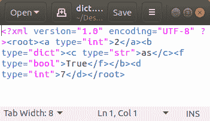

# 将 Python 字典序列化为 XML

> 原文:[https://www . geesforgeks . org/serialize-python-dictionary-to-XML/](https://www.geeksforgeeks.org/serialize-python-dictionary-to-xml/)

**XML** 是一种设计用于传输数据的标记语言。它是在牢记自我描述的同时制作的。除了 XML 中的标签不是预先定义的这一事实之外，XML 的语法类似于 HTML。这允许数据存储在定制标签之间，其中标签包含关于数据的细节，数据存储在开始和结束标签之间。

**注意:**你可以在这里阅读更多关于 XML 的内容: [XML |基础知识](https://www.geeksforgeeks.org/xml-basics/)和 [XML |语法](https://www.geeksforgeeks.org/xml-syntax/)

目前，有两个主要模块允许将 Python 字典序列化为 XML。他们是

1.  [dict2xml](#2)
2.  字典 xml

## 使用 dict2xml

要快速将 Python 字典转换为 XML，可以使用 dict2xml。使用以下方式安装:

```
$ pip install dict2xml
```

现在假设您在 Python 中有一个名为*数据*的字典，您想要将其转换为 XML

## 蟒蛇 3

```
# Converting Python Dictionary to XML
from dict2xml import dict2xml

data = {'a': 2,
        'b': {
               'c': 'as',
               'f': True},
        'd': 7,
        }

xml = dict2xml(data)
print(xml)
```

**输出:**

```
<a>2</a>
<b>
  <c>as</c>
  <f>True</f>
</b>
<d>7</d>
```

**环绕一个根元素并自定义缩进**
假设你想将答案环绕一个根元素并添加 3 个空格的缩进。

## 蟒蛇 3

```
# Converting Python Dictionary to XML
# with a root elemtnt
from dict2xml import dict2xml

data = {'a': 2,
        'b': {
               'c': 'as',
               'f': True},
        'd': 7,
        }

xml = dict2xml(data, wrap ='root', indent ="   ")
print(xml)
```

**输出:**

```
<root>
   <a>2</a>
   <b>
      <c>as</c>
      <f>True</f>
   </b>
   <d>7</d>
</root>
```

## Dicttoxml

Dict2xml 很好，但是它没有太多选项来指定我希望我的 xml 如何格式化或者在标签中添加属性。dicttoxml 可用于这些目的。它也能完美地处理类似字典的和可迭代的对象。键入以下命令，通过终端或命令提示符进行安装:

```
 $ pip install dicttoxml 
```

或者

```
 $ easy_install dicttoxml  
```

## 蟒蛇 3

```
# Using dicttoxml for converting Python
#  Dictionary to XML
from dicttoxml import dicttoxml

# Data to be parsed
data = {'a': 2,
        'b': {
               'c': 'as',
               'f': True},
        'd': 7,
        }

xml = dicttoxml(data)
print(xml)
```

**输出:**

> ' b '<root>**T5】为 <f type="”bool”">真</f>**T10】7</root>

**漂亮地格式化输出**
让我们漂亮地格式化文本，这样我们就可以清楚地阅读它。Python 已经为此内置了一个包！

## 蟒蛇 3

```
# Pretty printing XML after parsing
# it from dictionary
from xml.dom.minidom import parseString
from dicttoxml import dicttoxml

# Data to be parsed
data = {'a': 2,
        'b': {
               'c': 'as',
               'f': True},
        'd': 7,
        }

xml = dicttoxml(data)
dom = parseString(xml)

print(dom.toprettyxml())
```

**输出:**

```
<?xml version="1.0" ?>
<root>
    <a type="int">2</a>
    <b type="dict">
        <c type="str">as</c>
        <f type="bool">True</f>
    </b>
    <d type="int">7</d>
</root>
```

**移除类型属性**
您可能会注意到标签现在包含类似 type="int"/"dict"/"str "的属性，可以使用 *attr_type=False* 关闭这些属性

## 蟒蛇 3

```
# Removing Type Attribute from parsed XML
from xml.dom.minidom import parseString

# attr_type = False is used
# to remove type attributes
xml = dicttoxml(data, attr_type = False)

print(parseString(xml).toprettyxml())
```

**输出:**

```
<?xml version="1.0" ?>
<root>
    <a>2</a>
    <b>
        <c>as</c>
        <f>True</f>
    </b>
    <d>7</d>
</root>
```

**将 XML 保存到文件中**
有时，您可能需要将 XML 保存到一个文件中，具体操作如下

## 蟒蛇 3

```
# Converting Python Dictionary to
# XML and saving to a file
from dicttoxml import dicttoxml
from xml.dom.minidom import parseString

# Variable name of Dictionary is data
xml = dicttoxml(data)

# Obtain decode string by decode()
# function
xml_decode = xml.decode()

xmlfile = open("dict.xml", "w")
xmlfile.write(xml_decode)
xmlfile.close()
```

**输出:**



**定义自定义项名称**
如果不希望列表中的项元素被称为“项”，可以使用以父元素名称(即列表名称)为参数的函数来指定元素名称。

## 蟒蛇 3

```
# Defining custom names for lists
from dicttoxml import dicttoxml
from xml.dom.minidom import parseString

# Dictionary to be converted
obj = {'mylist': [u'foo', u'bar', u'baz'],
       'mydict': {
                  'foo': u'bar',
                  'baz': 1},
       'ok': True}

# custom function for defining
# item names
my_item_func = lambda x: 'list_item'
xml = dicttoxml(obj, item_func = my_item_func)

# Pretty formating XML
xml_format = parseString(xml).toprettyxml()

print(xml_format)
```

**输出:**

```
<?xml version="1.0" ?>
<root>
    <mylist type="list">
        <list_item type="str">foo</list_item>
        <list_item type="str">bar</list_item>
        <list_item type="str">baz</list_item>
    </mylist>
    <mydict type="dict">
        <foo type="str">bar</foo>
        <baz type="int">1</baz>
    </mydict>
    <ok type="bool">True</ok>
</root>
```

将父元素名称作为参数的好处是，您可以编写函数来处理它。假设您有一个包含一些特定项目列表的对象:

## 蟒蛇 3

```
# Using parent name in dictionary
# as tag name in xml

from dicttoxml import dicttoxml
from xml.dom.minidom import parseString

# Dictionary to be converted
data = {
    'month':['Jan', 'Feb',
             'Mar', 'Apr',
             'May', 'Jun',
             'Jul', 'Aug',
             'Sep', 'Oct',
             'Nov', 'Dec']
       }

# Here x is the parent, you can chose
# to do some processing or use a part
# of the parent name for tag name
my_item_func = lambda x: x+'s'
xml = dicttoxml(data, item_func = my_item_func)

print(parseString(xml).toprettyxml())
```

**输出:**

```
<?xml version="1.0" ?>
<root>
    <month type="list">
        <months type="str">Jan</months>
        <months type="str">Feb</months>
        <months type="str">Mar</months>
        <months type="str">Apr</months>
        <months type="str">May</months>
        <months type="str">Jun</months>
        <months type="str">Jul</months>
        <months type="str">Aug</months>
        <months type="str">Sep</months>
        <months type="str">Oct</months>
        <months type="str">Nov</months>
        <months type="str">Dec</months>
    </month>
</root>
```