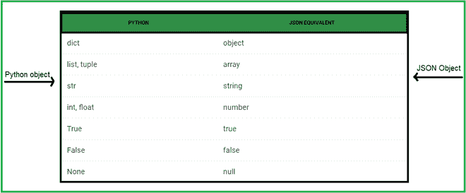
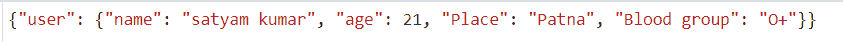
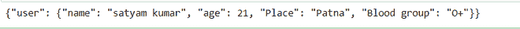

# 用 Python 序列化 JSON 数据

> 原文:[https://www . geesforgeks . org/serializing-JSON-data-in-python/](https://www.geeksforgeeks.org/serializing-json-data-in-python/)

序列化是将原始数据类型编码为 JSON 格式的过程。Python 模块 json 将一个 Python 字典对象转换为 JSON 对象，列表和元组转换为 JSON 数组，int 和 float 转换为 JSON 数，None 转换为 JSON null。



**我们来看看如何用这些方法将 Python 数据序列化为 JSON 格式:**

*   转储()。
*   转储()。

## json.dump()

[**json.dump()**](https://www.geeksforgeeks.org/json-dump-in-python/) 方法可用于写入 json 文件。以 json 格式将数据写入类似文件的对象。

> ***语法:** json.dump(dict，file_pointer)*
> 
> ***参数:***
> 
> *   ***字典–**应转换为 JSON 对象的字典名称。*
> *   ***文件指针–**以写入或追加模式打开的文件的指针。*

**下面是实现:**

转换 python 对象并写入 json 文件。

## 蟒蛇 3

```py
# import module
import json

# Data to be written
data = {
    "user": {
        "name": "satyam kumar",
        "age": 21,
        "Place": "Patna",
        "Blood group": "O+"
    }
}

# Serializing json and 
# Writing json file
with open( "datafile.json" , "w" ) as write:
    json.dump( data , write )
```

**输出:**



data_file.json

## json.dumps()

[**json.dumps()**](https://www.geeksforgeeks.org/json-dumps-in-python/) 方法可以将一个 Python 对象转换成 json 字符串。

> ***语法:** json.dumps(dict)*
> 
> ***参数:***
> 
> *   ***字典–**应转换为 JSON 对象的字典名称。*

**下面是实现:**

将 python 对象转换为 json 字符串。

## 蟒蛇 3

```py
# import module
import json

# Data to be written 
data = {
    "user": {
        "name": "satyam kumar",
        "age": 21,
        "Place": "Patna",
        "Blood group": "O+"
    }
}

# Serializing json
res = json.dumps( data )
print( res )
```

**输出:**

