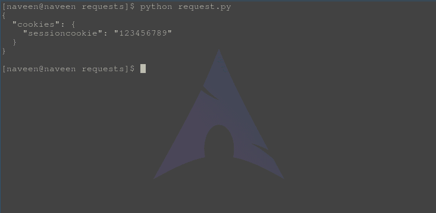
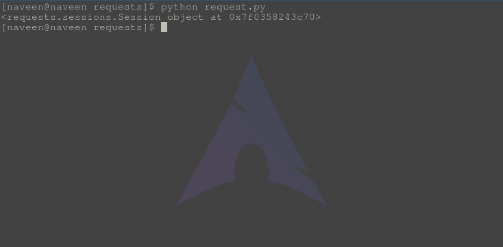

# 会话对象–Python 请求

> 原文:[https://www . geesforgeks . org/session-objects-python-requests/](https://www.geeksforgeeks.org/session-objects-python-requests/)

会话对象允许用户跨请求保存某些参数。它还在会话实例发出的所有请求中保留 cookies，并将使用 urllib3 的连接池。因此，如果向同一台主机发出多个请求，底层的 TCP 连接将被重用，这可能会导致性能显著提高。会话对象包含请求的所有方法。

#### 使用会话对象

让我们通过将 cookie 设置为 url，然后再次请求检查 cookie 是否已设置来说明会话对象的使用。

```py
# import requests module
import requests

# create a session object
s = requests.Session()

# make a get request
s.get('https://httpbin.org / cookies / set / sessioncookie / 123456789')

# again make a get request
r = s.get('https://httpbin.org / cookies')

# check if cookie is still set
print(r.text)
```

 **输出**

当再次发出请求时，可以检查 cookie 是否仍然被设置。
会话也可用于向请求方法提供默认数据。这是通过向会话对象的属性提供数据来实现的:

```py
# import requests module
import requests

# create a session object
s = requests.Session()

# set username and password
s.auth = ('user', 'pass')

# update headers
s.headers.update({'x-test': 'true'})

# both 'x-test' and 'x-test2' are sent
s.get('https://httpbin.org / headers', headers ={'x-test2': 'true'})

# print object
print(s)
```

**输出**
