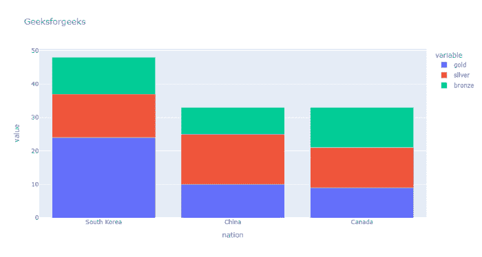
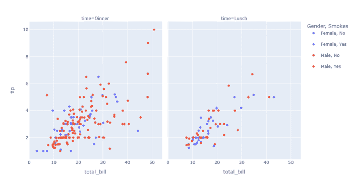

# 使用 Plotly-Python

设置图例组之间的垂直间距

> 原文:[https://www . geeksforgeeks . org/set-legend-group-use-plotly-python/](https://www.geeksforgeeks.org/set-the-amount-of-vertical-space-between-legend-groups-using-plotly-python/)

在本文中，我们将学习如何设置图例组之间的垂直间距。

图例是描述图形元素的区域。在剧情中，图例用于在轴上放置图例。

**示例 1:** 在这个条形图中，我们借助一个名为 fig . update _ layout(legend _ tracegrougap = 2)的方法，通过将 legend _ tracegrougap 参数作为 2 个像素传递，来设置图例组之间的垂直空间量(以 px 为单位)。

## 蟒蛇 3

```py
# importing packages
import plotly.express as px

# using medals_wide dataset
wide_df = px.data.medals_wide()

# plotting the bar chart
fig = px.bar(wide_df, x="nation", y=[
             "gold", "silver", "bronze"],
             title="Geeksforgeeks")

# spacing legend in plotly in pixels.
fig.update_layout(legend_tracegroupgap=2)

# showing fig.
fig.show()
```

**输出:**



**示例 2:** 在这个散点图中，我们借助一个名为 fig . update _ layout(legend _ tracegrougap = 2)的方法，通过将 legend _ tracegrougap 参数作为 12 个像素传递，来设置图例组之间的垂直空间量(以 px 为单位)。

## 蟒蛇 3

```py
# importing packages
import plotly.express as px

# using the gapminder dataset
df = px.data.tips()
fig = px.scatter(df, x="total_bill", y="tip", color="sex",
                 symbol="smoker", facet_col="time",
                 labels={"sex": "Gender", "smoker": "Smokes"})

# spaceing between legend in pixel.
fig.update_layout(legend_tracegroupgap=12)

# showing figure.
fig.show()
```

**输出:**

