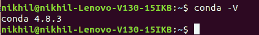
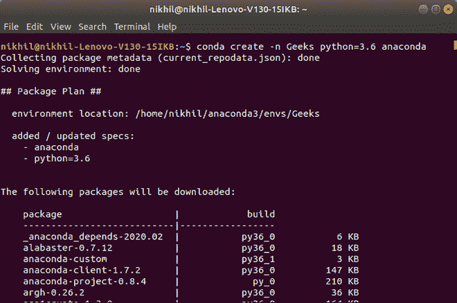
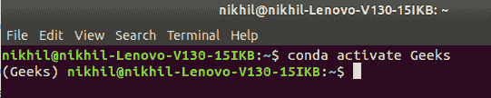
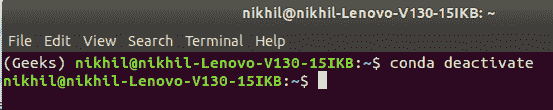
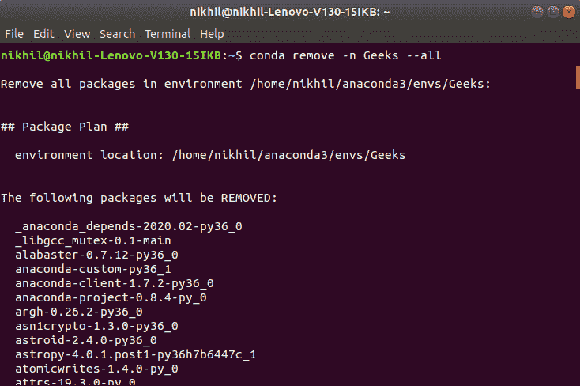

# 使用 Anaconda

为 Python 设置虚拟环境

> 原文:[https://www . geesforgeks . org/setup-virtual-environment-for-python-use-anaconda/](https://www.geeksforgeeks.org/set-up-virtual-environment-for-python-using-anaconda/)

如果您正在处理在蟒蛇中建立环境的问题，并且不知道为什么我们必须处理建立环境的痛苦，那么这是适合您的地方。

## 蟒蛇

Anaconda 是一款**开源软件**，包含 Jupyter、spyder 等，用于大数据处理、数据分析、重科学计算。Anaconda 为 R 和 Python 编程语言工作。包版本由包管理系统 conda 管理。

**安装蟒蛇:**

前往[anaconda.com](https://www.anaconda.com/products/individual#windows)安装最新版本的 Anaconda。确保下载“Python 3.7 版本”以获得合适的体系结构。有关在不同平台上安装 anaconda 的详细信息，请参考以下文章。

*   [如何在 windows 上安装 Anaconda？](https://www.geeksforgeeks.org/how-to-install-anaconda-on-windows/)

*   [如何在 Linux 上安装 Anaconda？](https://www.geeksforgeeks.org/how-to-install-anaconda-on-linux/)

## 为什么我们需要建立一个虚拟环境？

像许多其他语言一样，Python 对于不同类型的应用程序需要不同的版本。应用程序需要在特定版本的语言上运行，因为它需要某种依赖关系，这种依赖关系在旧版本中存在，但在新版本中会发生变化。 **虚拟环境**可以轻松理想地分离不同的应用程序，并避免不同依赖关系的问题。使用虚拟环境，我们可以轻松地在两个应用程序之间切换，并让它们运行。

使用 virtualenv、venv 和 conda 创建环境的方式有多种。 **C** **onda 命令**是管理 Anaconda Python 发行版的安装和虚拟环境的首选界面。

我们来看看使用 conda 界面创建虚拟环境的步骤:

**第一步:检查你的路径中是否安装了 conda。**T3】

*   打开蟒蛇命令提示符。
*   键入 conda -V，然后按回车键。
*   如果 conda 成功安装在您的系统中，您应该会看到类似的输出。

```
conda -V

```

**输出:**



**第二步:更新 conda 环境**

*   在 anaconda 提示符下输入以下内容。

```
conda update conda

```

**第三步:设置虚拟环境**

*   键入 conda 搜索“^python{content}#x201d；查看可用 python 版本的列表。
*   现在将 envname 替换为您想要赋予虚拟环境的名称，并将 x.x 替换为您想要使用的 python 版本。

```
conda create -n envname python=x.x anaconda

```

让我们为 Python3.6 创建一个名为 Geeks 的虚拟环境



**第四步:激活虚拟环境**

*   要查看所有可用环境的列表，请使用命令 conda info -e
*   要激活虚拟环境，请输入给定的命令，并用环境名替换给定的环境名

```
conda activate envname

```



当 conda 环境被激活时，它修改路径和外壳变量，特别指向您创建的隔离 Python 设置。

**步骤 5:将所需的包安装到虚拟环境**

*   键入以下命令将附加包安装到环境中，并用环境名称替换 envname。

```
conda install -n yourenvname package

```

**步骤 6:停用虚拟环境**

*   要退出特定环境，请键入以下命令。环境的设置将保持原样。

```
conda deactivate

```



**第七步:删除虚拟环境**

*   如果您不再需要虚拟环境。使用以下命令将其删除，并用环境名替换您的环境名

```
conda remove -n envname -all

```

