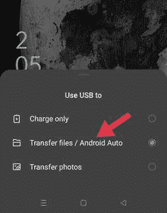
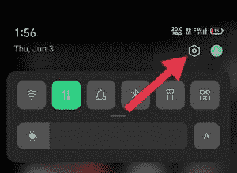
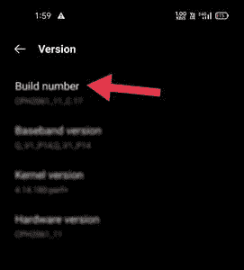
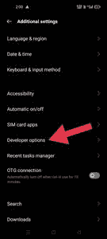
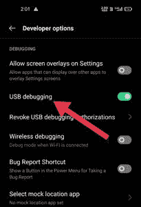
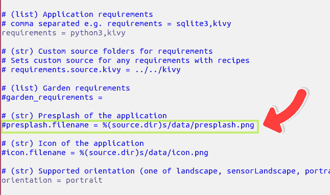
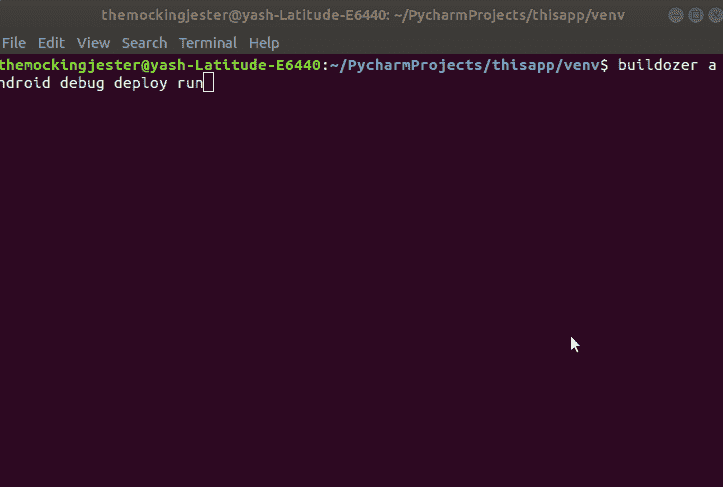
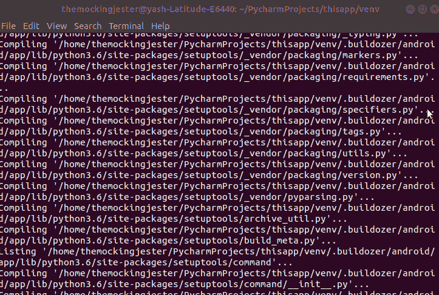
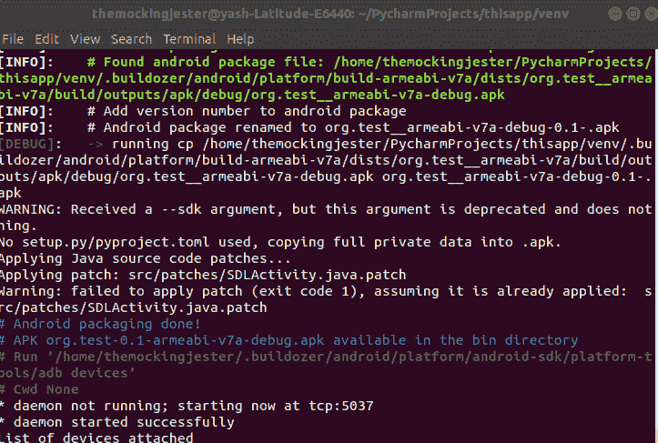

# 在 Kivy 安卓应用中设置自定义闪屏

> 原文:[https://www . geesforgeks . org/setting-custom-闪屏-in-kivy-android-app/](https://www.geeksforgeeks.org/setting-custom-splash-screen-in-kivy-android-app/)

Kivy 是 Python 中独立于平台的 GUI 工具。它可以在安卓、IOS、Linux 和 Windows 等平台上运行。这是 python 中唯一一个可以在安卓设备上独立运行的图形用户界面库，即使我们也可以在树莓 pi 上使用它。它是一个开源的 Python 库，用于快速开发多点触控应用程序。它的图形引擎是建立在 OpenGL 之上的，并且它还支持一个快速的图形管道。

在本文中，我们将看到如何在 kivy android 应用程序中添加自定义的 splashscreen！

### 入门指南

基本上，我们的动机是向您展示如何添加自定义闪屏，这就是为什么我们没有在应用程序的主屏幕上添加任何东西，除了中间的绿色框，表示应用程序工作正常。我们正在使用我们的 geeksforgeeks 标志作为这个应用程序的自定义闪屏。

## 蟒蛇 3

```
# importing Kivy App
from kivy.app import App

# importing builder from kivy
from kivy.lang import Builder

# this is the main class which 
# will render the whole application
class uiApp(App):

    # method which will render our application
    def build(self):
        return Builder.load_string("""
BoxLayout:
    BoxLayout:
    BoxLayout:
        canvas.before:
            Color:
                rgba:[0,1,0,1]
            Rectangle:
                pos:self.pos
                size:self.size
    BoxLayout:
                                   """)

# running the application
uiApp().run()
```

### 将电话与设备连接的步骤:

**步骤 1:** 将 USB 与手机和电脑连接，并允许在手机生成的弹出窗口中传输文件。



**第二步:**然后进入手机的设置并在你的设备中解锁开发者模式(如果你没有的话)你可以通过在你的手机中多次点击构建号来让自己成为一名开发者。

 

**第三步:**然后转到你最近解锁的开发者选项允许 USB 调试选项。

 

现在你可以成功地将文件从电脑传输到安卓手机。

### 编译 apk(或部署)的步骤:

**步骤 1:** 使用推土机创建一个. spec 文件，您可以创建您的。使用命令“buildozer init”的规范文件。

**第二步:**打开。文本编辑器中的 spec 文件，打开该文件后，从这一行的开头删除#。



**第三步:**通过此行的图像路径

<video class="wp-video-shortcode" id="video-616908-1" width="640" height="360" preload="metadata" controls=""><source type="video/mp4" src="https://media.geeksforgeeks.org/wp-content/uploads/20210403101251/customsplashvideo.mp4?_=1">[https://media.geeksforgeeks.org/wp-content/uploads/20210403101251/customsplashvideo.mp4](https://media.geeksforgeeks.org/wp-content/uploads/20210403101251/customsplashvideo.mp4)</video>

**步骤 4:** 现在将 USB 电缆连接到您的安卓设备和电脑

确保您已经在安卓设备中打开了 USB 调试模式，现在运行命令“buildozer 安卓调试部署运行”

  

**现在检查设备中的应用图标:**

<video class="wp-video-shortcode" id="video-616908-2" width="640" height="360" preload="metadata" controls=""><source type="video/mp4" src="https://media.geeksforgeeks.org/wp-content/uploads/20210403102009/customsplashvideofull.mp4?_=2">[https://media.geeksforgeeks.org/wp-content/uploads/20210403102009/customsplashvideofull.mp4](https://media.geeksforgeeks.org/wp-content/uploads/20210403102009/customsplashvideofull.mp4)</video>