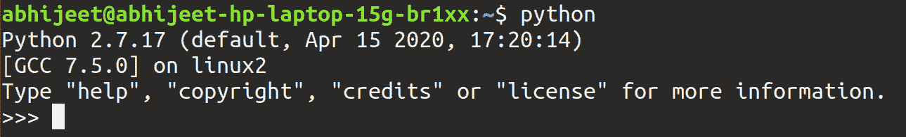
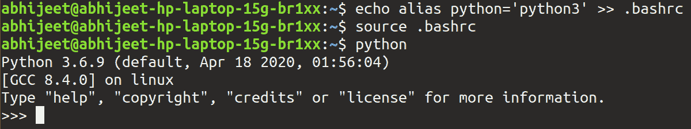

# 在 Linux 中将 python3 设置为默认值

> 原文:[https://www . geeksforgeeks . org/setting-python 3-as-default-in-Linux/](https://www.geeksforgeeks.org/setting-python3-as-default-in-linux/)

Python 2 支持于 2020 年 1 月 1 日结束，许多主要项目已经签署了 Python 3 声明，声明他们将删除 Python 2 支持。然而，我们中的许多人更喜欢在 python 解释器上为微小的代码片段编码，而不是制作。py 文件。而当我们在终端上发射**‘python’**命令时，默认情况下会启动 python2 的解释器。



这让我们别无选择，只能明确地键入 **python3。**但是，我们可以通过在终端上触发两个命令来将 python3 设置为默认值

```py
echo "alias python='python3'" >> .bashrc
source .bashrc

```

现在，如果我们通过运行“python”命令来签入终端，将会得到以下结果:



python 3 的解释器被启动，而不是 python2 的解释器。我们基本上在。bashrc，它将命令 python 替换为 python3，我们重新加载了。bashrc 文件。