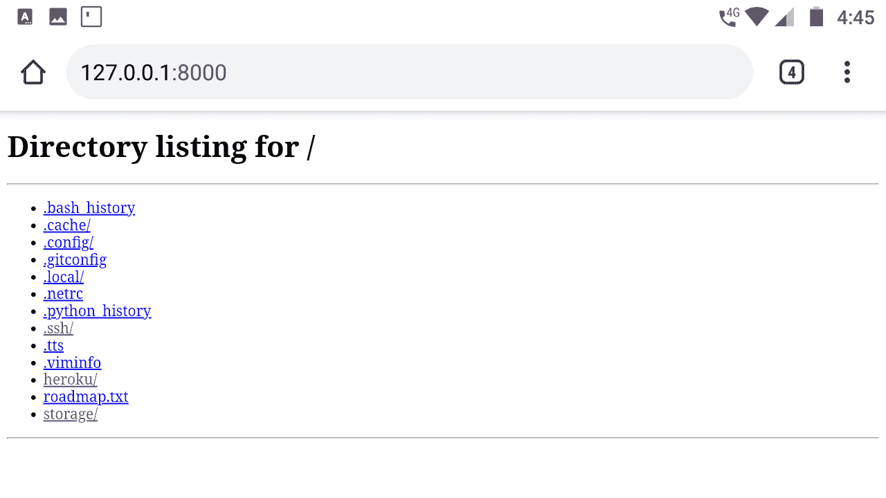
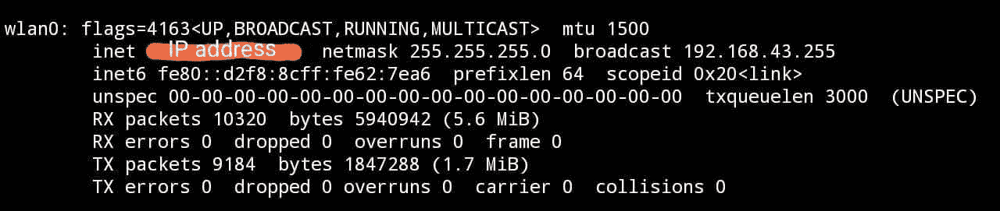
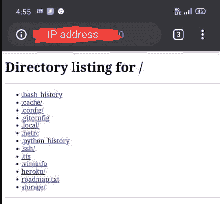

# 使用 Python 设置一个简单的 HTTP 服务器

> 原文:[https://www . geesforgeks . org/setting-a-simple-http-server-use-python/](https://www.geeksforgeeks.org/setting-up-a-simple-http-server-using-python/)

在本文中，我们将学习如何使用 Python 设置一个简单的本地 HTTP 服务器。在开发过程中，HTTP 服务器对于在本地测试安卓、个人电脑或网络应用非常有用。它还可以用于在通过同一局域网或无线局域网连接的两台设备之间共享文件。

### 装置

在终端上运行以下语句:

```py
python3 -m http.server

```

或者

```py
python -m http.server

```


Python3 服务器命令

## 本地访问服务器

要在本地访问服务器，您需要访问 [http://localhost:8000/](http://localhost:8000/) 。在这里，您可以看到本地存储的所有目录以及所有数据。您还可以访问一个网页，当您访问它时，它将由您的网络浏览器呈现。



localhost 页面

### 通过网络访问服务器

在进入应用程序之前，请注意，运行上述命令的设备称为服务器或主机，您将用于通过网络访问服务器的第二个设备称为客户端。要通过网络访问服务器，请确保设备(服务器和客户端)都通过同一局域网或无线局域网连接。要访问服务器，您需要服务器的 IP 地址。

**要获取 IP 地址，您的服务器设备需要遵循以下步骤:**

在 Windows 命令提示符下，执行以下语句:

```py
ipconfig

```

在 Linux、Unix 或 macOS 终端上，执行以下语句:

```py
ifconfig

```

请注意上述命令返回的 IP 地址。我们将进一步使用这个 IP 地址。



Linux 中“ifconfig”命令的结果。

知道 IP 地址后，打开客户端设备上的任何网络浏览器，输入第一台机器(服务器设备)的 IP 地址，以及端口 8000: http://[ip 地址]:8000



恭喜你！！现在您知道如何使用 Python 托管一个简单的 HTTP 服务器了。

**注意:**此 HTTP 服务器的安全性有限，因此仅用于开发目的或在本地共享文件，不建议在生产环境中使用。