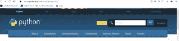
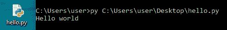
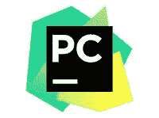
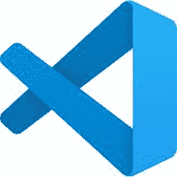
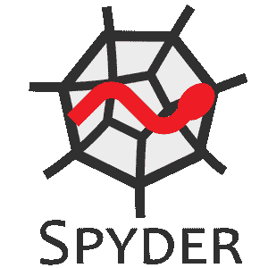
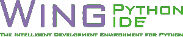

# 在本地计算机中设置 Python

> 原文:[https://www . geesforgeks . org/setup-python-in-a-local-computer/](https://www.geeksforgeeks.org/setup-python-in-a-local-computer/)

让我们看看如何在本地计算机中设置 Python。我们可以直接从官网下载最新版本的 Python。

Python 来自官方网站(https://www . python . org/downloads/)

之后，我们需要将其安装在本地计算机上。成功安装后，IDLE( 集成开发和学习环境)也将与一些软件包一起安装在我们的本地计算机上。对于简单的程序，我们可以使用 IDLE。

Python 程序也可以写在记事本上，从命令提示符运行。为此，请遵循以下步骤:

1.  打开记事本。
2.  把代码写进去。
3.  将文件与。py 分机。
4.  打开终端/命令提示符。
5.  对于，请键入以下命令> > py filename.py
6.  将显示输出。

**示例:**我们创建了一个名为 hello.py 的文件，内容为*打印(“Hello world”)。*

对于大型复杂的程序，使用智能 IDE 更方便。

**不同的 IDLE 以及 Python 编程环境**

**1。Atom**(https://Atom . io):**Atom 是一款面向 macOS、Linux 和微软 Windows 的免费开源文本和源代码编辑器，支持 Node.js 编写的插件，以及 GitHub 开发的嵌入式 Git Control。Atom 是使用 web 技术构建的桌面应用程序**

**

原子标志** 

****2。py charm**(https://www . jet brains . com/py charm/):py charm 是一个用于计算机编程的集成开发环境，专门针对 Python 语言。它是由捷克的捷脑公司开发的**

**

PyCharm 标志** 

****3。Visual Studio Code**(https://Code . visualstudio . com):Visual Studio Code 是微软为 Windows、Linux 和 macOS 制作的免费源代码编辑器。特性包括支持调试、语法突出显示、智能代码完成、代码片段、代码重构和嵌入式 Git。**

**

Visual Studio 代码** 

****4。Spyder(https://www . Spyder-ide . org):**Spyder 是一个面向 Python 语言科学编程的开源跨平台集成开发环境。**

**

斯派德** 

****5。Wing IDE**(https://Wing ware . com):Wing ware 集成开发环境的 Wing Python IDE 系列是专门为 Python 编程语言创建的。**

**

WinG IDE** 

****6。Thonny**(https://Thonny . org):Thonny 是一个面向 Python 的集成开发环境，专为初学者设计。它支持不同的代码遍历方式、逐步表达式求值、调用堆栈的详细可视化以及解释引用和堆概念的模式**

**

Thonny** 

**我们也可以使用在线 IDEs。在线 IDEs 有助于从不同计算机上的远程位置编写代码，如果我们的计算机没有空间下载软件，也可以使用它们。我们也可以在线与他人分享我们的代码。**