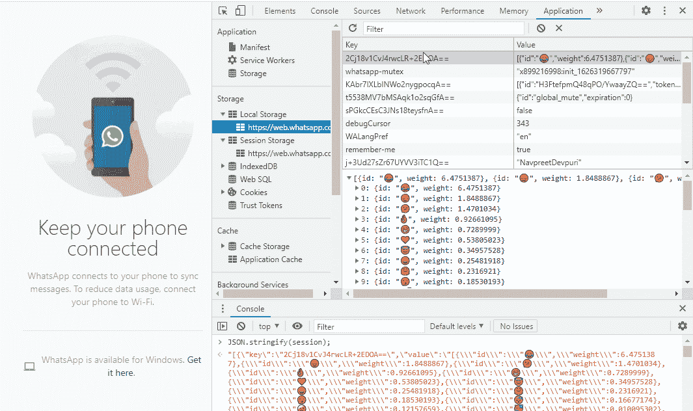
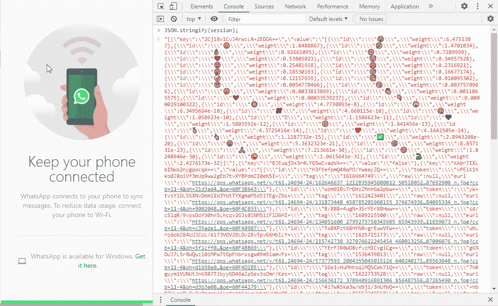
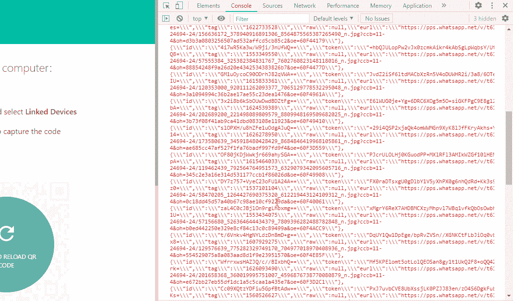
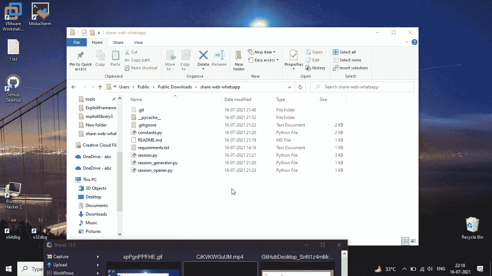
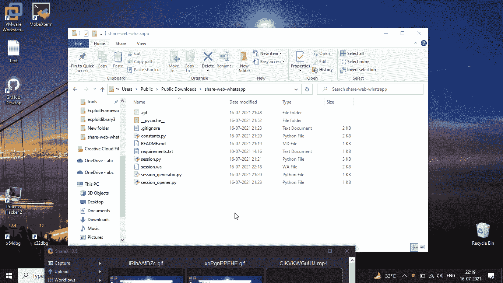

# 不使用 Python 扫描二维码分享 WhatsApp 网页

> 原文:[https://www . geesforgeks . org/share-whatsapp-web-无需扫描-QR-code-use-python/](https://www.geeksforgeeks.org/share-whatsapp-web-without-scanning-qr-code-using-python/)

**先决条件:** [**硒**](https://www.geeksforgeeks.org/how-to-install-selenium-in-python/)**[**浏览器自动化使用硒**](https://www.geeksforgeeks.org/browser-automation-using-selenium/)**

**在这篇文章中，我们将看到如何在不扫描二维码的情况下通过互联网与任何人共享您的网络应用程序。**

## **网络-Whatsapp 商店会话**

**Web Whatsapp 将会话存储在名为 **wawc** 的 IndexedDB 中，并将这些键值对同步到本地存储中。IndexedDB 将数据存储在用户的浏览器中，并允许创建 web 应用程序，无论是否有网络连接，都可以从该 indexedDB 进行查询。**

### **如何获得会话:**

**我们可以尝试以下方法来解决这个问题。我们将借助 [chrome 开发工具](https://developer.chrome.com/docs/devtools/#storage)。**

****步骤:****

1.  **清除 cookies 并刷新页面:它将保持登录状态。**
2.  **清除本地存储并刷新页面:它将恢复本地存储并保持登录状态。**
3.  **清除索引数据库并刷新页面:它将恢复索引数据库并保持登录状态。**
4.  **现在清除本地存储和索引。它将注销。**

****步骤演示:****

****

## **从索引数据库中提取会话:**

**我们可以使用下面的 javascript 从 IndexedDB 中提取会话。**

## **java 描述语言**

```
function getResultFromRequest(request) {
    return new Promise((resolve, reject) => {
        request.onsuccess = function (event) {
            resolve(request.result);
        };
    });
}

async function getDB() {
    var request = window.indexedDB.open("wawc");
    return await getResultFromRequest(request);
}

async function readAllKeyValuePairs() {
    var db = await getDB();
    var objectStore = db.transaction("user").objectStore("user");
    var request = objectStore.getAll();
       return await getResultFromRequest(request);
}

session = await readAllKeyValuePairs();
console.log(session);
```

**我们可以尝试在浏览器的控制台或选项卡中执行上面的代码，在那里我们打开了 Web-Whatsapp，我们将看到如下包含会话键值对的输出。** 

****

**现在，我们通过运行下面一行代码将这些键值对作为文本。**

## **java 描述语言**

```
JSON.stringify(session);
```

****

**现在，让我们将该文本复制到文件中以保存会话，并清除 localStorage 和 IndexedDB 以注销。现在，我们可以运行下面的代码，通过将刚刚复制到文件中的会话字符串的值赋给变量 SESSION_STRING 来注入会话。然后刷新页面，我们将再次登录，无需扫描二维码。**

## **java 描述语言**

```
function getResultFromRequest(request) {
    return new Promise((resolve, reject) => {
        request.onsuccess = function(event) {
            resolve(request.result);
        };
    })
}

async function getDB() {
    var request = window.indexedDB.open("wawc");
    return await getResultFromRequest(request);
}

async function injectSession(SESSION_STRING) {
    var session = JSON.parse(SESSION_STRING);
    var db = await getDB();
    var objectStore = db.transaction("user", "readwrite").objectStore("user");
    for(var keyValue of session) {
        var request = objectStore.put(keyValue);
        await getResultFromRequest(request);
    }
}

var SESSION_STRING = "";
await injectSession(SESSION_STRING);
```

****

## **自动化生成会话文件和注入会话的过程:**

**我们可以自动生成包含会话键值对的会话文件，并从生成的会话文件中读取会话键值对，以将会话注入浏览器，从而在不扫描二维码的情况下打开 web-WhatsApp**

### **我们可以自动化如下:**

**将会话文件路径作为命令行参数。**

#### **正在生成会话文件:**

*   **打开 Chrome 浏览器。**
*   **开放网络 Whatsapp。**
*   **要求用户扫描二维码。**
*   **等待二维码被扫描。**
*   **在浏览器中执行 javascript 并提取会话。**
*   **用带有自定义文件扩展名的会话文本文件保存文件”。哇”。**
*   **关闭浏览器。**

#### **正在打开会话文件:**

*   **请验证会话文件是否存在。**
*   **将给定文件读入“会话”变量。**
*   **打开 Chrome 浏览器。**
*   **开放网络 Whatsapp。**
*   **等待网络 Whatsapp 正确加载。**
*   **在浏览器中执行 javascript，使用变量“session”注入 session。**
*   **刷新页面。**
*   **要求用户按回车键关闭浏览器。**

**下面是实现:**

****注意:**运行代码前请下载[合唱曲](https://chromedriver.chromium.org/)。**

**通过使用 selenium 的网络驱动程序，我们可以等待一些元素出现在浏览器上，如下所示:**

## **蟒蛇 3**

```
def _wait_for_presence_of_an_element(browser, selector):
    element = None

    try:
        element = WebDriverWait(browser, DEFAULT_WAIT).until(
            EC.presence_of_element_located(selector)
        )
    except:
        pass
    finally:
        return element
```

### **正在生成会话文件:**

## **蟒蛇 3**

```
def sessionGenerator(sessionFilePath):

    # 1.1 Open Chrome browser
    browser = webdriver.Chrome()

    # 1.2 Open Web Whatsapp
    browser.get("https://web.whatsapp.com/")

    # 1.3 Ask user to scan QR code
    print("Waiting for QR code scan...")

    # 1.4 Wait for QR code to be scanned
    _wait_for_presence_of_an_element(
      browser, MAIN_SEARCH_BAR__SEARCH_ICON)

    # 1.5 Execute javascript in browser and 
    # extract the session text
    session = browser.execute_script(EXTRACT_SESSION)

    # 1.6 Save file with session text file with
    # custom file extension ".wa"
    with open(sessionFilePath, "w", encoding="utf-8") as sessionFile:
        sessionFile.write(str(session))

    print("Your session file is saved to: " + sessionFilePath)

    # 1.7 Close the browser
    browser.close()
```

****使用** **上述** **方法为** **生成会话文件:****

## **蟒蛇 3**

```
from session import *
import sys

# Taked session file path as command line
# argument and passed to following method
sessionFilePath = sys.argv[1]

sessionGenerator(sessionFilePath)
```

### **正在打开会话文件:**

## **蟒蛇 3**

```
def sessionOpener(sessionFilePath):

    # 2.1 Verify that session file is exist
    if sessionFilePath == "":
        raise IOError('"' + sessionFilePath + '" is not exist.')

    # 2.2 Read the given file into "session" variable
    with open(sessionFilePath, "r", encoding="utf-8") as sessionFile:
        session = sessionFile.read()

    # 2.3 Open Chrome browser
    browser = webdriver.Chrome()

    # 2.4 Open Web Whatsapp
    browser.get("https://web.whatsapp.com/")

    # 2.5 Wait for Web Whatsapp to be loaded properly
    _wait_for_presence_of_an_element(browser, QR_CODE)

    # 2.6 Execute javascript in browser to inject
    # session by using vaarible "session"
    print("Injecting session...")
    browser.execute_script(INJECT_SESSION, session)

    # 2.7 Refresh the page
    browser.refresh()

    # 2.8 Ask for user to enter any key to close browser
    input("Press enter to close browser.")
```

****使用******以上方法为** **打开会话文件:******

## ****蟒蛇 3****

```
**from session import *
import sys

# Taked session file path as command line 
# argument and passed to following method
sessionFilePath = sys.argv[1]

sessionOpener(sessionFilePath)**
```

****我们可以使用以下命令生成一个会话文件:****

******生成会话文件:******

```
**python session_generator.py session.wa**
```

****生成会话文件后，将其与他人共享，并将该会话文件放在 session_opener.py 所在的同一文件夹中，并运行以下命令打开 Web Whatsapp，而不扫描二维码****

******打开会话文件:******

```
**python session_opener.py session.wa**
```

****或者在不进入文件夹的情况下正常打开 PowerShell，并给出如下绝对路径****

#### ******生成会话文件:******

> ****python E:\ share-web-whatsapp \ session _ generator . py E:\ share-web-whatsapp \ session . wa****

********

#### ****对于打开会话文件:****

> ****python E:\ share-web-whatsapp \ session _ opener . py E:\ share-web-whatsapp \ session . wa****

********