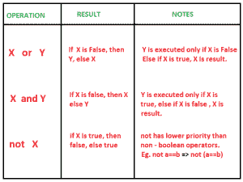

# Python 中的短路技术

> 原文:[https://www . geesforgeks . org/短路技术-python/](https://www.geeksforgeeks.org/short-circuiting-techniques-python/)

短路是指如果表达式的真值已经确定，布尔运算执行的**停止。表情的评价从**左到右**进行。在 python 中，各种布尔运算符和函数都支持短路。**

**Short Circuiting in Boolean Operators**

下面给出的图表给出了布尔表达式的短路情况。布尔运算符按升序排列。

[](https://media.geeksforgeeks.org/wp-content/uploads/bool.png)

**或:**当 Python 解释器扫描**或**表达式时，它会获取第一条语句并检查它是否为真。如果第一条语句为真，那么 Python 返回该对象的值，而不检查第二条语句。程序不会为第二条语句而烦恼。如果第一个值为假，则 Python 只检查第二个值，然后结果基于后半部分。
**和:**对于一个**和**表达式，Python 使用短路技术来检查第一个语句是否为假，那么整个语句必须为假，因此它返回该值。只有当第一个值为真时，它才会检查第二个语句并返回该值。
当表达式的真值已经达到时，包含**和**以及**或**的表达式停止执行。评估从左到右进行。

```py
# python code to demonstrate short circuiting 
# using and and or

# helper function
def check():
    return "geeks"

# using an expression to demonstrate
# prints "geeks", and gets executed 
# as both are required to check truth value
print (1 and check())

# using an expression to demonstrate
# prints 1
# as only if 1st value is true, or 
# doesnt require call check() fun
print (1 or check())

# using an expression to demonstrate
# prints "geeks"
# the value returns true when check 
# is encountered. 1 is not executed
print (0 or check() or 1)

# using an expression to demonstrate
# prints 1
# as last value is required to evaluate
# full expression because of "and"
print (0 or check() and 1)
```

输出:

```py
geeks
1
geeks
1

```

**Short Circuiting in all() and any()**

python 中的内置函数 [all()和 any()](https://www.geeksforgeeks.org/any-all-in-python/) 也支持短路。下面的例子会让你清楚地了解它是如何工作的。

```py
# python code to demonstrate short circuiting 
# using all() and any()

# helper function
def check(i):
    print ("geeks")
    return i

# using all()
# stops execution when false occurs
# tells the compiler that even if one is 
# false, all cannot be true, hence stop 
# execution further.
# prints 3 "geeks" 
print (all(check(i) for i in [1, 1, 0, 0, 3]))

print("\r")

# using any()
# stops execution when true occurs
# tells the compiler that even if one is 
# true, expression is true, hence stop 
# execution further.
# prints 4 "geeks" 
print (any(check(i) for i in [0, 0, 0, 1, 3]))
```

输出:

```py
geeks
geeks
geeks
False

geeks
geeks
geeks
geeks
True

```

**Short Circuiting in conditional operators**

条件运算符也遵循短路，因为当获得表达式结果时，不需要进一步执行。

```py
# python code to demonstrate short circuiting 
# using conditional operators

# helper function
def check(i):
    print ("geeks")
    return i

# using conditional expressions
# since 10 is not greater than 11
# further execution is not taken place 
# to check for truth value.
print( 10 > 11 > check(3) )

print ("\r")

# using conditional expressions
# since 11 is greater than 10
# further execution is taken place 
# to check for truth value.
# return true as 11 > 3
print( 10 < 11 > check(3) )

print ("\r")

# using conditional expressions
# since 11 is greater than 10
# further execution is taken place 
# to check for truth value.
# return false as 11 < 12
print( 10 < 11 > check(12) )
```

输出:

```py
False

geeks
True

geeks
False

```

本文由**曼吉特·辛格**供稿。如果你喜欢 GeeksforGeeks 并想投稿，你也可以使用[contribute.geeksforgeeks.org](http://www.contribute.geeksforgeeks.org)写一篇文章或者把你的文章邮寄到 contribute@geeksforgeeks.org。看到你的文章出现在极客博客主页上，帮助其他极客。

如果你发现任何不正确的地方，或者你想分享更多关于上面讨论的话题的信息，请写评论。